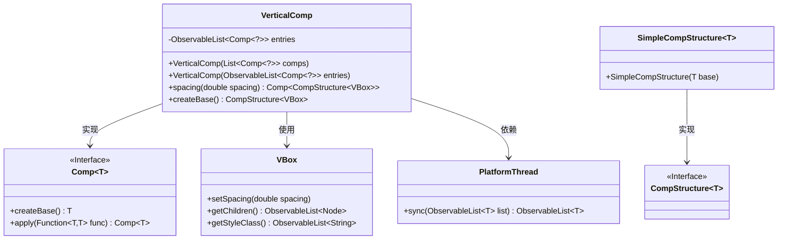
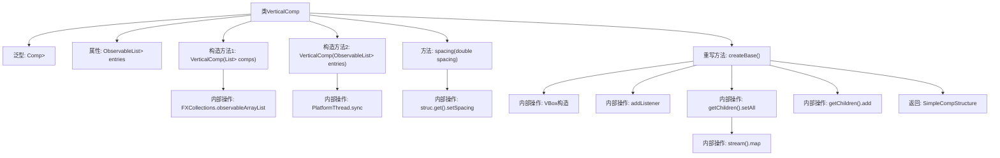

# 基础信息

|      |      |
|------|------|
| 名称 | VerticalComp |
| 编码语言 | .java |
| 代码路径 | xpipe/app/src/main/java/io/xpipe/app/comp/base/VerticalComp.java |
| 包名 | io.xpipe.app.comp.base |
| 依赖项 | ['io.xpipe.app.comp.Comp', 'io.xpipe.app.comp.CompStructure', 'io.xpipe.app.comp.SimpleCompStructure', 'io.xpipe.app.util.PlatformThread', 'javafx.collections.FXCollections', 'javafx.collections.ListChangeListener', 'javafx.collections.ObservableList', 'javafx.scene.layout.VBox', 'java.util.List'] |
| 概述说明 | 垂直布局组件类，支持动态条目更新和间距设置。 |

# 说明

VerticalComp是一个基于JavaFX的组件类，继承自Comp类，使用VBox作为布局容器。它包含一个可观察的条目列表entries，可通过构造函数传入普通列表或可观察列表。提供spacing方法设置子组件间距。在createBase方法中创建VBox容器，添加样式类，并设置条目变化监听器以动态更新子组件。初始化时会遍历条目列表并添加对应区域到容器中。

# 类列表 Class Summary

| 名称   | 类型  | 说明 |
|-------|------|-------------|
| VerticalComp | class | 垂直布局组件类，支持动态更新子组件和间距设置。 |

## 类 VerticalComp

|      |      |
|------|------|
| 访问范围 | public |
| 类型 | class |
| 名称 | VerticalComp |
| 说明 | 垂直布局组件类，支持动态更新子组件和间距设置。 |

### UML类图

这段类图展示了VerticalComp类的结构及其相关依赖。VerticalComp是一个泛型类，实现了Comp接口，用于垂直布局组件。它包含一个可观察的组件列表entries，提供两种构造方式，并支持设置间距。通过createBase()方法创建基于VBox的布局结构，当entries变化时自动更新子节点。类图中还展示了与Comp接口、SimpleCompStructure实现类、JavaFX的VBox类以及PlatformThread工具类的关系。

### 内部方法调用关系图

这段代码描述了一个名为VerticalComp的类，继承自泛型类Comp<CompStructure<VBox>>，主要用于垂直布局组件的管理。类中包含两个构造方法，分别接收List和ObservableList类型的组件列表，并通过createBase方法创建基于VBox的布局结构。关键操作包括监听列表变化动态更新子组件、设置间距参数以及初始化时添加所有子组件到VBox容器中。流程图清晰展示了从构造到布局生成的全过程，包括数据转换、事件监听和UI构建等关键步骤。

### 字段列表 Field List

| 名称  | 类型  | 说明 |
|-------|-------|------|
| entries | ObservableList<Comp<?>> | 私有可观察列表，存储Comp泛型对象。 |

### 方法列表 Method List

| 名称  | 类型  | 说明 |
|-------|-------|------|
| spacing | Comp<CompStructure<VBox>> | 设置VBox组件间距的方法，返回Comp对象。 |
| createBase | CompStructure<VBox> | 重写createBase方法，创建VBox并动态更新子组件。 |

