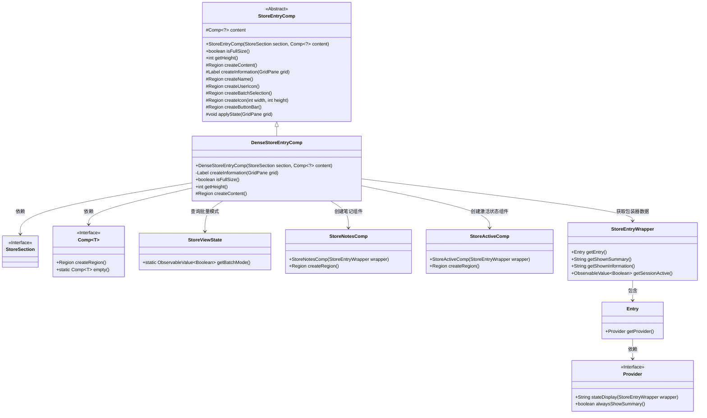
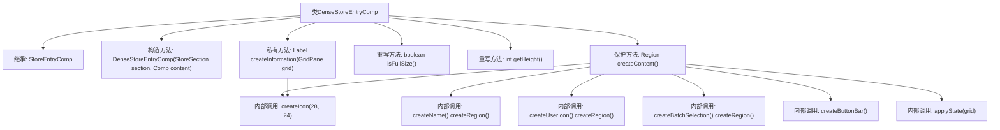
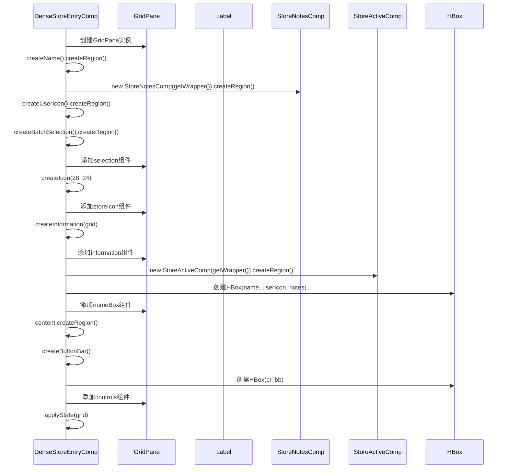

# 基础信息

|      |      |
|------|------|
| 名称 | DenseStoreEntryComp |
| 编码语言 | .java |
| 代码路径 | xpipe/app/src/main/java/io/xpipe/app/comp/store/DenseStoreEntryComp.java |
| 包名 | io.xpipe.app.comp.store |
| 依赖项 | ['io.xpipe.app.comp.Comp', 'io.xpipe.app.comp.augment.GrowAugment', 'io.xpipe.app.util.PlatformThread', 'io.xpipe.core.process.OsType', 'javafx.beans.binding.Bindings', 'javafx.geometry.HPos', 'javafx.geometry.Insets', 'javafx.geometry.Pos', 'javafx.scene.control.Label', 'javafx.scene.layout'] |
| 概述说明 | DenseStoreEntryComp继承StoreEntryComp，创建密集存储条目UI，包含状态显示、名称、图标、按钮等组件，高度根据系统类型调整。 |

# 说明

DenseStoreEntryComp是StoreEntryComp的子类，用于创建密集存储条目界面组件。它包含创建信息标签、名称、用户图标、笔记、选择控件等功能。组件高度根据操作系统类型调整（Windows为38，其他为37）。布局使用GridPane，包含图标、名称框、信息标签和按钮栏等元素。支持批量模式切换，动态调整列宽和控件可见性。组件样式类包括store-entry-grid和dense，应用状态绑定和悬停交互逻辑。

# 类列表 Class Summary

| 名称   | 类型  | 说明 |
|-------|------|-------------|
| DenseStoreEntryComp | class | DenseStoreEntryComp继承StoreEntryComp，创建密集存储条目UI组件，包含状态显示、名称、图标和交互控件。 |

## 类 DenseStoreEntryComp

|      |      |
|------|------|
| 访问范围 | public |
| 类型 | class |
| 名称 | DenseStoreEntryComp |
| 说明 | DenseStoreEntryComp继承StoreEntryComp，创建密集存储条目UI组件，包含状态显示、名称、图标和交互控件。 |

### UML类图

类图描述：
该图展示了DenseStoreEntryComp及其相关类的继承和依赖关系。DenseStoreEntryComp继承自抽象类StoreEntryComp，实现了密集存储条目的UI渲染逻辑。核心功能包括创建信息标签、处理批量选择模式、动态调整布局等。通过StoreEntryWrapper获取数据，依赖多个辅助组件(StoreNotesComp/StoreActiveComp)构建界面，并与StoreViewState交互处理批量模式状态。Provider接口提供状态显示策略，体现了良好的职责分离设计。

### 内部方法调用关系图

该流程图展示了DenseStoreEntryComp类的结构及其内部方法调用关系，重点描述了createContent()方法的详细执行流程。时序图则具体呈现了创建UI组件时的交互顺序，包括GridPane的构建、各类子组件的创建与添加过程，以及最终的状态应用。这两个图表共同揭示了该JavaFX组件如何动态构建其复杂的用户界面结构。

### 字段列表 Field List

| 名称  | 类型  | 说明 |
|-------|-------|------|

### 方法列表 Method List

| 名称  | 类型  | 说明 |
|-------|-------|------|
| createInformation | Label | 创建信息标签，绑定状态和摘要，根据条件显示不同文本。 |
| isFullSize | boolean | 重写方法isFullSize，返回固定值false。 |
| getHeight | int | 重写getHeight方法，根据操作系统返回不同高度值。 |
| createContent | Region | 创建网格布局，包含名称、图标、选择控件和信息栏，动态调整列宽和控件可见性。 |

