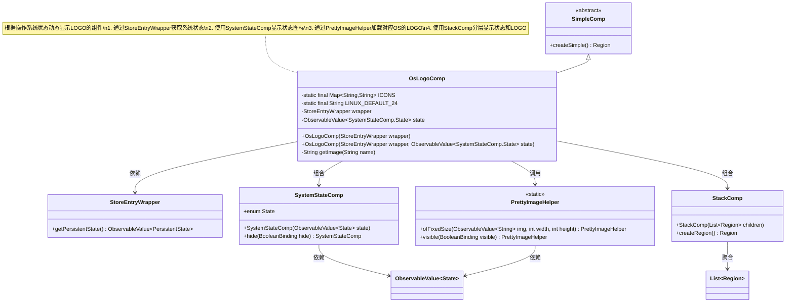
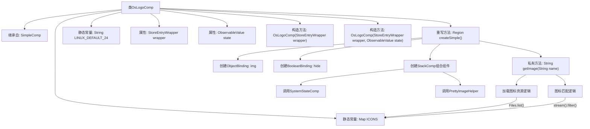

# 基础信息

|      |      |
|------|------|
| 名称 | OsLogoComp |
| 编码语言 | .java |
| 代码路径 | xpipe/app/src/main/java/io/xpipe/app/comp/store/OsLogoComp.java |
| 包名 | io.xpipe.app.comp.store |
| 依赖项 | ['io.xpipe.app.comp.SimpleComp', 'io.xpipe.app.comp.base.PrettyImageHelper', 'io.xpipe.app.comp.base.StackComp', 'io.xpipe.app.resources.AppResources', 'io.xpipe.core.process.SystemState', 'io.xpipe.core.store.FileNames', 'javafx.beans.binding.Bindings', 'javafx.beans.property.SimpleObjectProperty', 'javafx.beans.value.ObservableValue', 'javafx.scene.layout.Region', 'java.nio.file.Files', 'java.util.HashMap', 'java.util.List', 'java.util.Map'] |
| 概述说明 | OsLogoComp类根据系统状态显示对应操作系统图标，默认显示Linux图标。 |

# 说明

OsLogoComp是一个用于显示操作系统图标的组件，继承自SimpleComp。它通过StoreEntryWrapper获取系统状态，并根据操作系统名称匹配对应的图标。组件包含一个静态图标映射表ICONS，首次使用时从资源目录加载符合条件的PNG文件并转换为SVG路径。主要逻辑包括：根据系统状态决定是否显示图标，若状态为SUCCESS则从wrapper获取操作系统名称并匹配对应图标，未匹配时默认返回Linux图标。组件内部使用StackComp组合SystemStateComp和PrettyImageHelper，实现状态与图标的切换显示。图标匹配支持名称模糊匹配，忽略大小写和空格差异。

# 类列表 Class Summary

| 名称   | 类型  | 说明 |
|-------|------|-------------|
| OsLogoComp | class | OsLogoComp类根据系统状态显示对应操作系统图标，默认使用Linux图标。 |

## 类 OsLogoComp

|      |      |
|------|------|
| 访问范围 | public |
| 类型 | class |
| 名称 | OsLogoComp |
| 说明 | OsLogoComp类根据系统状态显示对应操作系统图标，默认使用Linux图标。 |

### UML类图

这段代码实现了一个操作系统LOGO显示组件OsLogoComp，它继承自SimpleComp抽象类。该组件主要功能是根据系统状态动态显示操作系统LOGO：当状态为SUCCESS时显示对应操作系统的LOGO图标，否则显示系统状态图标。组件通过StoreEntryWrapper获取持久化状态，使用SystemStateComp处理状态显示，通过PrettyImageHelper加载LOGO图片，最后用StackComp实现分层布局。getImage()方法实现了从资源文件动态加载操作系统图标的逻辑，支持名称模糊匹配和默认图标回退机制。

### 内部方法调用关系图

流程图描述：该流程图展示了OsLogoComp类的完整结构，从继承关系到关键方法调用链。核心流程包含两个构造方法、重写的createSimple()方法实现，以及图标加载逻辑getImage()。createSimple()方法通过绑定机制动态生成界面元素，结合SystemStateComp状态组件和PrettyImageHelper图像组件。getImage()方法实现了图标资源的延迟加载和智能匹配机制，包含文件系统扫描和名称模糊匹配逻辑。整体设计体现了响应式编程思想，通过数据绑定实现UI自动更新。

### 字段列表 Field List

| 名称  | 类型  | 说明 |
|-------|-------|------|
| LINUX_DEFAULT_24 = "linux-24.png" | String | Linux默认24位图文件名常量。 |
| state | ObservableValue<SystemStateComp.State> | 私有不可变状态观察值，类型为SystemStateComp.State。 |
| wrapper | StoreEntryWrapper | 私有存储条目包装器实例。 |
| ICONS = new HashMap<>() | Map<String, String> | 私有静态常量映射表ICONS，键值均为字符串。 |

### 方法列表 Method List

| 名称  | 类型  | 说明 |
|-------|-------|------|
| createSimple | Region | 创建区域：根据状态和持久状态生成图像，隐藏逻辑控制显示。 |
| getImage | String | 根据名称获取对应图标路径，优先匹配关键词，默认返回Linux图标。 |

