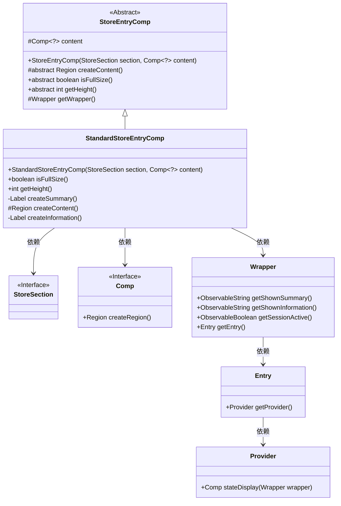
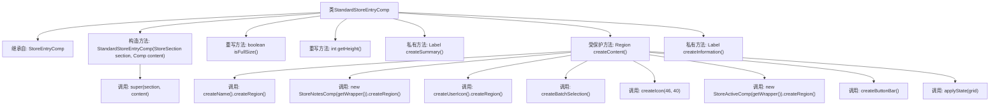
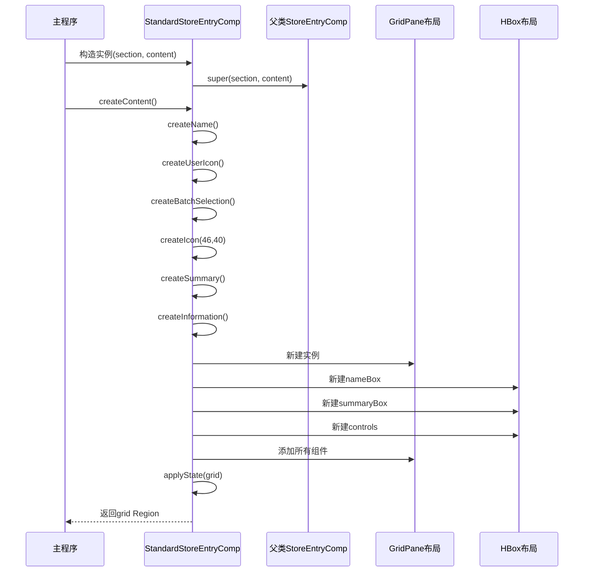

# 基础信息

|      |      |
|------|------|
| 名称 | StandardStoreEntryComp |
| 编码语言 | .java |
| 代码路径 | xpipe/app/src/main/java/io/xpipe/app/comp/store/StandardStoreEntryComp.java |
| 包名 | io.xpipe.app.comp.store |
| 依赖项 | ['io.xpipe.app.comp.Comp', 'io.xpipe.app.core.AppFontSizes', 'io.xpipe.core.process.OsType', 'javafx.geometry.HPos', 'javafx.geometry.Insets', 'javafx.geometry.Pos', 'javafx.scene.control.Label', 'javafx.scene.layout'] |
| 概述说明 | 标准商店条目组件，包含名称、图标、摘要和按钮栏，高度固定57，支持批量选择和状态显示。 |

# 说明

StandardStoreEntryComp是一个继承自StoreEntryComp的类，用于创建标准商店条目组件。它重写了isFullSize和getHeight方法，分别返回true和固定高度57。类中包含创建摘要标签、内容区域和信息标签的方法。内容区域使用GridPane布局，包含名称、笔记、用户图标、商店图标、活动状态组件、摘要框和信息框等元素，并根据不同条件动态调整布局。信息标签绑定显示数据并包含状态显示组件。整体设计注重响应式布局和动态内容更新。

# 类列表 Class Summary

| 名称   | 类型  | 说明 |
|-------|------|-------------|
| StandardStoreEntryComp | class | 标准商店条目组件，包含名称、图标、摘要和操作按钮，高度固定57像素，支持批量选择和状态显示。 |

## 类 StandardStoreEntryComp

|      |      |
|------|------|
| 访问范围 | public |
| 类型 | class |
| 名称 | StandardStoreEntryComp |
| 说明 | 标准商店条目组件，包含名称、图标、摘要和操作按钮，高度固定57像素，支持批量选择和状态显示。 |

### UML类图

该类图展示了StandardStoreEntryComp继承自抽象类StoreEntryComp，实现了创建商店条目UI组件的功能。StandardStoreEntryComp通过Wrapper获取数据，依赖StoreSection和泛型Comp接口，使用GridPane布局创建包含图标、名称、摘要等元素的复合组件。Provider模式用于状态显示，体现了观察者模式在UI更新中的应用。整体结构清晰地反映了GUI组件的层次关系和数据流动路径。

### 内部方法调用关系图

这段代码实现了一个标准商店条目组件，继承自基础商店条目组件。流程图展示了类结构和方法调用关系，时序图详细描述了组件创建过程。主要功能包括构建包含图标、名称、摘要、状态信息和控制按钮的网格布局，通过数据绑定和响应式编程实现动态UI更新。组件高度固定为57像素，始终以全尺寸显示，并根据内容存在与否调整布局约束条件。

### 字段列表 Field List

| 名称  | 类型  | 说明 |
|-------|-------|------|

### 方法列表 Method List

| 名称  | 类型  | 说明 |
|-------|-------|------|
| isFullSize | boolean | 方法isFullSize始终返回true。 |
| getHeight | int | 重写getHeight方法，返回固定值57。 |
| createInformation | Label | 创建带状态显示的标签，绑定信息并设置样式。 |
| createContent | Region | 创建网格布局，包含选择、图标、名称、摘要、信息和按钮栏，动态调整列宽和内容。 |
| createSummary | Label | 创建绑定文本样式的摘要标签方法。 |

