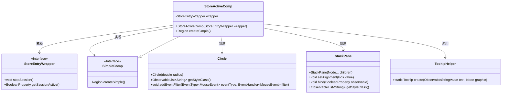
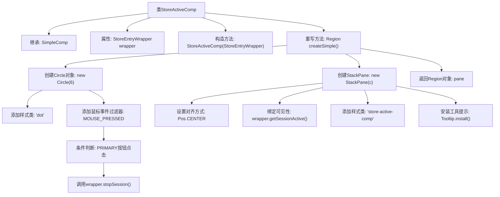

# 基础信息

|      |      |
|------|------|
| 名称 | StoreActiveComp |
| 编码语言 | .java |
| 代码路径 | xpipe/app/src/main/java/io/xpipe/app/comp/store/StoreActiveComp.java |
| 包名 | io.xpipe.app.comp.store |
| 依赖项 | ['io.xpipe.app.comp.SimpleComp', 'io.xpipe.app.comp.base.TooltipHelper', 'io.xpipe.app.core.AppI18n', 'javafx.geometry.Pos', 'javafx.scene.control.Tooltip', 'javafx.scene.input', 'javafx.scene.layout.Region', 'javafx.scene.layout.StackPane', 'javafx.scene.shape.Circle'] |
| 概述说明 | StoreActiveComp类继承SimpleComp，包含圆形交互组件，点击停止会话，绑定可见性。 |

# 说明

StoreActiveComp是一个继承自SimpleComp的类，用于创建表示商店会话激活状态的UI组件。它接收StoreEntryWrapper对象作为构造参数。组件核心是一个6像素半径的圆形，样式类为dot。当鼠标左键点击时，会调用wrapper的stopSession方法并消耗事件。圆形被放置在居中对齐的StackPane中，其可见性绑定到wrapper的sessionActive属性。整个面板添加了store-active-comp样式类，并安装了显示会话激活状态的工具提示。

# 类列表 Class Summary

| 名称   | 类型  | 说明 |
|-------|------|-------------|
| StoreActiveComp | class | StoreActiveComp类，创建带点击事件的圆点UI，绑定会话状态显示。 |

## 类 StoreActiveComp

|      |      |
|------|------|
| 访问范围 | public |
| 类型 | class |
| 名称 | StoreActiveComp |
| 说明 | StoreActiveComp类，创建带点击事件的圆点UI，绑定会话状态显示。 |

### UML类图

这段代码展示了一个JavaFX组件`StoreActiveComp`的实现，它继承自`SimpleComp`接口，用于创建表示会话激活状态的圆形指示器。类图清晰地呈现了核心类之间的关系：`StoreActiveComp`通过组合方式使用`StoreEntryWrapper`接口控制会话状态，同时创建`Circle`和`StackPane`来实现UI渲染，并调用`TooltipHelper`工具类添加提示功能。整个设计体现了清晰的职责分离，`StoreActiveComp`负责整合各种UI元素和交互逻辑，而具体功能则委托给其他专门类处理。

### 内部方法调用关系图

这段代码描述了一个继承自SimpleComp的StoreActiveComp类，主要用于创建一个带有交互功能的圆形UI组件。流程图展示了从类结构到具体实现的完整过程：包括构造方法初始化、创建圆形组件、添加鼠标事件处理（左键点击时停止会话）、布局容器设置、可见性绑定以及工具提示安装等关键步骤，最终返回一个包含所有功能的Region对象。整个过程体现了UI组件的封装性和事件驱动特性。

### 字段列表 Field List

| 名称  | 类型  | 说明 |
|-------|-------|------|
| wrapper | StoreEntryWrapper | 私有存储条目包装器。 |

### 方法列表 Method List

| 名称  | 类型  | 说明 |
|-------|-------|------|
| createSimple | Region | 创建圆形控件，绑定可见性，添加点击事件和提示。 |

