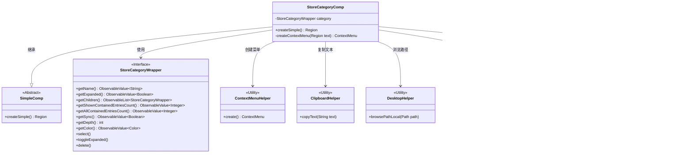

# 基础信息

|      |      |
|------|------|
| 名称 | StoreCategoryComp |
| 编码语言 | .java |
| 代码路径 | xpipe/app/src/main/java/io/xpipe/app/comp/store/StoreCategoryComp.java |
| 包名 | io.xpipe.app.comp.store |
| 依赖项 | ['io.xpipe.app.comp.Comp', 'io.xpipe.app.comp.SimpleComp', 'io.xpipe.app.comp.augment.ContextMenuAugment', 'io.xpipe.app.comp.base', 'io.xpipe.app.core.AppFontSizes', 'io.xpipe.app.core.AppI18n', 'io.xpipe.app.prefs.AppPrefs', 'io.xpipe.app.storage.DataStorage', 'io.xpipe.app.storage.DataStoreCategory', 'io.xpipe.app.storage.DataStoreColor', 'io.xpipe.app.util.ClipboardHelper', 'io.xpipe.app.util.ContextMenuHelper', 'io.xpipe.app.util.DesktopHelper', 'io.xpipe.app.util.LabelGraphic', 'io.xpipe.core.process.OsType', 'javafx.beans.binding.Bindings', 'javafx.beans.property.SimpleBooleanProperty', 'javafx.beans.property.SimpleObjectProperty', 'javafx.beans.property.SimpleStringProperty', 'javafx.css.PseudoClass', 'javafx.geometry.Insets', 'javafx.geometry.Pos', 'javafx.scene.control.ContextMenu', 'javafx.scene.control.MenuItem', 'javafx.scene.control.SeparatorMenuItem', 'javafx.scene.input.KeyCode', 'javafx.scene.input.KeyCodeCombination', 'javafx.scene.input.KeyEvent', 'javafx.scene.input.MouseButton', 'javafx.scene.layout.HBox', 'javafx.scene.layout.Region', 'lombok.EqualsAndHashCode', 'lombok.Value', 'org.kordamp.ikonli.javafx.FontIcon', 'java.util.Comparator', 'java.util.List', 'java.util.Locale'] |
| 概述说明 | StoreCategoryComp类实现商店分类UI组件，包含名称编辑、展开/折叠、同步状态及右键菜单功能。 |

# 说明

这是一个名为StoreCategoryComp的Java类，继承自SimpleComp，用于实现商店分类的UI组件。主要功能包括：显示分类名称（支持审查模式）、展开/折叠子分类按钮、状态图标按钮、条目计数显示、右键上下文菜单（包含复制ID、浏览存储、新建分类、配置、重命名和删除等功能）。组件会根据分类深度进行缩进，支持键盘操作（空格键切换展开状态），并能根据分类状态动态更新UI样式。子分类会按名称排序显示，整体布局采用水平排列的按钮和垂直排列的子分类列表。

# 类列表 Class Summary

| 名称   | 类型  | 说明 |
|-------|------|-------------|
| StoreCategoryComp | class | 商店分类组件，包含名称、展开按钮、状态图标和子分类列表，支持右键菜单操作。 |

## 类 StoreCategoryComp

|      |      |
|------|------|
| 访问范围 | @EqualsAndHashCode(callSuper = true);@Value;public |
| 类型 | class |
| 名称 | StoreCategoryComp |
| 说明 | 商店分类组件，包含名称、展开按钮、状态图标和子分类列表，支持右键菜单操作。 |

### UML类图

这段类图展示了StoreCategoryComp组件及其相关依赖关系。StoreCategoryComp继承自SimpleComp，主要功能是创建商店分类的UI组件，包含名称显示、展开/折叠控制、状态图标和上下文菜单等功能。它依赖于StoreCategoryWrapper接口获取数据，并调用多个工具类(ClipboardHelper/DesktopHelper)和单例对象(DataStorage/AppPrefs)完成具体操作。组件通过观察模式监听数据变化，实现了动态UI更新和交互功能。

### 内部方法调用关系图

这段代码是StoreCategoryComp类的实现，继承自SimpleComp，主要用于构建商店分类的UI组件。createSimple()方法负责创建完整的分类视图，包括名称显示、展开/折叠按钮、状态按钮和子分类列表。createContextMenu()方法生成右键上下文菜单，提供复制ID、浏览存储、新建分类、配置、重命名和删除等功能。整个流程涉及多个JavaFX组件的创建和属性绑定，实现了分类视图的交互功能和状态管理。

### 字段列表 Field List

| 名称  | 类型  | 说明 |
|-------|-------|------|
| SELECTED = PseudoClass.getPseudoClass("selected") | PseudoClass | 定义常量SELECTED表示伪类"selected"。 |
| category | StoreCategoryWrapper | 商店分类包装类 |

### 方法列表 Method List

| 名称  | 类型  | 说明 |
|-------|-------|------|
| createSimple | Region | 创建分类UI组件，包含名称、展开按钮、状态图标和子分类列表，支持交互和样式控制。 |
| createContextMenu | ContextMenu | 创建上下文菜单，含复制ID、浏览存储、新建分类、配置、重命名和删除功能。 |

