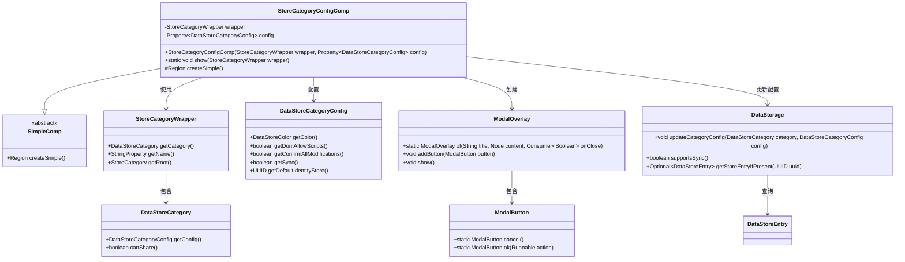
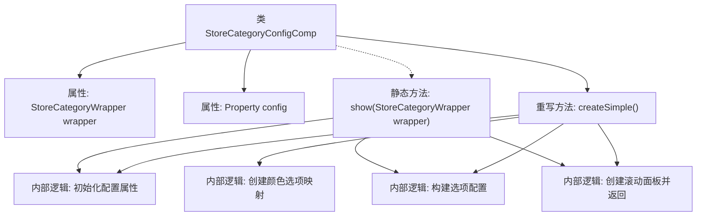
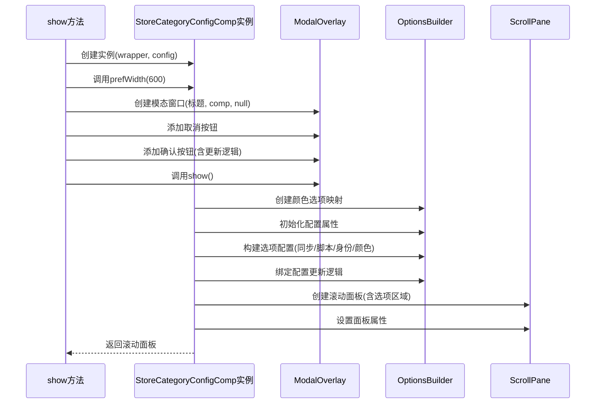

# 基础信息

|      |      |
|------|------|
| 名称 | StoreCategoryConfigComp |
| 编码语言 | .java |
| 代码路径 | xpipe/app/src/main/java/io/xpipe/app/comp/store/StoreCategoryConfigComp.java |
| 包名 | io.xpipe.app.comp.store |
| 依赖项 | ['io.xpipe.app.comp.SimpleComp', 'io.xpipe.app.comp.base.ModalButton', 'io.xpipe.app.comp.base.ModalOverlay', 'io.xpipe.app.core.AppI18n', 'io.xpipe.app.storage.DataStorage', 'io.xpipe.app.storage.DataStoreCategoryConfig', 'io.xpipe.app.storage.DataStoreColor', 'io.xpipe.app.storage.DataStoreEntry', 'io.xpipe.app.util.OptionsBuilder', 'io.xpipe.core.store.DataStore', 'javafx.beans.property.Property', 'javafx.beans.property.SimpleIntegerProperty', 'javafx.beans.property.SimpleObjectProperty', 'javafx.beans.value.ObservableValue', 'javafx.scene.control.ScrollPane', 'javafx.scene.layout.Region', 'lombok.AllArgsConstructor', 'java.util.Arrays', 'java.util.LinkedHashMap'] |
| 概述说明 | 商店分类配置组件，含颜色、脚本、同步等选项，支持模态窗口展示与更新。 |

# 说明

该代码定义了一个StoreCategoryConfigComp类，用于显示和编辑商店分类配置。主要功能包括：通过模态窗口展示分类配置表单，包含颜色选择、脚本禁用选项、同步设置和默认身份选择等控件。表单数据绑定到StoreCategoryWrapper对象的配置属性，支持取消和确认操作。确认时会更新数据存储中的分类配置。界面元素包括滚动面板和动态生成的选项区域，部分选项根据分类类型动态显示或隐藏。

# 类列表 Class Summary

| 名称   | 类型  | 说明 |
|-------|------|-------------|
| StoreCategoryConfigComp | class | 商店分类配置组件，含颜色、脚本、同步等选项，支持模态窗口展示与数据更新。 |

## 类 StoreCategoryConfigComp

|      |      |
|------|------|
| 访问范围 | @AllArgsConstructor;public |
| 类型 | class |
| 名称 | StoreCategoryConfigComp |
| 说明 | 商店分类配置组件，含颜色、脚本、同步等选项，支持模态窗口展示与数据更新。 |

### UML类图

这段类图展示了商店类别配置组件的核心结构。StoreCategoryConfigComp继承自SimpleComp，负责创建和展示商店类别的配置界面。它依赖StoreCategoryWrapper获取类别信息，使用DataStoreCategoryConfig存储配置数据，并通过ModalOverlay显示模态对话框。DataStorage负责持久化配置更新，ModalButton提供对话框操作按钮。组件通过OptionsBuilder动态构建配置选项界面，支持颜色选择、脚本控制等配置功能，特别处理了连接类别的特殊配置需求。

### 内部方法调用关系图

这段代码实现了一个商店分类配置组件，主要功能是通过模态窗口展示和编辑商店分类的配置参数。流程图展示了类的结构关系，时序图详细描述了从show方法调用到最终显示配置界面的完整过程。组件支持颜色选择、脚本控制、身份验证和同步设置等功能的配置，并通过OptionsBuilder构建复杂的选项界面，最后嵌入到可滚动的面板中返回显示。整个流程严格遵循配置数据的获取、界面构建和事件绑定的逻辑顺序。

### 字段列表 Field List

| 名称  | 类型  | 说明 |
|-------|-------|------|
| config | Property<DataStoreCategoryConfig> | 私有属性config，类型为Property<DataStoreCategoryConfig>。 |
| wrapper | StoreCategoryWrapper | 私有StoreCategoryWrapper对象wrapper。 |

### 方法列表 Method List

| 名称  | 类型  | 说明 |
|-------|-------|------|
| show | void | 静态方法显示商店分类配置弹窗，包含取消和确认按钮，确认时更新配置。 |
| createSimple | Region | 创建配置界面，包含颜色、脚本、同步等选项，绑定数据存储配置。 |

