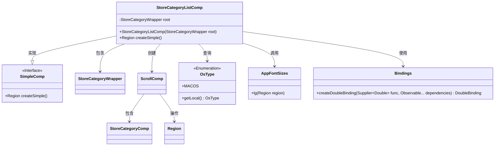
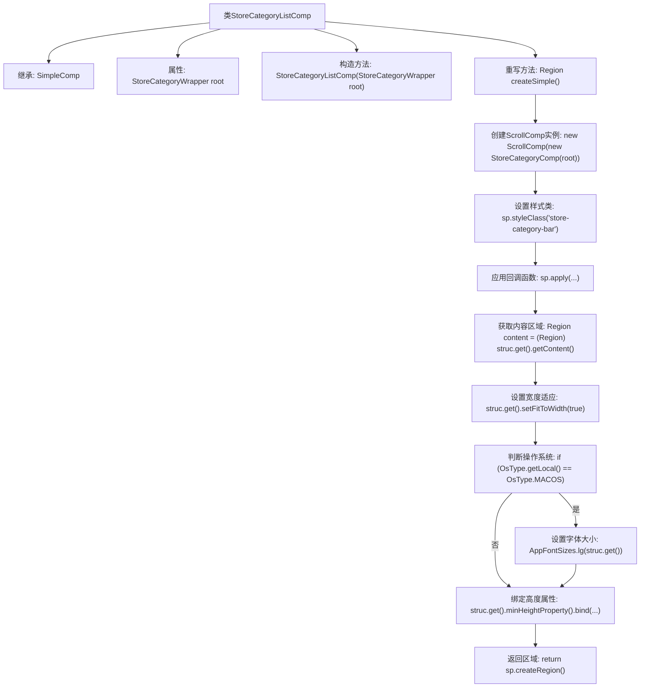

# 基础信息

|      |      |
|------|------|
| 名称 | StoreCategoryListComp |
| 编码语言 | .java |
| 代码路径 | xpipe/app/src/main/java/io/xpipe/app/comp/store/StoreCategoryListComp.java |
| 包名 | io.xpipe.app.comp.store |
| 依赖项 | ['io.xpipe.app.comp.SimpleComp', 'io.xpipe.app.comp.base.ScrollComp', 'io.xpipe.app.core.AppFontSizes', 'io.xpipe.core.process.OsType', 'javafx.beans.binding.Bindings', 'javafx.scene.layout.Region'] |
| 概述说明 | Java类：StoreCategoryListComp继承SimpleComp，包含根分类和滚动区域创建逻辑。 |

# 说明

该代码定义了一个名为StoreCategoryListComp的类，继承自SimpleComp。类中包含一个StoreCategoryWrapper类型的私有成员root，通过构造函数初始化。重写了createSimple方法，创建了一个ScrollComp实例，其内容为StoreCategoryComp组件。设置了滚动条的样式类为store-category-bar，并进行了多项配置：强制适应宽度，在MacOS系统下使用大字体，以及动态计算最小高度（不超过150像素）。最终返回创建的滚动区域。

# 类列表 Class Summary

| 名称   | 类型  | 说明 |
|-------|------|-------------|
| StoreCategoryListComp | class | Java类StoreCategoryListComp继承SimpleComp，通过ScrollComp展示StoreCategoryComp内容，适配不同操作系统并设置高度限制。 |

## 类 StoreCategoryListComp

|      |      |
|------|------|
| 访问范围 | public |
| 类型 | class |
| 名称 | StoreCategoryListComp |
| 说明 | Java类StoreCategoryListComp继承SimpleComp，通过ScrollComp展示StoreCategoryComp内容，适配不同操作系统并设置高度限制。 |

### UML类图

该类图展示了StoreCategoryListComp继承自SimpleComp接口，并包含StoreCategoryWrapper对象。主要功能是通过ScrollComp和StoreCategoryComp创建可滚动的分类列表界面，根据操作系统类型调整字体大小，并动态计算最小高度。涉及与OsType枚举、AppFontSizes工具类和Bindings绑定工具类的交互，体现了跨平台UI组件的自适应特性。

### 内部方法调用关系图

该流程图展示了StoreCategoryListComp类的继承关系和核心方法createSimple()的执行流程。该方法首先创建带滚动条的StoreCategoryComp组件，设置样式后应用回调函数，在回调中处理内容区域的高度绑定逻辑（特别处理MacOS系统的字体大小），最终返回构建好的UI区域。整个过程体现了组件初始化、样式配置、平台适配和动态布局绑定的完整生命周期。

### 字段列表 Field List

| 名称  | 类型  | 说明 |
|-------|-------|------|
| root | StoreCategoryWrapper | 私有终态根目录包装类 |

### 方法列表 Method List

| 名称  | 类型  | 说明 |
|-------|-------|------|
| createSimple | Region | 创建滚动区域组件，绑定高度并适配macOS字体。 |

