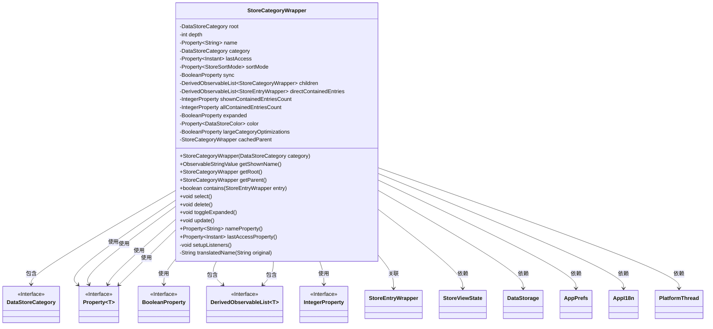

# 基础信息

|      |      |
|------|------|
| 名称 | StoreCategoryWrapper |
| 编码语言 | .java |
| 代码路径 | xpipe/app/src/main/java/io/xpipe/app/comp/store/StoreCategoryWrapper.java |
| 包名 | io.xpipe.app.comp.store |
| 依赖项 | ['io.xpipe.app.core.AppI18n', 'io.xpipe.app.prefs.AppPrefs', 'io.xpipe.app.storage.DataStorage', 'io.xpipe.app.storage.DataStoreCategory', 'io.xpipe.app.storage.DataStoreColor', 'io.xpipe.app.util.DerivedObservableList', 'io.xpipe.app.util.PlatformThread', 'javafx.beans.binding.Bindings', 'javafx.beans.property', 'javafx.beans.value.ObservableStringValue', 'lombok.Getter', 'java.time.Duration', 'java.time.Instant', 'java.util.ArrayList', 'java.util.Optional'] |
| 概述说明 | 存储分类包装类，包含根节点、深度、名称、子项等属性，支持监听更新、筛选和国际化。 |

# 说明

StoreCategoryWrapper是一个用于包装DataStoreCategory的类，提供对类别数据的封装和操作。它包含根类别、深度、名称、最后访问时间、排序模式等属性，以及子类别和直接包含的条目列表。类中实现了监听器机制，用于响应属性变化并更新数据。支持选择、删除、展开/折叠等操作，并能根据过滤条件动态更新显示条目数。名称属性支持多语言翻译，适用于特定预设类别。该类还处理大型类别的性能优化，并在父类别更新时同步状态。

# 类列表 Class Summary

| 名称   | 类型  | 说明 |
|-------|------|-------------|
| StoreCategoryWrapper | class | StoreCategoryWrapper类封装存储类别数据，包含名称、子项、排序模式等属性，支持更新、删除和选择操作。 |

## 类 StoreCategoryWrapper

|      |      |
|------|------|
| 访问范围 | @Getter;public |
| 类型 | class |
| 名称 | StoreCategoryWrapper |
| 说明 | StoreCategoryWrapper类封装存储类别数据，包含名称、子项、排序模式等属性，支持更新、删除和选择操作。 |

### UML类图

这段类图展示了StoreCategoryWrapper类的结构及其与外部组件的关系。该类是一个包装器，用于管理数据存储类别(DataStoreCategory)的视图状态，包含属性监听、子项管理、条目过滤等功能。它通过多个Property类型实现数据绑定，与StoreViewState、DataStorage等核心服务交互，并支持国际化(AppI18n)和偏好设置(AppPrefs)。类中维护了层次结构关系(parent/children)、条目计数、展开状态等视图相关属性，并通过监听器机制实现数据同步。

### 内部方法调用关系图

```mermaid
graph TD
    A["类StoreCategoryWrapper"]
    B["属性: DataStoreCategory root"]
    C["属性: int depth"]
    D["属性: Property<String> name"]
    E["属性: DataStoreCategory category"]
    F["属性: Property<Instant> lastAccess"]
    G["属性: Property<StoreSortMode> sortMode"]
    H["属性: BooleanProperty sync"]
    I["属性: DerivedObservableList<StoreCategoryWrapper> children"]
    J["属性: DerivedObservableList<StoreEntryWrapper> directContainedEntries"]
    K["属性: IntegerProperty shownContainedEntriesCount"]
    L["属性: IntegerProperty allContainedEntriesCount"]
    M["属性: BooleanProperty expanded"]
    N["属性: Property<DataStoreColor> color"]
    O["属性: BooleanProperty largeCategoryOptimizations"]
    P["属性: StoreCategoryWrapper cachedParent"]
    Q["构造方法: StoreCategoryWrapper(DataStoreCategory)"]
    R["方法: ObservableStringValue getShownName()"]
    S["方法: StoreCategoryWrapper getRoot()"]
    T["方法: StoreCategoryWrapper getParent()"]
    U["方法: boolean contains(StoreEntryWrapper)"]
    V["方法: void select()"]
    W["方法: void delete()"]
    X["方法: void toggleExpanded()"]
    Y["方法: void update()"]
    Z["方法: String translatedName(String)"]
    AA["方法: Property<String> nameProperty()"]
    AB["方法: Property<Instant> lastAccessProperty()"]
    AC["私有方法: void setupListeners()"]

    A --> B
    A --> C
    A --> D
    A --> E
    A --> F
    A --> G
    A --> H
    A --> I
    A --> J
    A --> K
    A --> L
    A --> M
    A --> N
    A --> O
    A --> P
    A --> Q
    Q --> AC
    A --> R
    A --> S
    A --> T
    A --> U
    A --> V
    A --> W
    A --> X
    A --> Y
    Y --> Z
    A --> AA
    A --> AB
```

这段代码定义了一个StoreCategoryWrapper类，用于包装DataStoreCategory对象并提供额外的功能。该类包含多个属性用于存储类别信息、访问时间、排序模式等，以及方法用于获取父类别、检查包含关系、更新状态等。构造方法中会计算类别深度并设置监听器，update方法负责同步类别状态。流程图展示了类的主要结构和内部调用关系，突出了属性与方法的组织方式。

### 字段列表 Field List

| 名称  | 类型  | 说明 |
|-------|-------|------|
| sortMode | Property<StoreSortMode> | 私有属性sortMode，类型为Property<StoreSortMode>。 |
| root | DataStoreCategory | 私有终态数据存储类别根节点 |
| cachedParent | StoreCategoryWrapper | 私有变量cachedParent存储父类别。 |
| expanded = new SimpleBooleanProperty() | BooleanProperty | 私有布尔属性expanded，初始化为SimpleBooleanProperty实例。 |
| name | Property<String> | 私有字符串属性name |
| children | DerivedObservableList<StoreCategoryWrapper> | 私有最终派生可观察列表存储子分类包装 |
| directContainedEntries | DerivedObservableList<StoreEntryWrapper> | 私有最终派生可观察列表，存储条目包装的直接包含项。 |
| depth | int | 私有整型变量depth |
| shownContainedEntriesCount = new SimpleIntegerProperty() | IntegerProperty | 私有整型属性shownContainedEntriesCount初始化为SimpleIntegerProperty实例。 |
| color = new SimpleObjectProperty<>() | Property<DataStoreColor> | 私有属性color，类型为Property<DataStoreColor>，初始化为SimpleObjectProperty。 |
| allContainedEntriesCount = new SimpleIntegerProperty() | IntegerProperty | 私有整型属性allContainedEntriesCount初始化为SimpleIntegerProperty实例。 |
| sync | BooleanProperty | 私有布尔属性sync |
| lastAccess | Property<Instant> | 私有属性，记录最后访问时间。 |
| category | DataStoreCategory | 私有数据存储类别变量。 |
| largeCategoryOptimizations = new SimpleBooleanProperty() | BooleanProperty | 私有布尔属性largeCategoryOptimizations初始化为SimpleBooleanProperty实例。 |

### 方法列表 Method List

| 名称  | 类型  | 说明 |
|-------|-------|------|
| delete | void | 删除子项及存储类别数据。 |
| update | void | 更新类别信息，检查状态，同步数据，计算条目数，优化大类别处理。 |
| toggleExpanded | void | 切换展开状态的函数，反转当前值。 |
| getRoot | StoreCategoryWrapper | 获取根目录分类包装器 |
| contains | boolean | 检查条目是否属于当前类别或其子类别。 |
| select | void | Java方法：通过UI线程更新当前活动分类为this。 |
| nameProperty | Property<String> | 公开返回字符串属性name的方法。 |
| getShownName | ObservableStringValue | 方法返回可观察字符串，根据审查模式决定显示原名称或星号替换。依赖AppPrefs和nameProperty。 |
| lastAccessProperty | Property<Instant> | 返回最后访问时间的属性对象。 |
| setupListeners | void | 设置监听器：更新名称、分类、显示子分类、语言和排序模式变化时触发相应操作。 |
| getParent | StoreCategoryWrapper | 获取父类，缓存未命中时从StoreViewState查找匹配项，无父类返回null。 |
| translatedName | String | 方法根据输入字符串返回对应的翻译结果，未匹配时返回原字符串。 |

