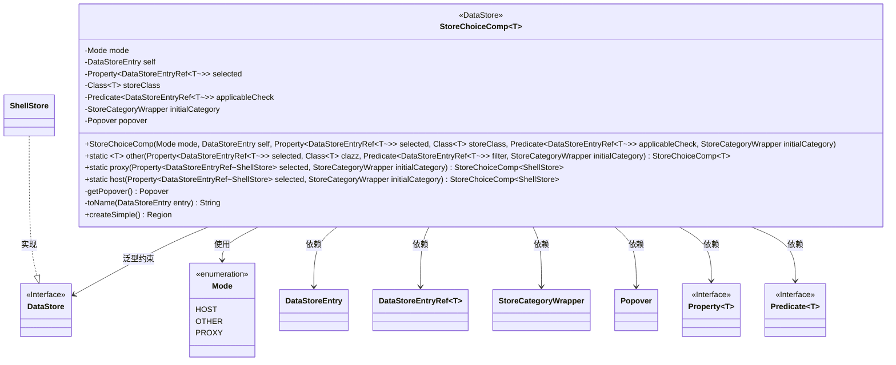
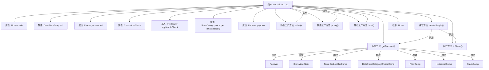

# 基础信息

|      |      |
|------|------|
| 名称 | StoreChoiceComp |
| 编码语言 | .java |
| 代码路径 | xpipe/app/src/main/java/io/xpipe/app/comp/store/StoreChoiceComp.java |
| 包名 | io.xpipe.app.comp.store |
| 依赖项 | ['io.xpipe.app.comp.Comp', 'io.xpipe.app.comp.SimpleComp', 'io.xpipe.app.comp.base', 'io.xpipe.app.core.AppFontSizes', 'io.xpipe.app.core.AppI18n', 'io.xpipe.app.core.window.AppDialog', 'io.xpipe.app.ext.LocalStore', 'io.xpipe.app.ext.ShellStore', 'io.xpipe.app.storage.DataStorage', 'io.xpipe.app.storage.DataStoreEntry', 'io.xpipe.app.storage.DataStoreEntryRef', 'io.xpipe.app.util.BindingsHelper', 'io.xpipe.app.util.DataStoreCategoryChoiceComp', 'io.xpipe.app.util.LabelGraphic', 'io.xpipe.core.store.DataStore', 'javafx.beans.binding.Bindings', 'javafx.beans.property.Property', 'javafx.beans.property.SimpleBooleanProperty', 'javafx.beans.property.SimpleObjectProperty', 'javafx.beans.property.SimpleStringProperty', 'javafx.collections.ListChangeListener', 'javafx.geometry.Insets', 'javafx.geometry.Pos', 'javafx.scene.control.MenuButton', 'javafx.scene.input.MouseButton', 'javafx.scene.layout.Region', 'javafx.scene.layout.StackPane', 'javafx.scene.layout.VBox', 'atlantafx.base.controls.Popover', 'atlantafx.base.theme.Styles', 'lombok.RequiredArgsConstructor', 'org.kordamp.ikonli.javafx.FontIcon', 'java.util.List', 'java.util.Set', 'java.util.function.Predicate'] |
| 概述说明 | StoreChoiceComp类用于选择数据存储条目，支持代理、主机和其他模式，包含弹窗交互和条件过滤功能。 |

# 说明

StoreChoiceComp是一个泛型类，继承自SimpleComp，用于数据存储选择功能。它包含模式枚举（HOST/OTHER/PROXY）、自身数据存储引用、选中项属性、存储类类型、适用性检查谓词和初始分类等核心字段。提供三种静态工厂方法创建不同模式的实例。核心功能通过getPopover方法实现，该方法构建并返回一个包含分类选择、过滤框、添加按钮和存储条目列表的弹出面板。列表会根据适用性条件动态过滤，支持键盘导航和右键清除选择。主界面显示为一个带下拉箭头的按钮，点击触发弹出面板，显示当前选中存储名称和图标。

# 类列表 Class Summary

| 名称   | 类型  | 说明 |
|-------|------|-------------|
| StoreChoiceComp | class | StoreChoiceComp类用于选择数据存储条目，支持主机、代理等模式，包含弹出菜单和过滤功能。 |

## 类 StoreChoiceComp

|      |      |
|------|------|
| 访问范围 | @RequiredArgsConstructor;public |
| 类型 | class |
| 名称 | StoreChoiceComp |
| 说明 | StoreChoiceComp类用于选择数据存储条目，支持主机、代理等模式，包含弹出菜单和过滤功能。 |

### UML类图

这段代码展示了一个泛型类`StoreChoiceComp<T>`，用于创建数据存储选择组件。该类通过模式枚举(Mode)区分不同选择类型，支持代理(proxy)和主机(host)等特定场景。核心功能包括构建弹出选择窗口(Popover)、处理选择逻辑、以及渲染UI组件。类图中清晰地展示了与数据存储相关的接口和实现关系，包括泛型参数约束和各类依赖关系。该组件具有较强的可配置性，支持自定义过滤条件和初始类别设置。

### 内部方法调用关系图

这段代码实现了一个可复用的数据存储选择组件，主要功能包括：通过静态工厂方法创建不同模式（HOST/OTHER/PROXY）的选择器，动态构建带有分类筛选功能的弹出面板（Popover），以及处理用户选择逻辑。核心流程涉及弹出面板的懒加载、数据过滤绑定、UI组件动态生成和事件处理，特别注重对数据存储条目有效性检查和类别导航的支持。

### 字段列表 Field List

| 名称  | 类型  | 说明 |
|-------|-------|------|
| applicableCheck | Predicate<DataStoreEntryRef<T>> | 私有谓词检查DataStoreEntryRef<T>适用性。 |
| mode | Mode | 私有不可变模式变量。 |
| storeClass | Class<T> | 私有终态类存储类型T |
| popover | Popover | 私有弹窗变量popover |
| selected | Property<DataStoreEntryRef<T>> | 私有属性，存储DataStoreEntryRef<T>类型的选择项。 |
| initialCategory | StoreCategoryWrapper | 初始类别存储包装器 |
| self | DataStoreEntry | 私有DataStoreEntry实例self |

### 方法列表 Method List

| 名称  | 类型  | 说明 |
|-------|-------|------|
| proxy | StoreChoiceComp<ShellStore> | 静态方法创建代理模式的StoreChoiceComp实例，参数为selected和initialCategory。 |
| other | StoreChoiceComp<T> | 静态方法创建存储选择组件，含模式、属性、类、过滤器和初始分类参数。 |
| host | StoreChoiceComp<ShellStore> | 静态方法host创建StoreChoiceComp实例，用于主机模式下的存储选择。 |
| getPopover | Popover | 创建并配置弹出窗口，包含分类选择、过滤和添加按钮，用于选择兼容连接。 |
| toName | String | 方法toName根据entry和mode返回名称：若entry为空返回null；若mode为PROXY且entry为LocalStore返回"none"；否则返回entry的名称。 |
| createSimple | Region | 创建按钮组件，绑定选择值并设置图标，点击显示弹出框，右键重置选择，包含下拉图标布局。 |

