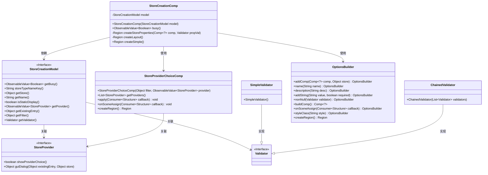
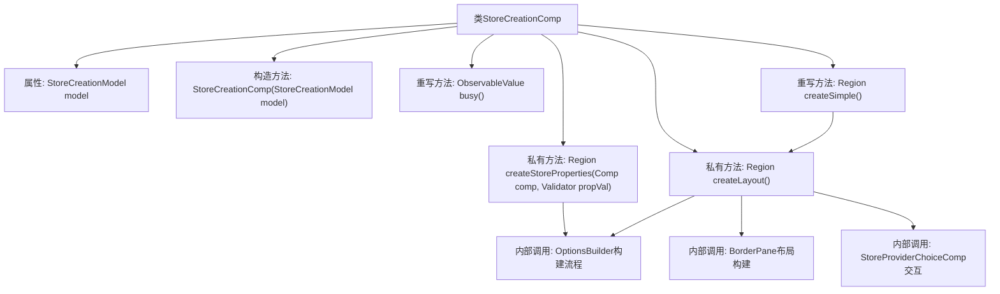

# 基础信息

|      |      |
|------|------|
| 名称 | StoreCreationComp |
| 编码语言 | .java |
| 代码路径 | xpipe/app/src/main/java/io/xpipe/app/comp/store/StoreCreationComp.java |
| 包名 | io.xpipe.app.comp.store |
| 依赖项 | ['io.xpipe.app.comp.Comp', 'io.xpipe.app.comp.augment.GrowAugment', 'io.xpipe.app.comp.base', 'io.xpipe.app.util', 'javafx.beans.property', 'javafx.beans.value.ObservableValue', 'javafx.geometry.Insets', 'javafx.scene.control', 'javafx.scene.control.skin.ScrollPaneSkin', 'javafx.scene.layout.BorderPane', 'javafx.scene.layout.Priority', 'javafx.scene.layout.Region', 'javafx.scene.layout.VBox', 'net.synedra.validatorfx.GraphicDecorationStackPane', 'java.util.List'] |
| 概述说明 | StoreCreationComp类扩展ModalOverlayContentComp，包含模型处理、布局创建和属性验证功能。 |

# 说明

StoreCreationComp是一个继承自ModalOverlayContentComp的Java类，用于创建商店界面。它包含一个StoreCreationModel实例，通过构造函数初始化。类中定义了busy方法返回模型的忙碌状态。createStoreProperties方法构建商店属性区域，包含名称、描述等字段，并处理静态显示逻辑。createLayout方法构建整体布局，使用BorderPane作为容器，动态加载商店提供者选择组件和属性区域，根据条件显示或隐藏提供者选项。布局包含滚动面板、分隔符和验证逻辑，最终通过createSimple方法返回完整布局区域。

# 类列表 Class Summary

| 名称   | 类型  | 说明 |
|-------|------|-------------|
| StoreCreationComp | class | 商店创建组件类，继承模态窗口，含模型处理、属性创建和布局构建功能。 |

## 类 StoreCreationComp

|      |      |
|------|------|
| 访问范围 | public |
| 类型 | class |
| 名称 | StoreCreationComp |
| 说明 | 商店创建组件类，继承模态窗口，含模型处理、属性创建和布局构建功能。 |

### UML类图

类图描述：该图展示了StoreCreationComp组件及其相关类的结构关系。StoreCreationComp作为模态覆盖层内容组件，依赖StoreCreationModel获取数据和状态，使用OptionsBuilder构建UI元素，并通过StoreProviderChoiceComp处理提供者选择逻辑。验证器体系采用SimpleValidator和ChainedValidator实现，StoreProvider接口定义了提供者的GUI行为。整体结构体现了商店创建功能的模块化设计，包含动态UI生成、状态管理和验证机制。

### 内部方法调用关系图

这段代码展示了一个商店创建组件(StoreCreationComp)的JavaFX实现，继承自ModalOverlayContentComp。核心功能包括：通过createLayout()构建动态UI布局，使用BorderPane作为基础容器；createStoreProperties()方法利用OptionsBuilder模式创建可验证的表单控件；与StoreProviderChoiceComp交互处理提供者选择逻辑。代码通过观察者模式监听模型变化，采用装饰器模式增强UI控件，并实现了复杂的验证器链式调用机制。整体流程展现了从模型数据到可视化组件的完整转换过程。

### 字段列表 Field List

| 名称  | 类型  | 说明 |
|-------|-------|------|
| model | StoreCreationModel | 私有存储创建模型实例。 |

### 方法列表 Method List

| 名称  | 类型  | 说明 |
|-------|-------|------|
| createStoreProperties | Region | 创建存储属性的私有方法，包含名称、描述、非空验证及场景处理。 |
| createLayout | Region | 创建布局方法，包含提供者选择、属性验证和滚动面板设置。 |
| createSimple | Region | 重写createSimple方法，调用createLayout返回Region对象。 |
| busy | ObservableValue<Boolean> | 重写busy方法，返回model的busy状态。 |

