# 基础信息

|      |      |
|------|------|
| 名称 | StoreCreationDialog |
| 编码语言 | .java |
| 代码路径 | xpipe/app/src/main/java/io/xpipe/app/comp/store/StoreCreationDialog.java |
| 包名 | io.xpipe.app.comp.store |
| 依赖项 | ['io.xpipe.app.comp.base.ModalButton', 'io.xpipe.app.comp.base.ModalOverlay', 'io.xpipe.app.core.AppI18n', 'io.xpipe.app.core.AppLayoutModel', 'io.xpipe.app.core.window.AppDialog', 'io.xpipe.app.ext.DataStoreCreationCategory', 'io.xpipe.app.ext.DataStoreProvider', 'io.xpipe.app.ext.DataStoreProviders', 'io.xpipe.app.issue.ErrorEvent', 'io.xpipe.app.prefs.AppPrefs', 'io.xpipe.app.storage.DataStorage', 'io.xpipe.app.storage.DataStoreEntry', 'io.xpipe.app.util', 'io.xpipe.core.store.DataStore', 'javafx.beans.binding.Bindings', 'javafx.beans.property.SimpleBooleanProperty', 'javafx.beans.property.SimpleObjectProperty', 'java.util.function.Consumer', 'java.util.function.Predicate'] |
| 概述说明 | 商店创建对话框类，支持编辑和创建数据存储条目，包含验证和扫描功能。 |

# 说明

StoreCreationDialog类提供创建和编辑数据存储条目的功能。包含showEdit和showCreation两个公开方法，分别用于编辑现有条目和创建新条目。内部通过show方法统一处理界面显示逻辑，使用ModalOverlay构建对话框界面。类中处理了数据存储的验证、更新、类别选择等逻辑，并支持扫描对话框的触发。对话框包含文档、连接、跳过和完成等按钮，根据条件动态控制可见性。整体实现了数据存储条目的全生命周期管理界面。

# 类列表 Class Summary

| 名称   | 类型  | 说明 |
|-------|------|-------------|
| StoreCreationDialog | class | 商店创建对话框类，支持编辑和创建数据存储条目，包含验证和扫描功能。 |

## 类 StoreCreationDialog

|      |      |
|------|------|
| 访问范围 | public |
| 类型 | class |
| 名称 | StoreCreationDialog |
| 说明 | 商店创建对话框类，支持编辑和创建数据存储条目，包含验证和扫描功能。 |

### UML类图

```mermaid
classDiagram
    class StoreCreationDialog {
        +showEdit(DataStoreEntry e)
        +showEdit(DataStoreEntry e, Consumer~DataStoreEntry~ c)
        +showCreation(DataStoreProvider selected, DataStoreCreationCategory category)
        +showCreation(DataStore base, DataStoreCreationCategory category, Consumer~DataStoreEntry~ listener, boolean selectCategory)
        -show(String initialName, DataStoreProvider provider, DataStore s, Predicate~DataStoreProvider~ filter, StoreCreationConsumer con, boolean staticDisplay, DataStoreEntry existingEntry)
        -showInvalidConfirmAlert() boolean
        -createModalOverlay(StoreCreationModel model) ModalOverlay
    }

    class DataStoreEntry {
        +String getName()
        +DataStore getStore()
        +DataStoreProvider getProvider()
        +Validity getValidity()
        +void setName(String name)
        +String getCategoryUuid()
    }

    class DataStore {
        // 数据存储基础类
    }

    class DataStoreProvider {
        +DataStore defaultStore(DataStoreCreationCategory category)
        +String getDisplayIconFileName(DataStore store)
        +boolean shouldShowScan()
        +DataStoreCreationCategory getCreationCategory()
    }

    class DataStoreCreationCategory {
        // 存储创建分类
    }

    class StoreCreationConsumer {
        <<Interface>>
        +accept(DataStoreEntry newE, boolean validated)
    }

    class StoreCreationModel {
        -SimpleObjectProperty~DataStoreProvider~ provider
        -SimpleObjectProperty~DataStore~ store
        -Predicate~DataStoreProvider~ filter
        -String initialName
        -DataStoreEntry existingEntry
        -boolean staticDisplay
        -StoreCreationConsumer con
        +String storeTypeNameKey()
        +void showDocs()
        +void connect()
        +void commit(boolean validated)
        +void finish()
        +SimpleBooleanProperty getFinished()
        +SimpleBooleanProperty getSkippable()
        +boolean canShowDocs()
        +boolean canConnect()
    }

    class ModalOverlay {
        +of(String titleKey, Node content) ModalOverlay
        +addButton(ModalButton button)
        +show()
        +showAndWait()
        +hide()
        +close()
        +setRequireCloseButtonForClose(boolean required)
    }

    class ModalButton {
        +ModalButton(String textKey, Runnable action, boolean closeOnClick, boolean isDefault)
        +augment(Consumer~ModalButton~ augmenter)
    }

    class DataStorage {
        +get() DataStorage
        +List~DataStoreEntry~ getStoreEntries()
        +void addStoreEntryIfNotPresent(DataStoreEntry entry)
        +void updateEntry(DataStoreEntry oldEntry, DataStoreEntry newEntry)
        +Optional~DataStoreCategory~ getStoreCategoryIfPresent(String uuid)
    }

    class StoreViewState {
        +get() StoreViewState
        +void triggerStoreListUpdate()
        +ObjectProperty~CategoryWrapper~ getActiveCategory()
        +CategoryWrapper getCategoryWrapper(DataStoreCategory cat)
    }

    class AppPrefs {
        +get() AppPrefs
        +BooleanProperty openConnectionSearchWindowOnConnectionCreation()
    }

    class ScanDialog {
        +showSingleAsync(DataStoreEntry entry)
    }

    StoreCreationDialog --> DataStoreEntry : 编辑/创建
    StoreCreationDialog --> DataStoreProvider : 获取默认存储
    StoreCreationDialog --> StoreCreationConsumer : 回调处理
    StoreCreationDialog --> StoreCreationModel : 创建模型
    StoreCreationDialog --> ModalOverlay : 显示模态窗口
    StoreCreationModel --> DataStoreProvider : 依赖
    StoreCreationModel --> DataStore : 依赖
    StoreCreationModel --> StoreCreationConsumer : 依赖
    ModalOverlay --> ModalButton : 包含
    DataStorage --> DataStoreEntry : 管理
    StoreViewState --> DataStoreCategory : 管理分类
    ScanDialog --> DataStoreEntry : 扫描连接
```

这段代码实现了一个商店创建/编辑对话框系统，主要包含以下功能：1) 提供两种入口方法（showEdit/showCreation）处理存储条目的编辑和创建；2) 使用StoreCreationModel维护对话框状态；3) 通过ModalOverlay展示交互界面；4) 与DataStorage系统集成实现数据持久化。系统采用观察者模式处理异步操作，支持自定义验证逻辑和回调处理，并提供了完整的UI控制流程。

### 内部方法调用关系图

这段代码实现了一个商店创建/编辑对话框系统，主要包含两种操作模式：编辑现有商店条目和创建新商店条目。流程图展示了类的方法结构和调用关系，时序图则详细描述了两种操作模式下的交互流程。系统通过DataStorage管理数据存储，使用ModalOverlay显示交互界面，并支持条件触发的扫描对话框显示和类别状态更新。代码处理了数据验证、异步操作、用户界面交互等多种场景，体现了完整的数据管理流程。

### 字段列表 Field List

| 名称  | 类型  | 说明 |
|-------|-------|------|

### 方法列表 Method List

| 名称  | 类型  | 说明 |
|-------|-------|------|
| showEdit | void | 静态方法显示编辑界面，处理数据存储条目更新，触发列表刷新和扫描对话框。 |
| showCreation | void | 静态方法显示数据存储创建界面，处理新建条目逻辑，支持扫描和分类选择。 |
| showCreation | void | 静态方法显示数据存储创建界面，参数为选定提供者和类别。 |
| showEdit | void | 静态方法显示编辑界面，接受数据存储条目参数。 |
| show | void | 私有方法显示数据存储创建界面，初始化属性并展示模态窗口。 |
| showInvalidConfirmAlert | boolean | 显示无效确认弹窗，含重试和跳过按钮，返回跳过状态。 |
| createModalOverlay | ModalOverlay | 创建模态窗口组件，设置宽度、图标和按钮，绑定事件和可见性，处理关闭逻辑。 |

