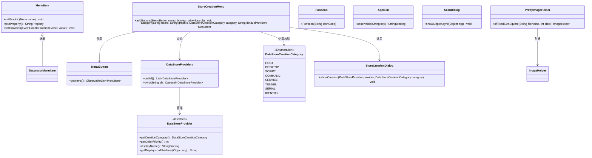
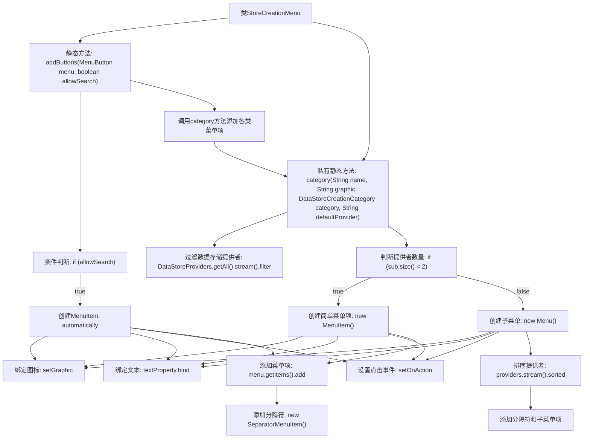

# 基础信息

|      |      |
|------|------|
| 名称 | StoreCreationMenu |
| 编码语言 | .java |
| 代码路径 | xpipe/app/src/main/java/io/xpipe/app/comp/store/StoreCreationMenu.java |
| 包名 | io.xpipe.app.comp.store |
| 依赖项 | ['io.xpipe.app.comp.base.PrettyImageHelper', 'io.xpipe.app.core.AppI18n', 'io.xpipe.app.ext.DataStoreCreationCategory', 'io.xpipe.app.ext.DataStoreProviders', 'io.xpipe.app.util.ScanDialog', 'javafx.application.Platform', 'javafx.scene.control.Menu', 'javafx.scene.control.MenuButton', 'javafx.scene.control.MenuItem', 'javafx.scene.control.SeparatorMenuItem', 'org.kordamp.ikonli.javafx.FontIcon', 'java.util.Comparator'] |
| 概述说明 | 为菜单添加创建各类数据存储的按钮选项。 |

# 说明

该代码描述了一个用于创建数据存储的菜单类StoreCreationMenu。主要功能包括根据参数allowSearch决定是否添加搜索按钮，以及添加多个预设类别的数据存储创建选项，如主机、桌面、脚本、命令、服务、隧道、串口和身份等。每个类别通过category方法生成菜单项，该方法会根据提供程序数量决定显示单个菜单项或带子菜单的选项。菜单项包含图标、本地化文本和点击事件处理，点击后会打开对应的创建对话框。对于多提供程序的类别，会按优先级排序并分组显示。

# 类列表 Class Summary

| 名称   | 类型  | 说明 |
|-------|------|-------------|
| StoreCreationMenu | class | 创建菜单按钮，支持搜索及多种数据存储类别添加。 |

## 类 StoreCreationMenu

|      |      |
|------|------|
| 访问范围 | public |
| 类型 | class |
| 名称 | StoreCreationMenu |
| 说明 | 创建菜单按钮，支持搜索及多种数据存储类别添加。 |

### UML类图

这段代码描述了一个商店创建菜单系统，主要包含StoreCreationMenu类及其相关依赖。StoreCreationMenu通过addButtons方法动态构建菜单项，根据allowSearch参数决定是否添加搜索功能，并使用category方法创建不同类型的菜单项。系统涉及菜单项管理、国际化支持、图标显示、对话框交互等功能，通过DataStoreProviders获取不同类别的数据存储提供者，最终通过StoreCreationDialog展示创建界面。代码结构清晰，采用了JavaFX的UI组件和事件处理机制。

### 内部方法调用关系图

这段代码流程图展示了StoreCreationMenu类的主要结构和工作流程。该类包含两个核心方法：addButtons用于构建菜单按钮，根据allowSearch参数决定是否添加搜索功能；category方法负责创建不同类型的菜单项，根据数据存储提供者数量决定生成简单菜单项还是带子菜单的复杂项。流程从主方法开始，通过条件分支和循环结构动态构建菜单层次，最终形成一个完整的交互式菜单系统。

### 字段列表 Field List

| 名称  | 类型  | 说明 |
|-------|-------|------|

### 方法列表 Method List

| 名称  | 类型  | 说明 |
|-------|-------|------|
| category | MenuItem | 创建菜单项，根据类别筛选数据存储提供者，支持单选项或多级菜单。 |
| addButtons | void | 为菜单添加按钮，包括搜索、主机、桌面、脚本、命令、服务、隧道、串口和身份选项。 |

