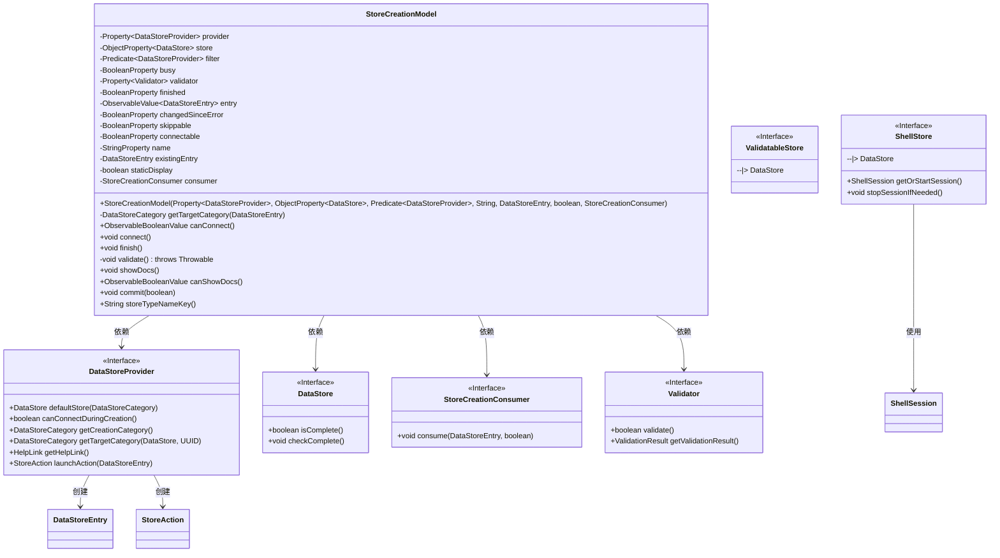

# 基础信息

|      |      |
|------|------|
| 名称 | StoreCreationModel |
| 编码语言 | .java |
| 代码路径 | xpipe/app/src/main/java/io/xpipe/app/comp/store/StoreCreationModel.java |
| 包名 | io.xpipe.app.comp.store |
| 依赖项 | ['io.xpipe.app.ext.DataStoreProvider', 'io.xpipe.app.ext.ShellStore', 'io.xpipe.app.issue.ErrorEvent', 'io.xpipe.app.storage.DataStorage', 'io.xpipe.app.storage.DataStoreCategory', 'io.xpipe.app.storage.DataStoreEntry', 'io.xpipe.app.util', 'io.xpipe.core.process.ShellTtyState', 'io.xpipe.core.store.DataStore', 'io.xpipe.core.store.ValidatableStore', 'io.xpipe.core.util.ValidationException', 'javafx.application.Platform', 'javafx.beans.binding.Bindings', 'javafx.beans.property', 'javafx.beans.value.ObservableBooleanValue', 'javafx.beans.value.ObservableValue', 'lombok.AccessLevel', 'lombok.Getter', 'lombok.experimental.FieldDefaults', 'java.util.UUID', 'java.util.function.Predicate'] |
| 概述说明 | 存储创建模型类，包含属性、验证及连接逻辑。 |

# 说明

StoreCreationModel类用于管理数据存储创建过程，包含多个属性如provider（数据存储提供者）、store（数据存储对象）、filter（提供者筛选条件）、busy（忙碌状态标志）等。构造函数初始化这些属性并设置监听器，当store或name变化时更新changedSinceError标志。提供者变更时重置store，并根据条件设置connectable属性。entry属性通过绑定name和store动态生成DataStoreEntry对象。包含连接、完成创建、验证、提交等方法，处理数据存储的创建、验证及提交逻辑，同时支持文档查看功能。通过getTargetCategory方法确定目标分类，处理不同分类场景。

# 类列表 Class Summary

| 名称   | 类型  | 说明 |
|-------|------|-------------|
| StoreCreationModel | class | 存储创建模型类，管理数据存储提供者、名称、验证等属性，支持连接、完成操作及文档查看。 |

## 类 StoreCreationModel

|      |      |
|------|------|
| 访问范围 | @FieldDefaults(makeFinal = true, level = AccessLevel.PRIVATE);@Getter;public |
| 类型 | class |
| 名称 | StoreCreationModel |
| 说明 | 存储创建模型类，管理数据存储提供者、名称、验证等属性，支持连接、完成操作及文档查看。 |

### UML类图

这段代码实现了一个商店创建模型(StoreCreationModel)，用于管理数据存储的创建流程。该模型包含多个属性如提供者(provider)、存储(store)、验证器(validator)等，并提供了连接(connect)、完成(finish)、提交(commit)等操作方法。类图中展示了StoreCreationModel与多个接口的依赖关系，包括DataStoreProvider、DataStore、Validator等，体现了该模型的核心职责是协调数据存储的创建过程，处理验证逻辑，并与UI层进行交互。代码中特别关注了各种边界条件处理，如空值检查、验证异常处理等。

### 内部方法调用关系图

```mermaid
graph TD
    A["类StoreCreationModel"]
    B["属性: Property<DataStoreProvider> provider"]
    C["属性: ObjectProperty<DataStore> store"]
    D["属性: Predicate<DataStoreProvider> filter"]
    E["属性: BooleanProperty busy"]
    F["属性: Property<Validator> validator"]
    G["属性: BooleanProperty finished"]
    H["属性: ObservableValue<DataStoreEntry> entry"]
    I["属性: BooleanProperty changedSinceError"]
    J["属性: BooleanProperty skippable"]
    K["属性: BooleanProperty connectable"]
    L["属性: StringProperty name"]
    M["属性: DataStoreEntry existingEntry"]
    N["属性: boolean staticDisplay"]
    O["属性: StoreCreationConsumer consumer"]

    P["构造方法: StoreCreationModel"]
    Q["方法: getTargetCategory"]
    R["方法: canConnect"]
    S["方法: connect"]
    T["方法: finish"]
    U["方法: validate"]
    V["方法: showDocs"]
    W["方法: canShowDocs"]
    X["方法: commit"]
    Y["方法: storeTypeNameKey"]

    A --> B
    A --> C
    A --> D
    A --> E
    A --> F
    A --> G
    A --> H
    A --> I
    A --> J
    A --> K
    A --> L
    A --> M
    A --> N
    A --> O
    A --> P
    A --> Q
    A --> R
    A --> S
    A --> T
    T --> U
    A --> V
    A --> W
    A --> X
    A --> Y
```

这段代码定义了一个`StoreCreationModel`类，用于管理数据存储创建的整个过程。该类包含多个属性用于跟踪存储提供者、存储对象、验证状态等，并提供了构造方法初始化这些属性。主要方法包括`finish`用于完成存储创建并验证数据，`connect`用于连接存储，`validate`用于验证存储的完整性，以及`commit`用于提交创建结果。此外，还包含辅助方法如`getTargetCategory`用于确定目标分类，`canConnect`和`canShowDocs`用于检查操作是否可用。整个类通过属性绑定和监听器实现动态响应。

### 字段列表 Field List

| 名称  | 类型  | 说明 |
|-------|-------|------|
| changedSinceError = new SimpleBooleanProperty() | BooleanProperty | 布尔属性changedSinceError初始化为SimpleBooleanProperty实例。 |
| existingEntry | DataStoreEntry | 数据存储条目现有实例。 |
| store | ObjectProperty<DataStore> | 数据存储对象引用 |
| entry | ObservableValue<DataStoreEntry> | 可观察数据存储条目 |
| busy = new SimpleBooleanProperty() | BooleanProperty | 定义布尔属性busy，初始化为SimpleBooleanProperty实例。 |
| finished = new SimpleBooleanProperty() | BooleanProperty | 创建布尔属性finished，初始化为SimpleBooleanProperty。 |
| filter | Predicate<DataStoreProvider> | 数据存储提供者过滤谓词。 |
| skippable = new SimpleBooleanProperty() | BooleanProperty | 定义布尔属性skippable |
| staticDisplay | boolean | 布尔变量staticDisplay声明。 |
| provider | Property<DataStoreProvider> | 数据存储提供者属性 |
| name | StringProperty | 字符串属性name |
| connectable = new SimpleBooleanProperty() | BooleanProperty | 布尔属性connectable初始化为SimpleBooleanProperty实例。 |
| consumer | StoreCreationConsumer | 创建StoreCreationConsumer实例。 |
| validator = new SimpleObjectProperty<>(new SimpleValidator()) | Property<Validator> | 创建属性对象，初始化为简单验证器实例。 |

### 方法列表 Method List

| 名称  | 类型  | 说明 |
|-------|-------|------|
| showDocs | void | 打开帮助文档链接 |
| validate | void | 验证存储对象完整性，若为ShellStore则检查会话支持性，不兼容则停止会话。 |
| getTargetCategory | DataStoreCategory | 获取目标分类，处理默认及特殊分类情况，返回有效分类。 |
| canConnect | ObservableBooleanValue | 检查连接条件：非连接状态或存储值为空/未完成。 |
| finish | void | 方法finish检查状态后验证数据，通过则异步提交，失败处理错误并清理。 |
| connect | void | 连接数据存储并异步执行操作。 |
| canShowDocs | ObservableBooleanValue | 检查provider值或其帮助链接是否为空，返回布尔结果。 |
| commit | void | 方法提交数据，若未完成则标记完成并调用消费者处理数据。 |
| storeTypeNameKey | String | 方法根据提供者类型返回存储类型名称键：空或全连接返回"connection"，全脚本返回"script"，否则返回"identity"。 |

