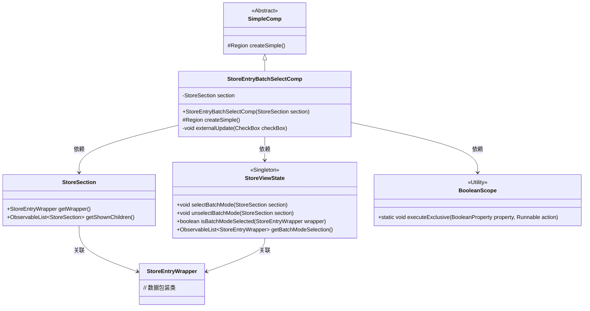
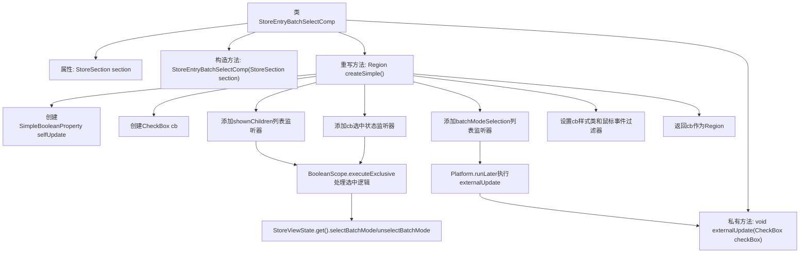

# 基础信息

|      |      |
|------|------|
| 名称 | StoreEntryBatchSelectComp |
| 编码语言 | .java |
| 代码路径 | xpipe/app/src/main/java/io/xpipe/app/comp/store/StoreEntryBatchSelectComp.java |
| 包名 | io.xpipe.app.comp.store |
| 依赖项 | ['io.xpipe.app.comp.SimpleComp', 'io.xpipe.app.util.BooleanScope', 'javafx.application.Platform', 'javafx.beans.property.SimpleBooleanProperty', 'javafx.collections.ListChangeListener', 'javafx.scene.control.CheckBox', 'javafx.scene.input.MouseButton', 'javafx.scene.input.MouseEvent', 'javafx.scene.layout.Region'] |
| 概述说明 | StoreEntryBatchSelectComp类实现批量选择功能，通过复选框控制StoreSection的批量模式状态。 |

# 说明

StoreEntryBatchSelectComp是一个继承自SimpleComp的类，用于管理批量选择模式。它包含一个StoreSection类型的成员变量section。类中创建了一个复选框控件，支持不确定状态，并通过监听器处理选中状态变化。当复选框状态改变时，会更新StoreViewState中的批量选择模式。同时，该类还监听批量模式选择列表和子节点列表的变化，动态调整复选框状态。复选框添加了鼠标事件过滤器，点击时切换选中状态。externalUpdate方法根据当前section及其子节点的选择状态更新复选框的选中和不确定状态。

# 类列表 Class Summary

| 名称   | 类型  | 说明 |
|-------|------|-------------|
| StoreEntryBatchSelectComp | class | StoreEntryBatchSelectComp类实现批量选择功能，通过复选框控制StoreSection的批量模式状态，并监听状态变化更新UI。 |

## 类 StoreEntryBatchSelectComp

|      |      |
|------|------|
| 访问范围 | public |
| 类型 | class |
| 名称 | StoreEntryBatchSelectComp |
| 说明 | StoreEntryBatchSelectComp类实现批量选择功能，通过复选框控制StoreSection的批量模式状态，并监听状态变化更新UI。 |

### UML类图

这段代码展示了一个批量选择组件`StoreEntryBatchSelectComp`，继承自`SimpleComp`，用于管理商店条目批量选择状态。核心功能包括：通过复选框控制批量模式、监听选择状态变化、处理子项选择状态同步。类图中包含6个主要类，展示了继承关系、依赖关系和关键方法调用。组件与`StoreViewState`单例交互管理全局选择状态，使用`BooleanScope`工具类确保线程安全操作。

### 内部方法调用关系图

这段代码实现了一个批量选择组件，主要功能是通过CheckBox控制StoreSection的批量选择模式。流程图展示了从类结构到核心方法createSimple()的执行流程，包括属性初始化、事件监听器设置、状态同步逻辑等关键步骤。组件会响应CheckBox状态变化、批量选择列表变更和子节点变化三种事件，通过StoreViewState管理批量选择状态，并使用externalUpdate方法保持UI与数据同步。

### 字段列表 Field List

| 名称  | 类型  | 说明 |
|-------|-------|------|
| section | StoreSection | 私有存储区段对象。 |

### 方法列表 Method List

| 名称  | 类型  | 说明 |
|-------|-------|------|
| createSimple | Region | 创建复选框控件，绑定批量模式选择状态，监听列表变化并更新UI。 |
| externalUpdate | void | 方法更新复选框状态：根据条件设置选中和不确定状态，无子项时取消不确定状态。 |

