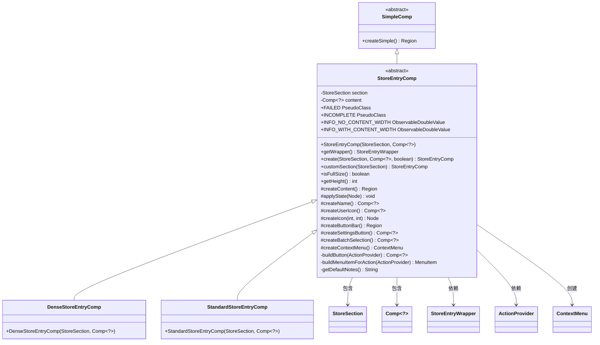

# 基础信息

|      |      |
|------|------|
| 名称 | StoreEntryComp |
| 编码语言 | .java |
| 代码路径 | xpipe/app/src/main/java/io/xpipe/app/comp/store/StoreEntryComp.java |
| 包名 | io.xpipe.app.comp.store |
| 依赖项 | ['io.xpipe.app.comp.Comp', 'io.xpipe.app.comp.SimpleComp', 'io.xpipe.app.comp.SimpleCompStructure', 'io.xpipe.app.comp.augment.ContextMenuAugment', 'io.xpipe.app.comp.augment.GrowAugment', 'io.xpipe.app.comp.base.IconButtonComp', 'io.xpipe.app.comp.base.LabelComp', 'io.xpipe.app.comp.base.LoadingOverlayComp', 'io.xpipe.app.core', 'io.xpipe.app.ext.ActionProvider', 'io.xpipe.app.prefs.AppPrefs', 'io.xpipe.app.resources.AppResources', 'io.xpipe.app.storage.DataStorage', 'io.xpipe.app.storage.DataStoreColor', 'io.xpipe.app.storage.DataStoreEntry', 'io.xpipe.app.util', 'io.xpipe.core.process.OsType', 'javafx.beans.binding.Bindings', 'javafx.beans.value.ObservableDoubleValue', 'javafx.css.PseudoClass', 'javafx.geometry.Insets', 'javafx.geometry.Pos', 'javafx.scene.Node', 'javafx.scene.control', 'javafx.scene.input.MouseButton', 'javafx.scene.input.MouseEvent', 'javafx.scene.layout.Region', 'atlantafx.base.layout.InputGroup', 'atlantafx.base.theme.Styles', 'org.kordamp.ikonli.javafx.FontIcon', 'java.nio.file.Files', 'java.util.ArrayList', 'java.util.Arrays'] |
| 概述说明 | 抽象类StoreEntryComp，继承SimpleComp，处理存储条目UI逻辑，含状态管理、按钮操作和上下文菜单。 |

# 说明

StoreEntryComp是一个抽象类，继承自SimpleComp，用于创建商店条目组件。它定义了两种伪类状态（FAILED和INCOMPLETE）以及两个动态宽度绑定（INFO_NO_CONTENT_WIDTH和INFO_WITH_CONTENT_WIDTH）。类中包含创建不同布局（标准或紧凑）的静态工厂方法，并提供了处理用户交互、上下文菜单、按钮栏、图标等功能。组件支持响应式布局、状态管理、批量选择、自定义颜色、排序和删除操作。上下文菜单包含多种操作选项，如添加笔记、复制ID、移动分类等。组件还处理了双击和右键点击事件，并支持加载状态显示。

# 类列表 Class Summary

| 名称   | 类型  | 说明 |
|-------|------|-------------|
| StoreEntryComp | class | 抽象类StoreEntryComp扩展SimpleComp，包含状态管理、动态宽度计算及UI组件创建功能。 |

## 类 StoreEntryComp

|      |      |
|------|------|
| 访问范围 | public abstract |
| 类型 | class |
| 名称 | StoreEntryComp |
| 说明 | 抽象类StoreEntryComp扩展SimpleComp，包含状态管理、动态宽度计算及UI组件创建功能。 |

### UML类图

该类图展示了StoreEntryComp抽象类及其实现类DenseStoreEntryComp和StandardStoreEntryComp的继承关系。StoreEntryComp继承自SimpleComp，主要功能是创建和管理商店条目组件，包含对UI状态、按钮栏、上下文菜单等的处理。它依赖于StoreSection、Comp、StoreEntryWrapper等多个类来实现完整功能，并通过工厂方法创建不同密度的条目组件实例。

### 内部方法调用关系图

```mermaid
graph TD
    A["抽象类StoreEntryComp"]
    B["常量: FAILED, INCOMPLETE"]
    C["绑定属性: INFO_NO_CONTENT_WIDTH, INFO_WITH_CONTENT_WIDTH"]
    D["字段: StoreSection section, Comp<?> content"]
    E["构造方法: StoreEntryComp(StoreSection, Comp<?>)"]
    F["方法: getWrapper()"]
    G["静态工厂方法: create(), customSection()"]
    H["抽象方法: isFullSize(), getHeight()"]
    I["重写方法: createSimple()"]
    J["抽象方法: createContent()"]
    K["状态方法: applyState()"]
    L["UI组件创建方法: createName(), createUserIcon(), createIcon(), createButtonBar()"]
    M["按钮构建方法: buildButton()"]
    N["设置按钮方法: createSettingsButton()"]
    O["批量选择方法: createBatchSelection()"]
    P["上下文菜单方法: createContextMenu(), buildMenuItemForAction()"]
    Q["工具方法: getDefaultNotes()"]

    A --> B
    A --> C
    A --> D
    A --> E
    A --> F
    A --> G
    A --> H
    A --> I
    I --> J
    A --> K
    A --> L
    L --> M
    A --> N
    A --> O
    A --> P
    P --> M
    A --> Q
```

这段代码定义了一个抽象类StoreEntryComp，主要用于创建和管理存储条目UI组件。它包含常量定义、响应式宽度绑定、多种UI组件创建方法(如按钮栏、图标、名称标签等)、上下文菜单构建逻辑以及状态管理功能。核心流程是通过createSimple()方法创建基础UI结构，其中会调用createContent()抽象方法由子类实现具体内容，同时处理各种用户交互事件(单击/双击/右键菜单)。类还提供了工厂方法用于创建不同样式的实例，并包含丰富的辅助方法用于构建符合特定业务需求的UI组件。

### 字段列表 Field List

| 名称  | 类型  | 说明 |
|-------|-------|------|
| DEFAULT_NOTES = null | String | 私有静态字符串默认值为空 |
| content | Comp<?> | 受保护的最终组件内容。 |
| INFO_WITH_CONTENT_WIDTH = Bindings.createDoubleBinding(            () -> {                var w = App.getApp().getStage().getWidth();                if (w >= 1000) {                    return (w / 2.1) - 200;                } else {                    return (w / 1.7) - 150;                }            },            App.getApp().getStage().widthProperty()) | ObservableDoubleValue | 根据窗口宽度动态计算内容宽度，宽屏减200窄屏减150。 |
| INFO_NO_CONTENT_WIDTH = Bindings.createDoubleBinding(            () -> {                var w = App.getApp().getStage().getWidth();                if (w >= 1000) {                    return (w / 2.1) - 100;                } else {                    return (w / 1.7) - 50;                }            },            App.getApp().getStage().widthProperty()) | ObservableDoubleValue | 定义动态宽度绑定，根据窗口宽度计算内容区宽度。 |
| section | StoreSection | 受保护的最终存储区段section。 |
| INCOMPLETE = PseudoClass.getPseudoClass("incomplete") | PseudoClass | 定义静态常量INCOMPLETE，表示伪类"incomplete"。 |
| FAILED = PseudoClass.getPseudoClass("failed") | PseudoClass | 定义FAILED伪类常量，值为"failed"。 |

### 方法列表 Method List

| 名称  | 类型  | 说明 |
|-------|-------|------|
| createName | Comp<?> | 创建LabelComp组件，设置文本溢出样式并添加样式类。 |
| create | StoreEntryComp | 静态方法根据偏好和设置创建紧凑或标准存储条目组件。 |
| buildButton | Comp<?> | 构建按钮组件，根据数据存储调用站点设置图标、动作及上下文菜单。 |
| applyState | void | 根据节点状态更新伪类状态。 |
| createContent | Region | 创建内容的抽象区域方法。 |
| createSimple | Region | 创建按钮组件，绑定点击事件，处理双击逻辑，适配不同系统字体。 |
| getHeight | int | 获取高度的抽象方法。 |
| createIcon | Node | 创建图标方法，返回指定宽高的StoreIconComp区域。 |
| createSettingsButton | Comp<?> | 创建带菜单的按钮，含图标、提示和右键功能。 |
| createBatchSelection | Comp<?> | 创建批量选择组件，隐藏非批量模式。 |
| createButtonBar | Region | 创建按钮栏，包含动态按钮列表和设置按钮，右对齐样式化。 |
| getWrapper | StoreEntryWrapper | 获取存储条目包装器的方法，返回section的包装器实例。 |
| customSection | StoreEntryComp | 静态方法根据条件返回定制或标准组件。 |
| createUserIcon | Comp<?> | 创建用户图标按钮，设置样式、提示和可见性绑定。 |
| isFullSize | boolean | 抽象方法：判断是否为全尺寸。 |
| createContextMenu | ContextMenu | 创建上下文菜单，包含操作项、分隔符、笔记、开发者选项、颜色选择、移动分类、排序和删除功能。 |
| buildMenuItemForAction | MenuItem | 构建菜单项，处理动作和权限，支持子菜单、执行、快捷方式和分享链接。 |
| getDefaultNotes | String | 静态方法获取默认注释，若为空则从资源文件读取。 |

