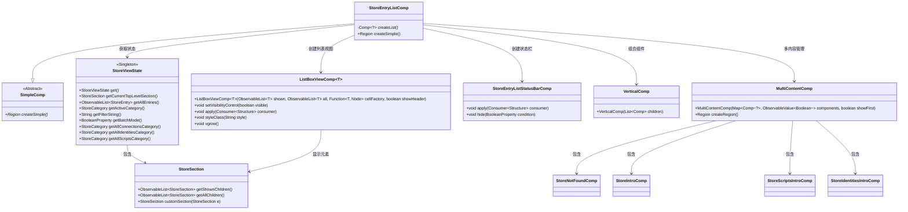
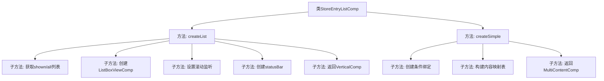

# 基础信息

|      |      |
|------|------|
| 名称 | StoreEntryListComp |
| 编码语言 | .java |
| 代码路径 | xpipe/app/src/main/java/io/xpipe/app/comp/store/StoreEntryListComp.java |
| 包名 | io.xpipe.app.comp.store |
| 依赖项 | ['io.xpipe.app.comp.Comp', 'io.xpipe.app.comp.SimpleComp', 'io.xpipe.app.comp.base.ListBoxViewComp', 'io.xpipe.app.comp.base.MultiContentComp', 'io.xpipe.app.comp.base.VerticalComp', 'io.xpipe.app.core.AppCache', 'io.xpipe.app.core.AppLayoutModel', 'javafx.beans.binding.Bindings', 'javafx.beans.property.SimpleBooleanProperty', 'javafx.beans.value.ObservableValue', 'javafx.geometry.Insets', 'javafx.scene.layout.Region', 'javafx.scene.layout.VBox', 'java.util.LinkedHashMap', 'java.util.List'] |
| 概述说明 | 创建商店条目列表组件，包含滚动重置、状态栏和不同条件下的内容显示逻辑。 |

# 说明

StoreEntryListComp是一个继承自SimpleComp的组件，主要用于创建和管理商店条目列表界面。它包含一个createList方法，用于构建列表视图，该视图显示当前顶级部分的子项，并支持滚动重置功能。组件还包含状态栏和多个条件绑定的显示逻辑，如根据不同的分类和条目数量显示不同的介绍内容。整体布局采用垂直结构，结合了多种条件判断来控制不同组件的显示与隐藏。

# 类列表 Class Summary

| 名称   | 类型  | 说明 |
|-------|------|-------------|
| StoreEntryListComp | class | 创建商店条目列表组件，包含动态显示逻辑和滚动控制。 |

## 类 StoreEntryListComp

|      |      |
|------|------|
| 访问范围 | public |
| 类型 | class |
| 名称 | StoreEntryListComp |
| 说明 | 创建商店条目列表组件，包含动态显示逻辑和滚动控制。 |

### UML类图

类图描述：
该图展示了StoreEntryListComp继承自SimpleComp的类结构，主要功能是管理商店条目列表的显示逻辑。核心类StoreViewState作为单例维护应用状态，StoreSection处理分类数据，ListBoxViewComp实现动态列表渲染。通过MultiContentComp协调多个子组件（如StoreIntroComp等）的显示条件，根据不同的状态（如空列表、首次访问等）展示相应内容。整体结构体现了观察者模式和组合模式的应用，通过属性绑定实现动态UI更新。

### 内部方法调用关系图

这段代码是StoreEntryListComp类的实现，继承自SimpleComp。主要功能是创建商店条目列表界面，包含两个核心方法：createList()负责构建列表视图和状态栏，createSimple()处理不同场景下的内容显示逻辑。流程图展示了类结构和方法调用关系，createList()内部获取数据、创建组件并设置监听器，createSimple()通过多个条件绑定决定显示哪种内容（介绍页或列表页），最终返回组合后的界面区域。

### 字段列表 Field List

| 名称  | 类型  | 说明 |
|-------|-------|------|

### 方法列表 Method List

| 名称  | 类型  | 说明 |
|-------|-------|------|
| createSimple | Region | 创建界面组件，根据条件显示不同内容：连接、脚本、身份介绍或列表。 |
| createList | Comp<?> | 创建列表组件，包含显示项、滚动重置和状态栏。 |

