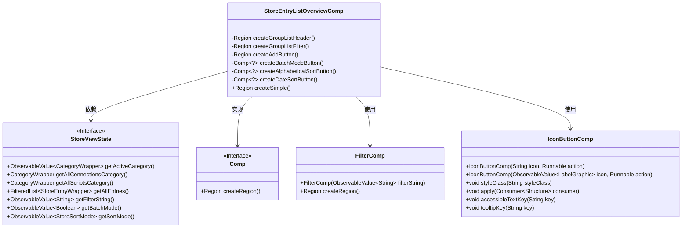

# 基础信息

|      |      |
|------|------|
| 名称 | StoreEntryListOverviewComp |
| 编码语言 | .java |
| 代码路径 | xpipe/app/src/main/java/io/xpipe/app/comp/store/StoreEntryListOverviewComp.java |
| 包名 | io.xpipe.app.comp.store |
| 依赖项 | ['io.xpipe.app.comp.Comp', 'io.xpipe.app.comp.SimpleComp', 'io.xpipe.app.comp.base.CountComp', 'io.xpipe.app.comp.base.FilterComp', 'io.xpipe.app.comp.base.IconButtonComp', 'io.xpipe.app.core.AppFontSizes', 'io.xpipe.app.core.AppI18n', 'io.xpipe.app.util.BindingsHelper', 'io.xpipe.app.util.LabelGraphic', 'io.xpipe.app.util.ThreadHelper', 'io.xpipe.core.process.OsType', 'javafx.beans.binding.Bindings', 'javafx.beans.property.SimpleStringProperty', 'javafx.css.PseudoClass', 'javafx.geometry.Pos', 'javafx.scene.control.Label', 'javafx.scene.control.MenuButton', 'javafx.scene.layout.HBox', 'javafx.scene.layout.Priority', 'javafx.scene.layout.Region', 'javafx.scene.layout.VBox', 'javafx.scene.text.TextAlignment', 'atlantafx.base.theme.Styles', 'org.kordamp.ikonli.javafx.FontIcon', 'java.util.function.Function'] |
| 概述说明 | 商店列表组件，含分类标题、筛选器、排序和批量操作按钮。 |

# 说明

StoreEntryListOverviewComp类继承自SimpleComp，主要用于创建存储条目列表的界面组件。类中包含创建列表头部、过滤器和排序按钮的方法。列表头部显示当前活动分类的名称和条目数量，支持按字母或日期排序。过滤器部分包含搜索框、添加按钮和批量模式按钮。排序按钮根据当前排序模式切换图标和状态，并调整透明度以反映激活状态。最终界面由头部和过滤器垂直堆叠组成，适配不同操作系统下的字体大小。

# 类列表 Class Summary

| 名称   | 类型  | 说明 |
|-------|------|-------------|
| StoreEntryListOverviewComp | class | 商店条目列表组件，包含分类标题、过滤、排序和批量操作功能。 |

## 类 StoreEntryListOverviewComp

|      |      |
|------|------|
| 访问范围 | public |
| 类型 | class |
| 名称 | StoreEntryListOverviewComp |
| 说明 | 商店条目列表组件，包含分类标题、过滤、排序和批量操作功能。 |

### UML类图

这段代码展示了一个商店条目列表概览组件(StoreEntryListOverviewComp)，它继承自SimpleComp并实现了多个UI构建方法。主要功能包括：创建分组列表头部(显示分类名称和条目数量)、创建过滤控件、添加按钮、批量模式按钮以及两种排序按钮(字母和日期)。类图中清晰地展示了与StoreViewState状态的依赖关系，以及使用FilterComp和IconButtonComp等辅助组件的情况。该组件通过响应式编程方式处理用户交互，并根据不同操作系统(MacOS/其他)调整字体大小。

### 内部方法调用关系图

```mermaid
graph TD
    A["类StoreEntryListOverviewComp"]
    B["方法: Region createGroupListHeader()"]
    C["方法: Region createGroupListFilter()"]
    D["方法: Region createAddButton()"]
    E["方法: Comp<?> createBatchModeButton()"]
    F["方法: Comp<?> createAlphabeticalSortButton()"]
    G["方法: Comp<?> createDateSortButton()"]
    H["重写方法: Region createSimple()"]
    
    A --> B
    A --> C
    A --> D
    A --> E
    A --> F
    A --> G
    A --> H
    
    B --> B1["创建Label并绑定国际化文本"]
    B --> B2["构建分类条目过滤器"]
    B --> B3["创建计数组件CountComp"]
    B --> B4["组装顶部工具栏HBox"]
    
    C --> C1["创建过滤器属性监听器"]
    C --> C2["构建过滤器组件FilterComp"]
    C --> C3["创建添加按钮和批量模式按钮"]
    C --> C4["组装过滤器栏HBox"]
    
    D --> D1["创建带'+'图标的MenuButton"]
    D --> D2["绑定国际化文本"]
    D --> D3["添加StoreCreationMenu按钮"]
    
    E --> E1["创建批量模式切换按钮"]
    E --> E2["绑定状态变化样式"]
    
    F --> F1["创建字母排序切换按钮"]
    F --> F2["绑定图标变化逻辑"]
    F --> F3["设置透明度绑定"]
    
    G --> G1["创建日期排序切换按钮"]
    G --> G2["绑定图标变化逻辑"]
    G --> G3["设置透明度绑定"]
    
    H --> H1["组合顶部栏和过滤器栏"]
    H --> H2["设置VBox样式"]
```

这段代码实现了一个商店条目列表的顶部控制栏组件，包含分类标题、过滤器、添加按钮和排序功能。流程图展示了类结构和方法调用关系，主要分为7个核心方法：createGroupListHeader创建分类标题栏，createGroupListFilter构建搜索过滤区，createAddButton生成添加菜单，两个排序按钮分别处理字母和日期排序逻辑，createSimple方法组合所有子组件。每个方法内部又包含多层级的UI构建和状态绑定逻辑，通过属性监听实现动态交互效果。

### 字段列表 Field List

| 名称  | 类型  | 说明 |
|-------|-------|------|

### 方法列表 Method List

| 名称  | 类型  | 说明 |
|-------|-------|------|
| createGroupListHeader | Region | 创建分组列表头部，包含标签、计数器和排序按钮，适配不同操作系统。 |
| createAddButton | Region | 创建带加号图标的菜单按钮，绑定"new"文本，居中显示，添加按钮并设置透明度。 |
| createAlphabeticalSortButton | Comp<?> | 创建字母排序按钮，根据排序模式切换图标和状态。 |
| createGroupListFilter | Region | 创建包含过滤框、添加按钮和批量模式按钮的水平布局组件。 |
| createBatchModeButton | Comp<?> | 创建批量模式按钮，切换状态并更新样式。 |
| createDateSortButton | Comp<?> | 创建日期排序按钮，根据排序模式切换图标和状态。 |
| createSimple | Region | 创建VBox区域，包含列表头和过滤器，设置宽度填充并添加样式类。 |

