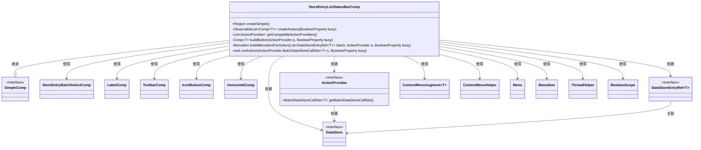
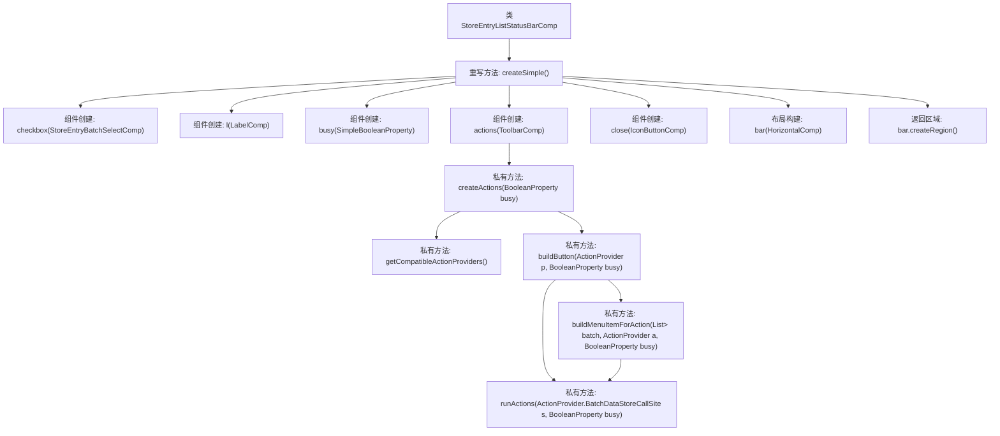

# 基础信息

|      |      |
|------|------|
| 名称 | StoreEntryListStatusBarComp |
| 编码语言 | .java |
| 代码路径 | xpipe/app/src/main/java/io/xpipe/app/comp/store/StoreEntryListStatusBarComp.java |
| 包名 | io.xpipe.app.comp.store |
| 依赖项 | ['io.xpipe.app.comp.Comp', 'io.xpipe.app.comp.SimpleComp', 'io.xpipe.app.comp.augment.ContextMenuAugment', 'io.xpipe.app.comp.base', 'io.xpipe.app.core.AppI18n', 'io.xpipe.app.ext.ActionProvider', 'io.xpipe.app.storage.DataStoreEntryRef', 'io.xpipe.app.util', 'io.xpipe.core.store.DataStore', 'javafx.beans.binding.Bindings', 'javafx.beans.property.BooleanProperty', 'javafx.beans.property.SimpleBooleanProperty', 'javafx.beans.property.SimpleObjectProperty', 'javafx.collections.ListChangeListener', 'javafx.collections.ObservableList', 'javafx.geometry.Pos', 'javafx.scene.control.Menu', 'javafx.scene.control.MenuItem', 'javafx.scene.input.MouseButton', 'javafx.scene.layout.Region', 'atlantafx.base.theme.Styles', 'java.util.ArrayList', 'java.util.List'] |
| 概述说明 | StoreEntryListStatusBarComp类实现批量操作状态栏，包含选择框、标签、工具栏和关闭按钮。 |

# 说明

StoreEntryListStatusBarComp是一个继承自SimpleComp的组件，用于显示批量操作状态栏。它包含一个复选框组件用于批量选择条目，一个标签组件动态显示当前选中条目数量，一个工具栏组件展示兼容的批量操作按钮，以及一个关闭按钮用于退出批量模式。组件会根据选中条目的类型动态过滤可用的批量操作，并为每个操作生成按钮或下拉菜单。按钮点击或菜单项选择会触发对应的批量操作，操作执行期间组件会被禁用。组件高度固定为40像素，样式类为store-entry-list-status-bar。

# 类列表 Class Summary

| 名称   | 类型  | 说明 |
|-------|------|-------------|
| StoreEntryListStatusBarComp | class | Java类实现批量操作状态栏，包含选择框、标签、工具栏和关闭按钮，支持多选操作和异步执行。 |

## 类 StoreEntryListStatusBarComp

|      |      |
|------|------|
| 访问范围 | public |
| 类型 | class |
| 名称 | StoreEntryListStatusBarComp |
| 说明 | Java类实现批量操作状态栏，包含选择框、标签、工具栏和关闭按钮，支持多选操作和异步执行。 |

### UML类图

这段代码实现了一个商店条目列表状态栏组件，主要功能包括批量选择控制、状态显示和批量操作。类图展示了核心类StoreEntryListStatusBarComp继承自SimpleComp，并组合使用了多种UI组件（如LabelComp、ToolbarComp等）和业务逻辑类（如ActionProvider）。该组件通过监听选择状态变化动态生成可用的批量操作按钮，支持嵌套菜单操作，并使用异步任务执行批量操作，同时通过BooleanProperty管理操作状态。整个设计体现了响应式编程思想，通过数据绑定实现UI与状态的自动同步。

### 内部方法调用关系图

这段代码实现了一个商店条目列表状态栏组件，主要功能包括创建批量选择复选框、显示选中数量的标签、操作工具栏和关闭按钮。核心逻辑通过createActions方法动态生成兼容当前选中条目的操作按钮，buildButton方法构建带上下文菜单的按钮，runActions方法异步执行批量操作。状态栏布局采用水平排列，包含间距调整和样式设置，整体设计支持批量操作模式和国际化显示。

### 字段列表 Field List

| 名称  | 类型  | 说明 |
|-------|-------|------|

### 方法列表 Method List

| 名称  | 类型  | 说明 |
|-------|-------|------|
| createActions | ObservableList<Comp<?>> | 创建动态操作列表，根据选择状态更新按钮组件。 |
| getCompatibleActionProviders | List<ActionProvider> | 获取兼容操作提供者列表，筛选适用条目并返回。 |
| createSimple | Region | 创建批量选择工具栏，包含复选框、标签、操作按钮和关闭按钮，高度40像素。 |
| buildMenuItemForAction | MenuItem | 构建菜单项方法：根据批量数据和动作生成菜单项，支持子菜单和事件处理。 |
| buildButton | Comp<?> | 构建按钮组件，处理批量操作，包含空检查和上下文菜单逻辑。 |
| runActions | void | 异步执行批量数据存储操作，映射选择项并执行非空动作。 |

