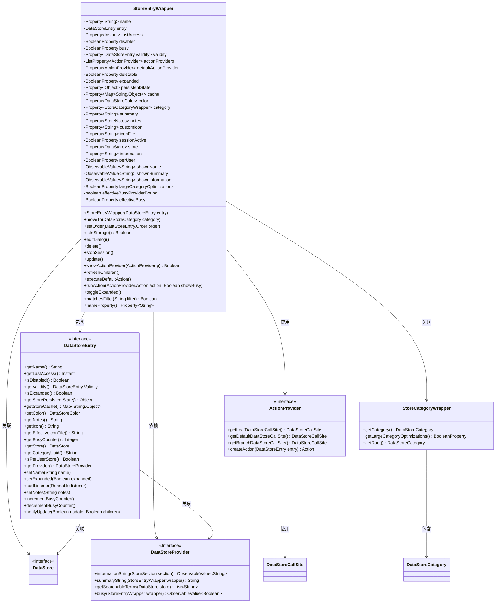

# 基础信息

|      |      |
|------|------|
| 名称 | StoreEntryWrapper |
| 编码语言 | .java |
| 代码路径 | xpipe/app/src/main/java/io/xpipe/app/comp/store/StoreEntryWrapper.java |
| 包名 | io.xpipe.app.comp.store |
| 依赖项 | ['io.xpipe.app.ext.ActionProvider', 'io.xpipe.app.ext.LocalStore', 'io.xpipe.app.ext.ShellStore', 'io.xpipe.app.issue.ErrorEvent', 'io.xpipe.app.prefs.AppPrefs', 'io.xpipe.app.storage.DataStorage', 'io.xpipe.app.storage.DataStoreCategory', 'io.xpipe.app.storage.DataStoreColor', 'io.xpipe.app.storage.DataStoreEntry', 'io.xpipe.app.util.PlatformThread', 'io.xpipe.app.util.ThreadHelper', 'io.xpipe.core.store.DataStore', 'io.xpipe.core.store.SingletonSessionStore', 'javafx.beans.binding.Bindings', 'javafx.beans.property', 'javafx.beans.value.ObservableValue', 'javafx.collections.FXCollections', 'lombok.Getter', 'java.time.Duration', 'java.time.Instant', 'java.util.Comparator', 'java.util.HashMap', 'java.util.Map'] |
| 概述说明 | StoreEntryWrapper类封装DataStoreEntry，管理属性、操作和状态，支持数据存储和UI交互。 |

# 说明

StoreEntryWrapper是一个用于包装DataStoreEntry的类，提供了丰富的属性和方法来管理数据存储条目。它包含多个属性，如名称、最后访问时间、禁用状态、忙碌状态、有效性、操作提供者列表等。该类支持监听属性变化，自动更新条目数据，并提供了多种操作方法，如移动条目、设置顺序、编辑对话框、删除条目等。此外，它还支持会话管理、过滤匹配、默认操作执行等功能，确保数据的一致性和操作的便捷性。

# 类列表 Class Summary

| 名称   | 类型  | 说明 |
|-------|------|-------------|
| StoreEntryWrapper | class | StoreEntryWrapper类封装数据存储条目属性，提供操作和状态管理功能。 |

## 类 StoreEntryWrapper

|      |      |
|------|------|
| 访问范围 | @Getter;public |
| 类型 | class |
| 名称 | StoreEntryWrapper |
| 说明 | StoreEntryWrapper类封装数据存储条目属性，提供操作和状态管理功能。 |

### UML类图

这段代码定义了一个`StoreEntryWrapper`类，用于包装`DataStoreEntry`对象并提供额外的属性和功能。该类主要管理数据存储条目的各种属性（如名称、最后访问时间、禁用状态等），处理与用户界面相关的操作（如展开/折叠、执行默认动作等），并与`ActionProvider`、`DataStore`等其他组件交互。类图展示了`StoreEntryWrapper`与多个接口和类的关系，包括数据存储条目、动作提供者、数据存储等核心组件。

### 内部方法调用关系图

```mermaid
graph TD
    A["类StoreEntryWrapper"]
    B["属性: Property<String> name"]
    C["属性: DataStoreEntry entry"]
    D["属性: Property<Instant> lastAccess"]
    E["属性: BooleanProperty disabled"]
    F["属性: BooleanProperty busy"]
    G["属性: Property<DataStoreEntry.Validity> validity"]
    H["属性: ListProperty<ActionProvider> actionProviders"]
    I["属性: Property<ActionProvider> defaultActionProvider"]
    J["属性: BooleanProperty deletable"]
    K["属性: BooleanProperty expanded"]
    L["属性: Property<Object> persistentState"]
    M["属性: Property<Map<String, Object>> cache"]
    N["属性: Property<DataStoreColor> color"]
    O["属性: Property<StoreCategoryWrapper> category"]
    P["属性: Property<String> summary"]
    Q["属性: Property<StoreNotes> notes"]
    R["属性: Property<String> customIcon"]
    S["属性: Property<String> iconFile"]
    T["属性: BooleanProperty sessionActive"]
    U["属性: Property<DataStore> store"]
    V["属性: Property<String> information"]
    W["属性: BooleanProperty perUser"]
    X["属性: ObservableValue<String> shownName"]
    Y["属性: ObservableValue<String> shownSummary"]
    Z["属性: ObservableValue<String> shownInformation"]
    AA["属性: BooleanProperty largeCategoryOptimizations"]
    AB["属性: BooleanProperty effectiveBusy"]
    AC["构造方法: StoreEntryWrapper(DataStoreEntry entry)"]
    AD["方法: moveTo(DataStoreCategory category)"]
    AE["方法: setOrder(DataStoreEntry.Order order)"]
    AF["方法: isInStorage()"]
    AG["方法: editDialog()"]
    AH["方法: delete()"]
    AI["方法: stopSession()"]
    AJ["方法: update()"]
    AK["方法: showActionProvider(ActionProvider p)"]
    AL["方法: refreshChildren()"]
    AM["方法: executeDefaultAction()"]
    AN["方法: runAction(ActionProvider.Action action, boolean showBusy)"]
    AO["方法: toggleExpanded()"]
    AP["方法: matchesFilter(String filter)"]
    AQ["方法: nameProperty()"]
    AR["私有方法: setupListeners()"]

    A --> B
    A --> C
    A --> D
    A --> E
    A --> F
    A --> G
    A --> H
    A --> I
    A --> J
    A --> K
    A --> L
    A --> M
    A --> N
    A --> O
    A --> P
    A --> Q
    A --> R
    A --> S
    A --> T
    A --> U
    A --> V
    A --> W
    A --> X
    A --> Y
    A --> Z
    A --> AA
    A --> AB
    A --> AC
    A --> AD
    A --> AE
    A --> AF
    A --> AG
    A --> AH
    A --> AI
    A --> AJ
    A --> AK
    A --> AL
    A --> AM
    A --> AN
    A --> AO
    A --> AP
    A --> AQ
    A -.-> AR
    AC --> AR
    AJ --> AR
```

该流程图展示了StoreEntryWrapper类的完整结构，包含23个属性和15个主要方法。这个类是一个数据存储条目包装器，负责管理数据存储条目的各种属性和状态，包括名称、访问时间、禁用状态、有效性验证等。核心方法update()用于同步条目状态，setupListeners()建立属性监听机制，其他方法提供条目操作功能如移动、删除、会话控制等。类通过属性绑定和监听器实现数据同步，并支持动作提供者和过滤功能。

### 字段列表 Field List

| 名称  | 类型  | 说明 |
|-------|-------|------|
| name | Property<String> | 私有字符串属性name |
| busy = new SimpleBooleanProperty() | BooleanProperty | 私有布尔属性busy初始化为SimpleBooleanProperty实例。 |
| shownInformation | ObservableValue<String> | 私有不可变字符串可观察值 |
| shownSummary | ObservableValue<String> | 私有不可变字符串可观察值。 |
| defaultActionProvider = new SimpleObjectProperty<>() | Property<ActionProvider> | 私有属性，类型为Property<ActionProvider>，初始化为SimpleObjectProperty。 |
| persistentState = new SimpleObjectProperty<>() | Property<Object> | 私有属性persistentState，类型为Property<Object>，初始化为SimpleObjectProperty对象。 |
| disabled = new SimpleBooleanProperty() | BooleanProperty | 私有布尔属性disabled初始化为SimpleBooleanProperty实例。 |
| information = new SimpleStringProperty() | Property<String> | 私有字符串属性information，使用SimpleStringProperty初始化。 |
| lastAccess | Property<Instant> | 私有属性，记录最后访问时间。 |
| store = new SimpleObjectProperty<>() | Property<DataStore> | 私有属性store，类型为Property<DataStore>，初始化为SimpleObjectProperty对象。 |
| effectiveBusyProviderBound = false | boolean | 私有布尔变量effectiveBusyProviderBound初始为false。 |
| customIcon = new SimpleObjectProperty<>() | Property<String> | 私有属性customIcon，类型为Property<String>，初始化为SimpleObjectProperty。 |
| summary = new SimpleObjectProperty<>() | Property<String> | 私有属性summary，类型为Property<String>，初始化为SimpleObjectProperty。 |
| sessionActive = new SimpleBooleanProperty() | BooleanProperty | 私有布尔属性sessionActive，初始化为SimpleBooleanProperty实例。 |
| iconFile = new SimpleObjectProperty<>() | Property<String> | 私有属性iconFile，类型为Property<String>，初始化为SimpleObjectProperty。 |
| notes | Property<StoreNotes> | 私有属性notes，类型为Property<StoreNotes>。 |
| perUser = new SimpleBooleanProperty() | BooleanProperty | 私有布尔属性perUser初始化为SimpleBooleanProperty实例。 |
| largeCategoryOptimizations = new SimpleBooleanProperty() | BooleanProperty | 私有布尔属性largeCategoryOptimizations初始化为SimpleBooleanProperty实例。 |
| entry | DataStoreEntry | 私有数据存储条目entry。 |
| color = new SimpleObjectProperty<>() | Property<DataStoreColor> | 私有属性color，类型为Property<DataStoreColor>，初始化为SimpleObjectProperty。 |
| deletable = new SimpleBooleanProperty() | BooleanProperty | 私有布尔属性deletable初始化为SimpleBooleanProperty。 |
| category = new SimpleObjectProperty<>() | Property<StoreCategoryWrapper> | 私有属性category，类型为Property<StoreCategoryWrapper>，初始化为SimpleObjectProperty。 |
| cache = new SimpleObjectProperty<>(Map.of()) | Property<Map<String, Object>> | 私有属性cache，类型为Property<Map<String, Object>>，初始化为空Map。 |
| actionProviders =            new SimpleListProperty<>(FXCollections.observableArrayList()) | ListProperty<ActionProvider> | 私有列表属性actionProviders，初始化为可观察数组列表。 |
| validity = new SimpleObjectProperty<>() | Property<DataStoreEntry.Validity> | 私有属性validity，类型为Property<DataStoreEntry.Validity>，初始化为SimpleObjectProperty。 |
| effectiveBusy = new SimpleBooleanProperty() | BooleanProperty | 私有布尔属性effectiveBusy初始化为SimpleBooleanProperty实例。 |
| shownName | ObservableValue<String> | 私有不可变字符串可观察值shownName |
| expanded = new SimpleBooleanProperty() | BooleanProperty | 私有布尔属性expanded初始化为SimpleBooleanProperty实例。 |

### 方法列表 Method List

| 名称  | 类型  | 说明 |
|-------|-------|------|
| refreshChildren | void | 刷新子节点数据并更新展开状态。 |
| runAction | void | 执行指定动作，根据showBusy参数增减计数器。 |
| toggleExpanded | void | 切换展开状态方法：取反当前值并设置。 |
| setOrder | void | 异步设置数据存储条目顺序。 |
| update | void | 同步更新存储视图状态，检查有效性并绑定相关属性。 |
| showActionProvider | boolean | 检查动作提供者是否显示：验证叶子或分支节点条件，递归检查子节点。 |
| setupListeners | void | 监听器设置：更新名称、展开状态、条目及备注。 |
| delete | void | 异步删除数据及其子项 |
| moveTo | void | 异步移动数据条目到指定分类 |
| isInStorage | boolean | 检查存储中是否存在指定条目。 |
| editDialog | void | 显示编辑对话框以修改条目。 |
| stopSession | void | 异步停止单例会话存储的会话。 |
| executeDefaultAction | void | 方法根据数据条目状态执行默认操作：无效返回，不完整则编辑，否则触发默认操作或切换展开状态。 |
| matchesFilter | boolean | 检查字符串是否匹配过滤条件：名称包含或提供方可搜索项包含。 |
| nameProperty | Property<String> | 公开返回字符串类型的name属性。 |

