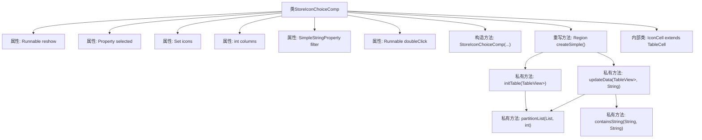
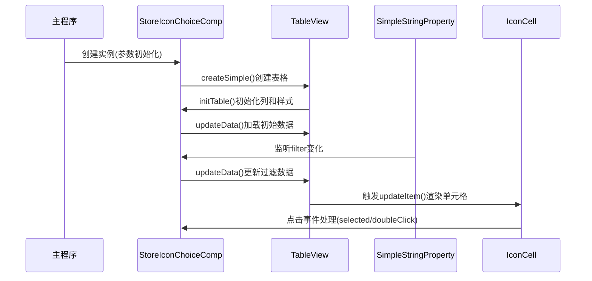

# 基础信息

|      |      |
|------|------|
| 名称 | StoreIconChoiceComp |
| 编码语言 | .java |
| 代码路径 | xpipe/app/src/main/java/io/xpipe/app/comp/store/StoreIconChoiceComp.java |
| 包名 | io.xpipe.app.comp.store |
| 依赖项 | ['io.xpipe.app.comp.SimpleComp', 'io.xpipe.app.comp.base', 'io.xpipe.app.core.AppI18n', 'io.xpipe.app.icon.SystemIcon', 'io.xpipe.app.icon.SystemIconCache', 'io.xpipe.app.icon.SystemIconManager', 'io.xpipe.app.resources.AppImages', 'io.xpipe.app.util.BooleanScope', 'io.xpipe.app.util.LabelGraphic', 'io.xpipe.app.util.ThreadHelper', 'javafx.beans.property', 'javafx.geometry.Pos', 'javafx.scene.control', 'javafx.scene.input.MouseButton', 'javafx.scene.layout.Region', 'javafx.scene.layout.StackPane', 'javafx.scene.text.TextAlignment', 'atlantafx.base.theme.Styles', 'atlantafx.base.theme.Tweaks', 'java.util', 'atlantafx.base.theme.Styles.TEXT_SMALL'] |
| 概述说明 | 图标选择组件，支持筛选、刷新和双击操作。 |

# 说明

StoreIconChoiceComp是一个用于选择系统图标的组件，继承自SimpleComp。它包含重新显示功能、选中的图标属性、图标集合、列数、过滤属性和双击操作。组件创建表格视图展示图标，支持按列布局和过滤功能。表格初始化时设置列属性、单元格样式和选择行为。提供刷新按钮重新加载图标，并显示加载状态。更新数据时根据过滤条件筛选图标并分区显示。IconCell类处理图标的显示和交互，包括选中和双击操作。

# 类列表 Class Summary

| 名称   | 类型  | 说明 |
|-------|------|-------------|
| StoreIconChoiceComp | class | 商店图标选择组件，支持筛选、刷新和双击操作。 |


## 类 StoreIconChoiceComp

|      |      |
|------|------|
| 访问范围 | public |
| 类型 | class |
| 名称 | StoreIconChoiceComp |
| 说明 | 商店图标选择组件，支持筛选、刷新和双击操作。 |


### UML类图

```mermaid
classDiagram
    class StoreIconChoiceComp {
        -Runnable reshow
        -Property~SystemIcon~ selected
        -Set~SystemIcon~ icons
        -int columns
        -SimpleStringProperty filter
        -Runnable doubleClick
        +StoreIconChoiceComp(Runnable reshow, Property~SystemIcon~ selected, Set~SystemIcon~ icons, int columns, SimpleStringProperty filter, Runnable doubleClick)
        +Region createSimple()
        -void initTable(TableView~List~SystemIcon~~ table)
        -void updateData(TableView~List~SystemIcon~~ table, String filterString)
        -List~List~T~~ partitionList(List~T~ list, int size)
        -boolean containsString(String s1, String s2)
    }

    class IconCell {
        -Label root
        -StringProperty image
        +IconCell()
        +void updateItem(SystemIcon icon, boolean empty)
    }

    class TableView~List~SystemIcon~~ {
        <<Generic>>
    }

    class SystemIcon {
        <<Data>>
    }

    StoreIconChoiceComp --> TableView~List~SystemIcon~~ : 使用
    StoreIconChoiceComp --> SystemIcon : 操作
    StoreIconChoiceComp *-- IconCell : 包含
    IconCell --> SystemIcon : 显示

    note for StoreIconChoiceComp "负责创建图标选择界面组件，包含表格视图和图标单元格。\n管理图标数据的过滤、分页和选择逻辑，支持双击事件和刷新功能。\n通过监听过滤器属性实现动态数据更新，自动处理选中状态同步。"
```

该代码实现了一个图标选择器组件，主要功能包括：1) 以表格形式展示系统图标集合；2) 支持按名称过滤图标；3) 处理图标选择和双击事件；4) 提供图标刷新功能。核心类StoreIconChoiceComp继承自SimpleComp，包含表格初始化、数据更新和分区逻辑，内部类IconCell负责单个图标的渲染和交互。通过Property绑定实现选中状态管理，采用观察者模式响应过滤条件变化。


### 内部方法调用关系图





这段代码实现了一个带过滤功能的图标选择器组件。流程图展示了类结构关系，包含6个属性和5个核心方法，其中createSimple()作为入口方法会调用initTable()初始化表格列，并通过updateData()处理数据加载和过滤。时序图则描述了从组件初始化到用户交互的完整流程，包括表格创建、数据加载、过滤监听和单元格渲染过程。内部类IconCell负责处理单元格渲染和点击事件，与外部通过selected属性和doubleClick回调进行交互。

### 字段列表 Field List

| 名称  | 类型  | 说明 |
|-------|-------|------|
| selected | Property<SystemIcon> | 私有属性selected，类型为Property<SystemIcon>。 |
| reshow | Runnable | 私有最终可运行任务reshow |
| filter | SimpleStringProperty | 私有字符串属性过滤器 |
| columns | int | 私有整型变量columns。 |
| icons | Set<SystemIcon> | 私有系统图标集合。 |
| doubleClick | Runnable | 私有Runnable双击事件处理 |

### 方法列表 Method List

| 名称  | 类型  | 说明 |
|-------|-------|------|
| updateData | void | 更新表格数据，过滤图标并处理选择逻辑。 |
| initTable | void | 初始化表格并添加刷新按钮，设置列样式和占位符。 |
| createSimple | Region | 创建表格视图，初始化并更新数据，监听过滤变化。 |
| partitionList | List<List<T>> | 将列表按指定大小分块，返回分块后的列表集合。 |
| containsString | boolean | 检查s1是否包含s2，忽略大小写。 |


