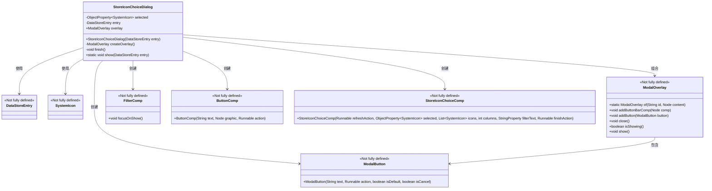
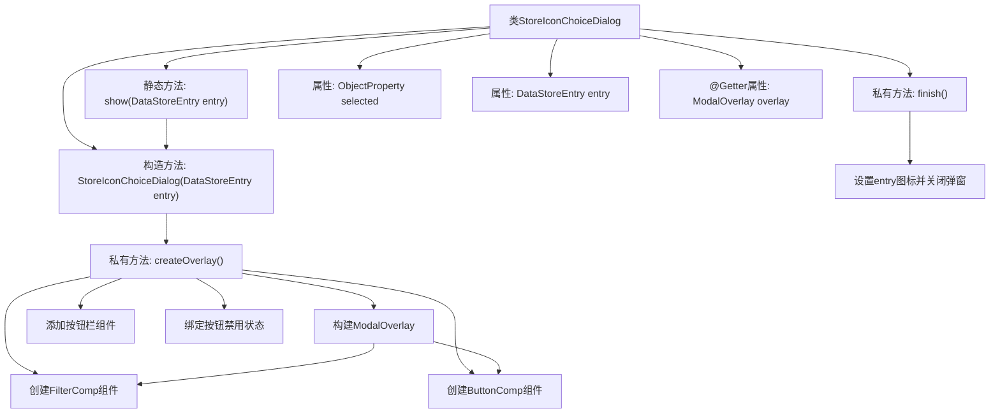

# 基础信息

|      |      |
|------|------|
| 名称 | StoreIconChoiceDialog |
| 编码语言 | .java |
| 代码路径 | xpipe/app/src/main/java/io/xpipe/app/comp/store/StoreIconChoiceDialog.java |
| 包名 | io.xpipe.app.comp.store |
| 依赖项 | ['io.xpipe.app.comp.base', 'io.xpipe.app.icon.SystemIcon', 'io.xpipe.app.icon.SystemIconManager', 'io.xpipe.app.prefs.AppPrefs', 'io.xpipe.app.storage.DataStoreEntry', 'javafx.application.Platform', 'javafx.beans.property.ObjectProperty', 'javafx.beans.property.SimpleObjectProperty', 'javafx.beans.property.SimpleStringProperty', 'lombok.Getter', 'org.kordamp.ikonli.javafx.FontIcon'] |
| 概述说明 | 显示图标选择对话框，设置选中图标并更新数据存储条目。 |

# 说明

该代码定义了一个StoreIconChoiceDialog类，用于显示图标选择对话框。主要功能包括：通过show静态方法启动对话框，使用ModalOverlay作为容器，包含图标选择组件StoreIconChoiceComp和过滤组件FilterComp。对话框提供清除图标、确认选择等按钮操作，并将最终选择的图标ID保存到DataStoreEntry对象中。对话框支持图标过滤功能，并通过属性绑定确保未选择图标时确认按钮禁用。

# 类列表 Class Summary

| 名称   | 类型  | 说明 |
|-------|------|-------------|
| StoreIconChoiceDialog | class | 显示图标选择对话框，设置数据存储条目图标。 |

## 类 StoreIconChoiceDialog

|      |      |
|------|------|
| 访问范围 | public |
| 类型 | class |
| 名称 | StoreIconChoiceDialog |
| 说明 | 显示图标选择对话框，设置数据存储条目图标。 |

### UML类图

该代码实现了一个图标选择对话框，主要类StoreIconChoiceDialog通过组合ModalOverlay作为容器，内部包含FilterComp(过滤器)、ButtonComp(按钮)、StoreIconChoiceComp(图标选择组件)等UI元素。当用户选择图标后，会将结果保存到DataStoreEntry中。整个设计采用响应式编程模式，通过属性绑定(如selected属性)实现状态管理，ModalButton的禁用状态与选择状态动态绑定体现了良好的交互设计。

### 内部方法调用关系图

流程图描述：该流程图展示了StoreIconChoiceDialog类的核心结构和执行流程。从静态show方法入口开始，通过构造函数初始化对象，createOverlay方法负责构建包含过滤组件、按钮组件和模态窗口的复杂界面，finish方法处理图标选择结果。特别注意按钮状态绑定和异步界面更新等细节处理，体现了弹窗式图标选择器的完整生命周期管理。

### 字段列表 Field List

| 名称  | 类型  | 说明 |
|-------|-------|------|
| overlay | ModalOverlay | 私有模态覆盖层成员变量，带Getter方法。 |
| entry | DataStoreEntry | 私有数据存储条目entry |
| selected = new SimpleObjectProperty<>() | ObjectProperty<SystemIcon> | 私有属性selected，类型为ObjectProperty<SystemIcon>，初始化为SimpleObjectProperty。 |

### 方法列表 Method List

| 名称  | 类型  | 说明 |
|-------|-------|------|
| createOverlay | ModalOverlay | 创建自定义图标选择模态框，包含搜索过滤、设置按钮、清除和确认功能。 |
| show | void | 显示数据存储条目图标的对话框。 |
| finish | void | 方法finish设置条目图标，若selected非空则用其值拼接路径，否则置空，最后关闭overlay。 |

