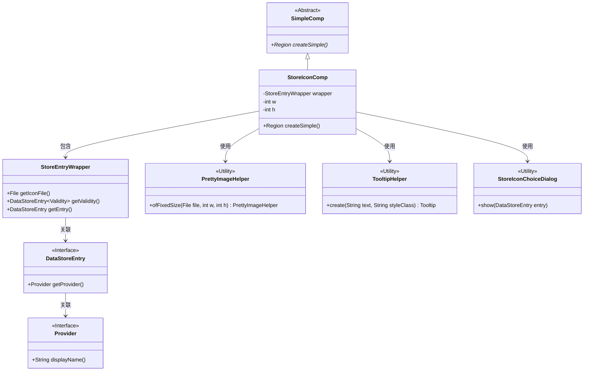

# 基础信息

|      |      |
|------|------|
| 名称 | StoreIconComp |
| 编码语言 | .java |
| 代码路径 | xpipe/app/src/main/java/io/xpipe/app/comp/store/StoreIconComp.java |
| 包名 | io.xpipe.app.comp.store |
| 依赖项 | ['io.xpipe.app.comp.SimpleComp', 'io.xpipe.app.comp.base.PrettyImageHelper', 'io.xpipe.app.comp.base.TooltipHelper', 'io.xpipe.app.storage.DataStoreEntry', 'javafx.beans.binding.Bindings', 'javafx.geometry.Pos', 'javafx.scene.control.Tooltip', 'javafx.scene.input', 'javafx.scene.layout.Region', 'javafx.scene.layout.StackPane', 'lombok.AllArgsConstructor', 'org.kordamp.ikonli.javafx.FontIcon'] |
| 概述说明 | StoreIconComp类创建带悬停效果和点击处理的商店图标组件。 |

# 说明

StoreIconComp是一个继承自SimpleComp的JavaFX组件类，用于创建商店图标界面元素。它接收StoreEntryWrapper对象和宽高参数，构建包含图标、背景和悬浮点的堆叠面板。图标根据可用性显示提示信息，悬浮时图标透明度变化并显示点状图标。点击主鼠标按钮时，若数据有效则弹出选择对话框。组件样式通过CSS类控制，布局尺寸固定为宽高加5像素。

# 类列表 Class Summary

| 名称   | 类型  | 说明 |
|-------|------|-------------|
| StoreIconComp | class | Java类StoreIconComp创建商店图标组件，含悬停效果和点击事件处理。 |

## 类 StoreIconComp

|      |      |
|------|------|
| 访问范围 | @AllArgsConstructor;public |
| 类型 | class |
| 名称 | StoreIconComp |
| 说明 | Java类StoreIconComp创建商店图标组件，含悬停效果和点击事件处理。 |

### UML类图

该类图展示了StoreIconComp继承自SimpleComp，并依赖多个工具类和接口来实现商店图标组件的功能。StoreIconComp通过StoreEntryWrapper获取图标数据和状态，使用PrettyImageHelper创建图像组件，TooltipHelper生成提示信息，并在用户点击时通过StoreIconChoiceDialog显示选项。DataStoreEntry和Provider接口提供了数据访问和显示名称的能力。整个设计体现了清晰的职责分离和模块化思想。

### 内部方法调用关系图

这段代码是StoreIconComp类的实现，继承自SimpleComp，主要用于创建商店图标的UI组件。流程从创建图像组件开始，检查有效性后可能添加工具提示，接着构建包含背景、图标和悬浮点的堆栈面板，设置各种属性和事件绑定，最终返回该面板。当鼠标点击时，会检查有效性状态，若非加载失败则显示选择对话框。整个过程涉及UI组件的创建、属性绑定和事件处理。

### 字段列表 Field List

| 名称  | 类型  | 说明 |
|-------|-------|------|
| w | int | 私有整型变量w |
| wrapper | StoreEntryWrapper | 私有存储条目包装器实例。 |
| h | int | 私有整型变量h |

### 方法列表 Method List

| 名称  | 类型  | 说明 |
|-------|-------|------|
| createSimple | Region | 创建图标区域，包含背景、图标和悬停效果，点击显示对话框。 |

