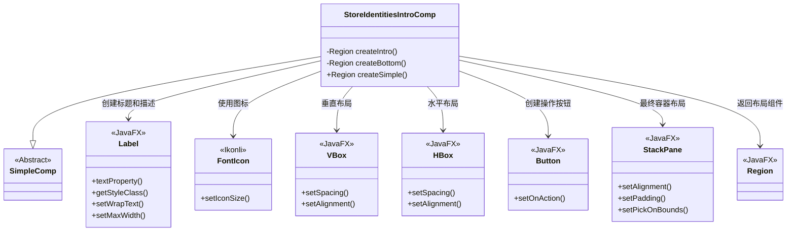
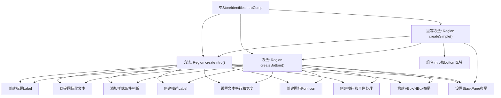

# 基础信息

|      |      |
|------|------|
| 名称 | StoreIdentitiesIntroComp |
| 编码语言 | .java |
| 代码路径 | xpipe/app/src/main/java/io/xpipe/app/comp/store/StoreIdentitiesIntroComp.java |
| 包名 | io.xpipe.app.comp.store |
| 依赖项 | ['io.xpipe.app.comp.SimpleComp', 'io.xpipe.app.core.AppFontSizes', 'io.xpipe.app.core.AppI18n', 'io.xpipe.app.ext.DataStoreCreationCategory', 'io.xpipe.app.ext.DataStoreProviders', 'io.xpipe.app.prefs.AppPrefs', 'io.xpipe.app.storage.DataStorage', 'io.xpipe.core.process.OsType', 'javafx.geometry.Insets', 'javafx.geometry.Pos', 'javafx.scene.control.Button', 'javafx.scene.control.Label', 'javafx.scene.layout.HBox', 'javafx.scene.layout.Region', 'javafx.scene.layout.StackPane', 'javafx.scene.layout.VBox', 'atlantafx.base.theme.Styles', 'org.kordamp.ikonli.javafx.FontIcon'] |
| 概述说明 | 创建身份介绍界面，包含标题、描述、图标和操作按钮，支持同步设置。 |

# 说明

StoreIdentitiesIntroComp是一个继承自SimpleComp的组件类，用于创建身份管理界面的介绍部分。它包含两个主要区域：createIntro和createBottom。createIntro区域包含标题、描述文本、账户组图标和一个创建身份的按钮，按钮点击后会根据是否支持同步显示不同的创建对话框。createBottom区域包含另一个标题、描述文本、Git图标和一个设置同步的按钮，点击按钮会导航到同步设置页面。两个区域都使用VBox和HBox进行布局，设置了间距、对齐方式和样式。最终通过createSimple方法将两个区域垂直排列，并添加内边距和居中对齐。整个组件具有自适应尺寸和统一的样式类。

# 类列表 Class Summary

| 名称   | 类型  | 说明 |
|-------|------|-------------|
| StoreIdentitiesIntroComp | class | 创建身份介绍界面，含标题、描述、按钮和同步功能。 |

## 类 StoreIdentitiesIntroComp

|      |      |
|------|------|
| 访问范围 | public |
| 类型 | class |
| 名称 | StoreIdentitiesIntroComp |
| 说明 | 创建身份介绍界面，含标题、描述、按钮和同步功能。 |

### UML类图

这段代码展示了一个JavaFX组件`StoreIdentitiesIntroComp`，它继承自`SimpleComp`抽象类，主要用于创建身份管理界面的介绍部分。类中包含两个私有方法`createIntro()`和`createBottom()`分别创建上半部分和下半部分的UI元素，以及重写的`createSimple()`方法将两部分组合成完整的界面。该组件使用了多种JavaFX控件（如Label、Button、VBox、HBox等）和布局容器，通过绑定国际化文本和设置样式来构建响应式用户界面。

### 内部方法调用关系图

这段代码是StoreIdentitiesIntroComp类的实现，继承自SimpleComp。主要功能是创建身份管理界面的介绍区域，包含两个主要部分：createIntro()创建顶部介绍区域，包含标题、描述和创建按钮；createBottom()创建底部同步设置区域，包含标题、描述和同步按钮。createSimple()方法将这两个区域组合成垂直布局，并添加整体样式和边距设置。代码中大量使用了JavaFX的UI组件和布局容器，并实现了国际化文本绑定和平台特定的样式处理。

### 字段列表 Field List

| 名称  | 类型  | 说明 |
|-------|-------|------|

### 方法列表 Method List

| 名称  | 类型  | 说明 |
|-------|-------|------|
| createIntro | Region | 创建身份介绍界面，含标题、描述、图标和添加按钮，支持多语言和样式调整。 |
| createBottom | Region | 创建底部区域，包含标题、描述、同步按钮和图标，布局为水平垂直组合。 |
| createSimple | Region | 创建垂直布局VBox，设置间距和尺寸，放入StackPane居中显示。 |

