# 基础信息

|      |      |
|------|------|
| 名称 | StoreIntroComp |
| 编码语言 | .java |
| 代码路径 | xpipe/app/src/main/java/io/xpipe/app/comp/store/StoreIntroComp.java |
| 包名 | io.xpipe.app.comp.store |
| 依赖项 | ['io.xpipe.app.comp.SimpleComp', 'io.xpipe.app.comp.base.PrettyImageHelper', 'io.xpipe.app.core.AppFontSizes', 'io.xpipe.app.core.AppI18n', 'io.xpipe.app.prefs.AppPrefs', 'io.xpipe.app.storage.DataStorage', 'io.xpipe.app.util.ScanDialog', 'io.xpipe.core.process.OsType', 'javafx.geometry.Insets', 'javafx.geometry.Pos', 'javafx.scene.control.Button', 'javafx.scene.control.Label', 'javafx.scene.layout.HBox', 'javafx.scene.layout.Region', 'javafx.scene.layout.StackPane', 'javafx.scene.layout.VBox', 'atlantafx.base.theme.Styles', 'org.kordamp.ikonli.javafx.FontIcon'] |
| 概述说明 | 创建商店介绍组件，包含标题、描述和扫描按钮，以及导入连接功能。 |

# 说明

StoreIntroComp类继承自SimpleComp，包含两个主要方法createIntro和createImportIntro，分别创建商店介绍和导入连接功能的界面。createIntro方法生成一个包含标题、描述文本、扫描按钮和波浪图形的水平布局，标题根据操作系统类型设置粗体样式，扫描按钮触发ScanDialog显示。createImportIntro方法生成类似布局，包含导入标题、描述文本、导入按钮和Git图标，导入按钮跳转到vaultSync分类。两个布局垂直排列，间距80像素，整体居中显示，顶部有40像素内边距。界面元素使用绑定实现多语言支持，并设置了样式类和尺寸约束。

# 类列表 Class Summary

| 名称   | 类型  | 说明 |
|-------|------|-------------|
| StoreIntroComp | class | 创建商店介绍界面，含标题、描述、扫描按钮和导入功能。 |

## 类 StoreIntroComp

|      |      |
|------|------|
| 访问范围 | public |
| 类型 | class |
| 名称 | StoreIntroComp |
| 说明 | 创建商店介绍界面，含标题、描述、扫描按钮和导入功能。 |

### UML类图

```mermaid
classDiagram
    class StoreIntroComp {
        -Region createIntro()
        -Region createImportIntro()
        +Region createSimple()
    }
    class SimpleComp {
        <<Interface>>
        +Region createSimple()
    }
    class Region {
        <<JavaFX>>
    }
    class Label {
        <<JavaFX>>
        +textProperty()
        +getStyleClass()
        +setWrapText()
        +setMaxWidth()
    }
    class Button {
        <<JavaFX>>
        +textProperty()
        +setOnAction()
        +setDefaultButton()
    }
    class StackPane {
        <<JavaFX>>
        +setAlignment()
        +setPadding()
        +setPickOnBounds()
    }
    class VBox {
        <<JavaFX>>
        +setSpacing()
        +setAlignment()
        +setMinWidth()
        +setMaxWidth()
        +setMinHeight()
        +setMaxHeight()
    }
    class HBox {
        <<JavaFX>>
        +setSpacing()
        +setAlignment()
    }
    class FontIcon {
        +setIconSize()
    }
    class AppI18n {
        +observable(String)
    }
    class OsType {
        +getLocal()
    }
    class Styles {
        +TEXT_BOLD
    }
    class AppFontSizes {
        +title(Label)
    }
    class ScanDialog {
        +showSingleAsync()
    }
    class DataStorage {
        +get()
    }
    class PrettyImageHelper {
        +ofSpecificFixedSize()
    }
    class AppPrefs {
        +get()
    }

    StoreIntroComp --|> SimpleComp : 实现
    StoreIntroComp --> Label : 使用
    StoreIntroComp --> Button : 使用
    StoreIntroComp --> StackPane : 使用
    StoreIntroComp --> VBox : 使用
    StoreIntroComp --> HBox : 使用
    StoreIntroComp --> FontIcon : 使用
    StoreIntroComp --> AppI18n : 依赖
    StoreIntroComp --> OsType : 依赖
    StoreIntroComp --> Styles : 依赖
    StoreIntroComp --> AppFontSizes : 依赖
    StoreIntroComp --> ScanDialog : 依赖
    StoreIntroComp --> DataStorage : 依赖
    StoreIntroComp --> PrettyImageHelper : 依赖
    StoreIntroComp --> AppPrefs : 依赖
```

这段代码描述了一个JavaFX组件`StoreIntroComp`，它继承自`SimpleComp`接口，主要用于创建商店介绍界面。该组件包含两个主要方法`createIntro()`和`createImportIntro()`，分别创建扫描连接和导入连接的UI部分。代码中大量使用了JavaFX控件如Label、Button、VBox、HBox等，并通过绑定国际化文本、设置样式和布局来构建界面。组件还依赖多个工具类如AppI18n、OsType、ScanDialog等来实现国际化、操作系统判断和功能调用。整体设计体现了清晰的UI构建逻辑和模块化思想。

### 内部方法调用关系图

这段代码是StoreIntroComp类的实现，继承自SimpleComp类，主要用于创建商店介绍界面。包含两个核心方法createIntro()和createImportIntro()，分别创建扫描功能和导入功能的界面布局。createSimple()方法将这两个界面组合成垂直布局，并设置容器样式。每个方法都遵循相似的流程：创建组件、绑定数据、设置样式、组合布局，最终返回Region对象。代码使用了JavaFX的UI组件，并考虑了国际化支持和不同操作系统的样式适配。

### 字段列表 Field List

| 名称  | 类型  | 说明 |
|-------|-------|------|

### 方法列表 Method List

| 名称  | 类型  | 说明 |
|-------|-------|------|
| createImportIntro | Region | 创建导入界面，包含标题、描述、按钮和图标布局。 |
| createIntro | Region | 创建包含标题、描述、扫描按钮和图片的垂直布局界面组件。 |
| createSimple | Region | 创建垂直布局面板，设置间距尺寸，居中显示。 |

