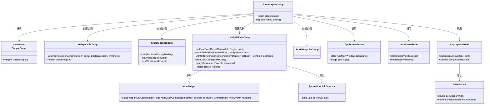
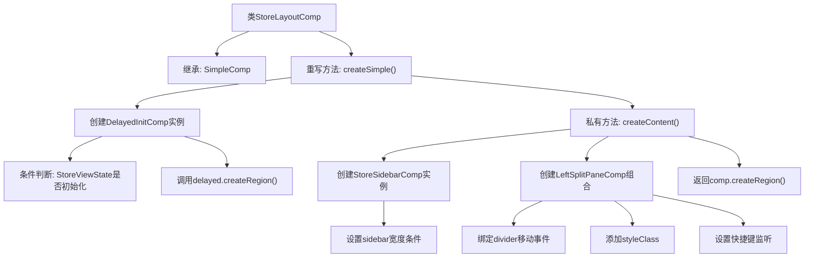

# 基础信息

|      |      |
|------|------|
| 名称 | StoreLayoutComp |
| 编码语言 | .java |
| 代码路径 | xpipe/app/src/main/java/io/xpipe/app/comp/store/StoreLayoutComp.java |
| 包名 | io.xpipe.app.comp.store |
| 依赖项 | ['io.xpipe.app.comp.Comp', 'io.xpipe.app.comp.SimpleComp', 'io.xpipe.app.comp.base.DelayedInitComp', 'io.xpipe.app.comp.base.LeftSplitPaneComp', 'io.xpipe.app.core.AppActionLinkDetector', 'io.xpipe.app.core.AppLayoutModel', 'io.xpipe.app.core.window.AppMainWindow', 'io.xpipe.app.util.InputHelper', 'javafx.scene.input.KeyCode', 'javafx.scene.input.KeyCodeCombination', 'javafx.scene.input.KeyCombination', 'javafx.scene.layout.Region'] |
| 概述说明 | 商店布局组件，包含延迟初始化的侧边栏和主内容区，支持宽度调整和快捷键粘贴检测。 |

# 说明

该代码定义了一个名为StoreLayoutComp的组件类，继承自SimpleComp。主要功能是创建商店布局界面，包含左侧边栏和主内容区。左侧边栏宽度可调整并保存状态，最小宽度270，最大500，在窗口宽度小于1000时隐藏。布局支持快捷键Ctrl+V触发粘贴检测。整体采用延迟初始化策略，需等待StoreViewState初始化完成才会加载内容。

# 类列表 Class Summary

| 名称   | 类型  | 说明 |
|-------|------|-------------|
| StoreLayoutComp | class | StoreLayoutComp创建延迟初始化布局，包含可隐藏侧边栏和主内容区，支持宽度调整和快捷键粘贴检测。 |

## 类 StoreLayoutComp

|      |      |
|------|------|
| 访问范围 | public |
| 类型 | class |
| 名称 | StoreLayoutComp |
| 说明 | StoreLayoutComp创建延迟初始化布局，包含可隐藏侧边栏和主内容区，支持宽度调整和快捷键粘贴检测。 |

### UML类图

这段代码展示了一个商店布局组件(StoreLayoutComp)的实现，它继承自SimpleComp接口。主要功能是通过DelayedInitComp延迟初始化布局内容，创建包含左侧边栏(StoreSidebarComp)和主内容区(StoreEntryListComp)的可调整分割布局(LeftSplitPaneComp)。组件会响应窗口大小变化，保存布局状态，并处理快捷键操作。整个设计采用了分层结构和观察者模式，通过多个辅助类共同完成复杂的UI交互功能。

### 内部方法调用关系图

这段代码实现了一个商店布局组件，主要包含延迟初始化和响应式布局功能。流程图展示了从主类继承关系开始，通过createSimple()方法创建延迟初始化组件，当StoreViewState就绪时才会执行实际内容创建。createContent()方法构建了包含侧边栏和主内容区的分割面板布局，设置了宽度约束、分割线移动事件监听、样式类和Ctrl+V快捷键粘贴检测功能，最终返回布局区域。整个过程体现了条件渲染和UI交互的完整生命周期管理。

### 字段列表 Field List

| 名称  | 类型  | 说明 |
|-------|-------|------|

### 方法列表 Method List

| 名称  | 类型  | 说明 |
|-------|-------|------|
| createContent | Region | 创建左侧边栏组件，宽度270-500，随窗口隐藏，保存宽度状态，支持快捷键粘贴检测。 |
| createSimple | Region | 重写方法创建延迟初始化区域，依赖状态检查。 |

