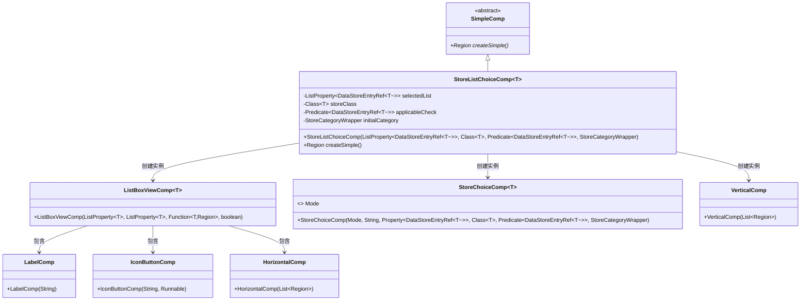
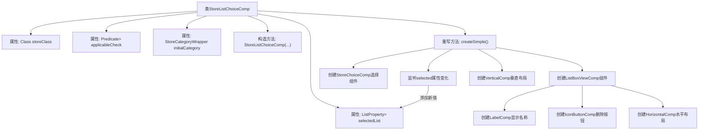
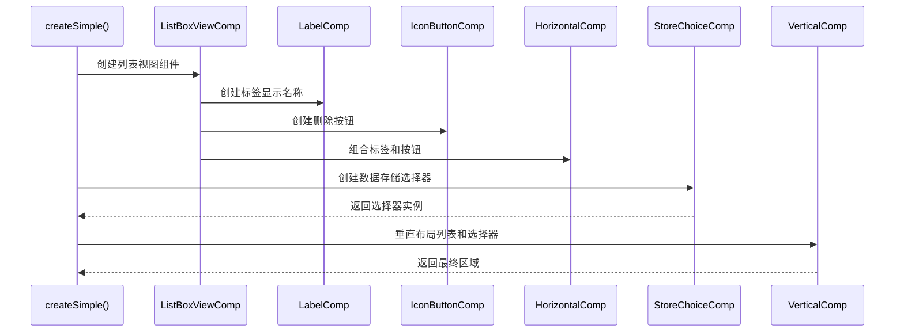

# 基础信息

|      |      |
|------|------|
| 名称 | StoreListChoiceComp |
| 编码语言 | .java |
| 代码路径 | xpipe/app/src/main/java/io/xpipe/app/comp/store/StoreListChoiceComp.java |
| 包名 | io.xpipe.app.comp.store |
| 依赖项 | ['io.xpipe.app.comp.Comp', 'io.xpipe.app.comp.SimpleComp', 'io.xpipe.app.comp.base', 'io.xpipe.app.storage.DataStoreEntryRef', 'io.xpipe.core.store.DataStore', 'javafx.beans.binding.Bindings', 'javafx.beans.property.ListProperty', 'javafx.beans.property.SimpleObjectProperty', 'javafx.geometry.Insets', 'javafx.scene.layout.Region', 'javafx.scene.layout.VBox', 'java.util.List', 'java.util.function.Predicate'] |
| 概述说明 | 存储列表选择组件，支持多选和删除操作。 |

# 说明

这是一个名为StoreListChoiceComp的Java类，继承自SimpleComp，用于创建数据存储列表选择组件。类包含四个主要属性：selectedList存储选定项列表，storeClass指定存储类型，applicableCheck用于验证项是否可用，initialCategory设置初始类别。createSimple方法构建界面，包含列表显示区(ListBoxViewComp)和添加区(StoreChoiceComp)。列表项显示名称和图标，可删除；添加区通过监听器将新项加入列表。整体布局使用VerticalComp垂直排列组件，并应用样式类。

# 类列表 Class Summary

| 名称   | 类型  | 说明 |
|-------|------|-------------|
| StoreListChoiceComp | class | 存储列表选择组件，支持多选、删除和添加功能。 |

## 类 StoreListChoiceComp

|      |      |
|------|------|
| 访问范围 | public |
| 类型 | class |
| 名称 | StoreListChoiceComp |
| 说明 | 存储列表选择组件，支持多选、删除和添加功能。 |

### UML类图

类图描述：该图展示了一个泛型类`StoreListChoiceComp`继承自抽象类`SimpleComp`的结构，主要用于管理数据存储条目选择列表。它包含多个UI组件如`ListBoxViewComp`、`StoreChoiceComp`等，通过组合模式构建复杂界面。`ListBoxViewComp`内部又包含`LabelComp`、`IconButtonComp`等基础组件，形成层级嵌套关系。整体设计体现了JavaFX组件的组合使用和属性绑定机制。

### 内部方法调用关系图

该流程图展示了StoreListChoiceComp泛型类的核心结构和createSimple()方法的执行流程。类包含4个主要属性和1个构造方法，核心逻辑在createSimple()中实现，该方法创建了包含可删除项列表和添加功能的复合组件。时序图详细描述了组件创建过程，包括列表项渲染、删除按钮集成和垂直布局构建，最终生成一个支持多选和分类筛选的数据存储选择界面。

### 字段列表 Field List

| 名称  | 类型  | 说明 |
|-------|-------|------|
| applicableCheck | Predicate<DataStoreEntryRef<T>> | 私有谓词检查DataStoreEntryRef<T>适用性。 |
| storeClass | Class<T> | 私有泛型类成员变量storeClass。 |
| selectedList | ListProperty<DataStoreEntryRef<T>> | 私有最终列表属性，存储DataStoreEntryRef类型元素。 |
| initialCategory | StoreCategoryWrapper | 初始类别存储包装器 |

### 方法列表 Method List

| 名称  | 类型  | 说明 |
|-------|-------|------|
| createSimple | Region | 创建列表选择组件，含删除功能，支持添加新项并验证。 |

