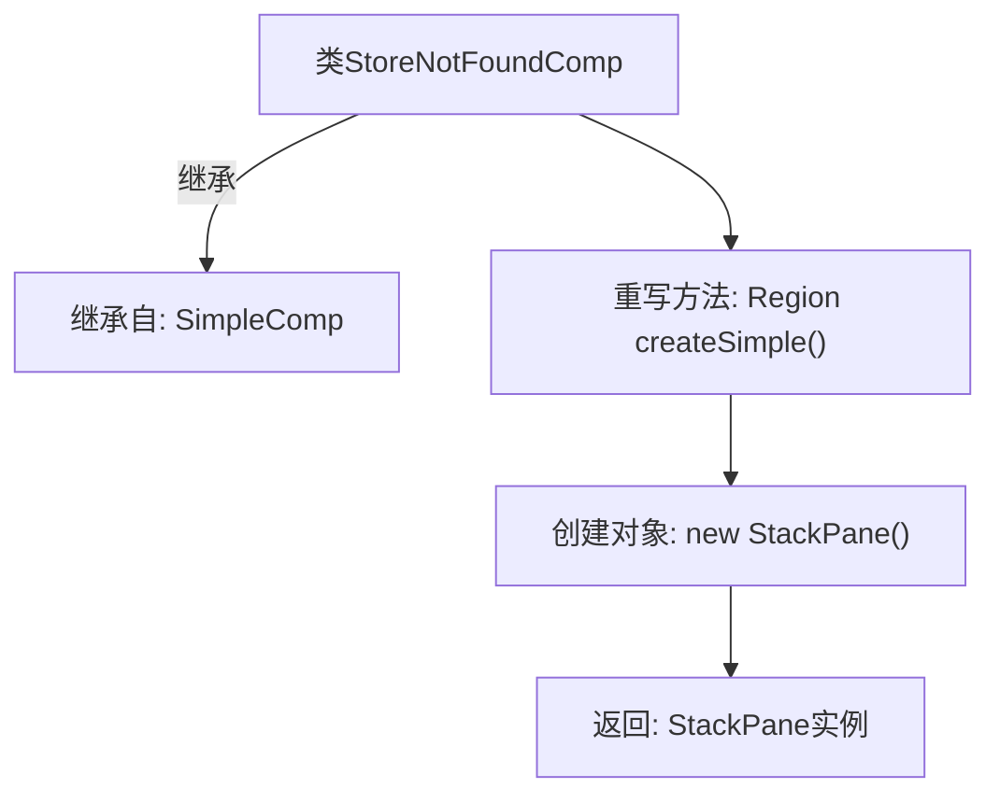

# 基础信息

|      |      |
|------|------|
| 名称 | StoreNotFoundComp |
| 编码语言 | .java |
| 代码路径 | xpipe/app/src/main/java/io/xpipe/app/comp/store/StoreNotFoundComp.java |
| 包名 | io.xpipe.app.comp.store |
| 依赖项 | ['io.xpipe.app.comp.SimpleComp', 'javafx.scene.layout.Region', 'javafx.scene.layout.StackPane'] |
| 概述说明 | 未找到商店页面的简单组件类，重写方法返回空面板。 |

# 说明

该内容定义了一个名为StoreNotFoundComp的Java类，继承自SimpleComp类。该类重写了createSimple方法，返回一个StackPane类型的Region对象。方法实现简单，仅创建并返回一个空的StackPane实例，未包含其他逻辑或属性设置。整个类结构简洁，专注于基础UI容器的创建。

# 类列表 Class Summary

| 名称   | 类型  | 说明 |
|-------|------|-------------|
| StoreNotFoundComp | class | 未找到商店的简单组件类，返回空面板。 |


## 类 StoreNotFoundComp

|      |      |
|------|------|
| 访问范围 | public |
| 类型 | class |
| 名称 | StoreNotFoundComp |
| 说明 | 未找到商店的简单组件类，返回空面板。 |


### UML类图

```mermaid
classDiagram
    class SimpleComp {
        <<Abstract>>
        +Region createSimple()*
    }
    // SimpleComp是抽象基类，定义创建Region的接口

    class StoreNotFoundComp {
        +Region createSimple()
    }
    // StoreNotFoundComp是具体实现类，返回StackPane实例

    SimpleComp <|-- StoreNotFoundComp : 继承
```

这段类图展示了StoreNotFoundComp继承自抽象类SimpleComp的关系。SimpleComp定义了抽象方法createSimple()，要求子类实现返回Region对象的功能。StoreNotFoundComp作为具体实现类，通过重写该方法返回一个StackPane实例。这种设计模式实现了模板方法模式，父类定义算法骨架，子类提供具体实现。


### 内部方法调用关系图



这段流程图描述了StoreNotFoundComp类的结构及其关键方法。该类继承自SimpleComp基类，并重写了createSimple()方法。当调用createSimple()时，会创建一个StackPane布局对象并返回。该流程图清晰地展示了类继承关系和方法调用链，其中createSimple()作为核心功能方法，通过实例化StackPane实现父类抽象方法的具象化，最终返回该布局对象供上层使用。

### 字段列表 Field List

| 名称  | 类型  | 说明 |
|-------|-------|------|

### 方法列表 Method List

| 名称  | 类型  | 说明 |
|-------|-------|------|
| createSimple | Region | 重写方法，返回新建的StackPane区域实例。 |


