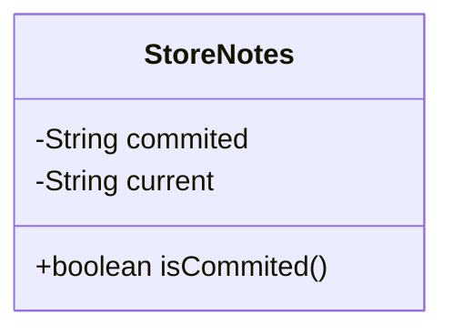
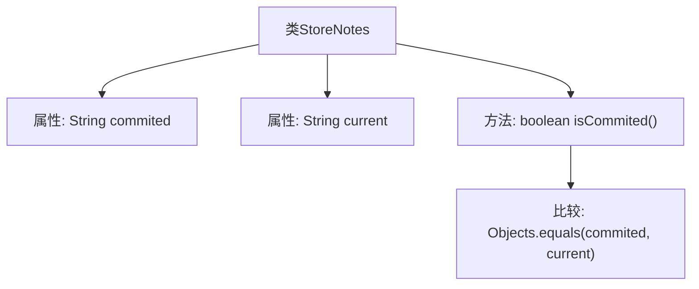

# 基础信息

|      |      |
|------|------|
| 名称 | StoreNotes |
| 编码语言 | .java |
| 代码路径 | xpipe/app/src/main/java/io/xpipe/app/comp/store/StoreNotes.java |
| 包名 | io.xpipe.app.comp.store |
| 依赖项 | ['lombok.Value', 'java.util.Objects'] |
| 概述说明 | 存储笔记类，含提交和当前内容，检查是否一致。 |

# 说明

这是一个名为StoreNotes的公开类，包含两个字符串类型成员变量commited和current。该类提供了一个isCommited方法，用于比较这两个变量的值是否相等，返回布尔结果。方法通过Objects.equals实现安全比较，避免空指针异常。整个类结构简洁，专注于状态比较功能。

# 类列表 Class Summary

| 名称   | 类型  | 说明 |
|-------|------|-------------|
| StoreNotes | class | StoreNotes类包含commited和current字段，isCommited方法比较两者是否相等。 |

## 类 StoreNotes

|      |      |
|------|------|
| 访问范围 | @Value;public |
| 类型 | class |
| 名称 | StoreNotes |
| 说明 | StoreNotes类包含commited和current字段，isCommited方法比较两者是否相等。 |

### UML类图

这段代码定义了一个简单的`StoreNotes`类，用于存储和比较两个字符串状态。类中包含两个私有字符串字段`commited`和`current`，以及一个公有方法`isCommited()`用于比较这两个字段是否相等。通过`Objects.equals()`方法进行空安全比较，返回布尔值表示当前状态是否与提交状态一致。该设计适用于需要跟踪对象状态变化的场景，如版本控制或事务管理。

### 内部方法调用关系图

这段代码展示了一个简单的StoreNotes类，包含两个字符串属性commited和current，以及一个isCommited()方法。该方法通过Objects.equals()比较两个属性的值是否相等，返回布尔结果。流程图清晰地呈现了类结构与内部方法调用关系，其中isCommited()方法作为核心功能，直接依赖于两个属性的值比较。这种设计常用于版本控制或状态跟踪场景，用于检测当前内容是否与已提交内容一致。

### 字段列表 Field List

| 名称  | 类型  | 说明 |
|-------|-------|------|
| current | String | 当前字符串 |
| commited | String | 字符串已提交 |

### 方法列表 Method List

| 名称  | 类型  | 说明 |
|-------|-------|------|
| isCommited | boolean | 检查commited与current是否相等。 |

