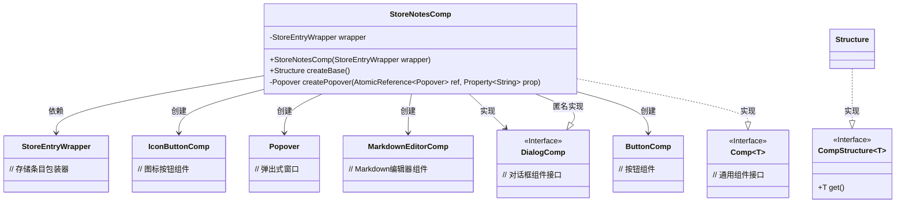
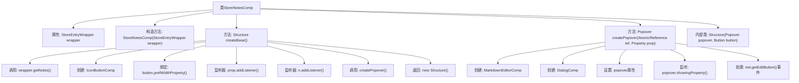

# 基础信息

|      |      |
|------|------|
| 名称 | StoreNotesComp |
| 编码语言 | .java |
| 代码路径 | xpipe/app/src/main/java/io/xpipe/app/comp/store/StoreNotesComp.java |
| 包名 | io.xpipe.app.comp.store |
| 依赖项 | ['io.xpipe.app.comp.Comp', 'io.xpipe.app.comp.CompStructure', 'io.xpipe.app.comp.base.ButtonComp', 'io.xpipe.app.comp.base.DialogComp', 'io.xpipe.app.comp.base.IconButtonComp', 'io.xpipe.app.comp.base.MarkdownEditorComp', 'io.xpipe.app.core.AppFontSizes', 'io.xpipe.app.core.AppI18n', 'io.xpipe.app.storage.DataStorage', 'io.xpipe.app.util.BindingsHelper', 'javafx.application.Platform', 'javafx.beans.property.Property', 'javafx.beans.property.SimpleStringProperty', 'javafx.event.ActionEvent', 'javafx.scene.control.Button', 'javafx.scene.paint.Color', 'atlantafx.base.controls.Popover', 'java.util.List', 'java.util.concurrent.atomic.AtomicReference'] |
| 概述说明 | StoreNotesComp类实现笔记按钮和弹出编辑功能，支持保存和删除操作。 |

# 说明

StoreNotesComp是一个用于管理存储条目笔记的组件类，继承自Comp基类。它包含一个StoreEntryWrapper实例作为构造参数，通过createBase方法构建界面结构。主要功能包括：创建带图标的按钮，按钮显示状态与笔记内容绑定；点击按钮时弹出Popover对话框，内置Markdown编辑器用于编辑笔记；支持保存、取消、删除笔记操作，并自动同步到数据存储。组件还处理了笔记状态变更监听、对话框显示逻辑及平台兼容性问题，确保UI交互流畅。

# 类列表 Class Summary

| 名称   | 类型  | 说明 |
|-------|------|-------------|
| StoreNotesComp | class | StoreNotesComp类实现笔记按钮和弹出编辑功能，支持保存和删除操作。 |

## 类 StoreNotesComp

|      |      |
|------|------|
| 访问范围 | public |
| 类型 | class |
| 名称 | StoreNotesComp |
| 说明 | StoreNotesComp类实现笔记按钮和弹出编辑功能，支持保存和删除操作。 |

### UML类图

这段代码展示了一个笔记存储组件`StoreNotesComp`的类结构，它继承自通用组件接口`Comp`并实现了特定的笔记管理功能。核心类`StoreNotesComp`通过`StoreEntryWrapper`获取笔记数据，使用`IconButtonComp`作为触发按钮，通过`Popover`显示包含`MarkdownEditorComp`的编辑对话框。匿名实现的`DialogComp`处理笔记的保存和删除操作，整体结构体现了GUI组件间的组合关系和事件处理机制。

### 内部方法调用关系图

这段代码流程图展示了StoreNotesComp类的核心结构和主要方法调用关系。该类用于管理商店笔记的交互界面，包含创建基础UI结构(createBase)和弹窗(createPopover)两个核心方法。流程从类属性开始，展示了构造方法初始化、按钮创建与绑定、属性监听器设置、弹窗创建与配置等关键步骤，最后返回包含弹窗和按钮的Structure结构体。整个流程体现了响应式UI组件的构建过程，包括事件处理、数据绑定和状态管理等重要环节。

### 字段列表 Field List

| 名称  | 类型  | 说明 |
|-------|-------|------|
| wrapper | StoreEntryWrapper | 私有存储条目包装器实例。 |

### 方法列表 Method List

| 名称  | 类型  | 说明 |
|-------|-------|------|
| createBase | Structure | 创建带注释按钮的UI组件，绑定属性并处理弹出窗口逻辑。 |
| createPopover | Popover | 创建弹窗编辑器，含保存、取消、删除功能，支持编辑和自动保存。 |

