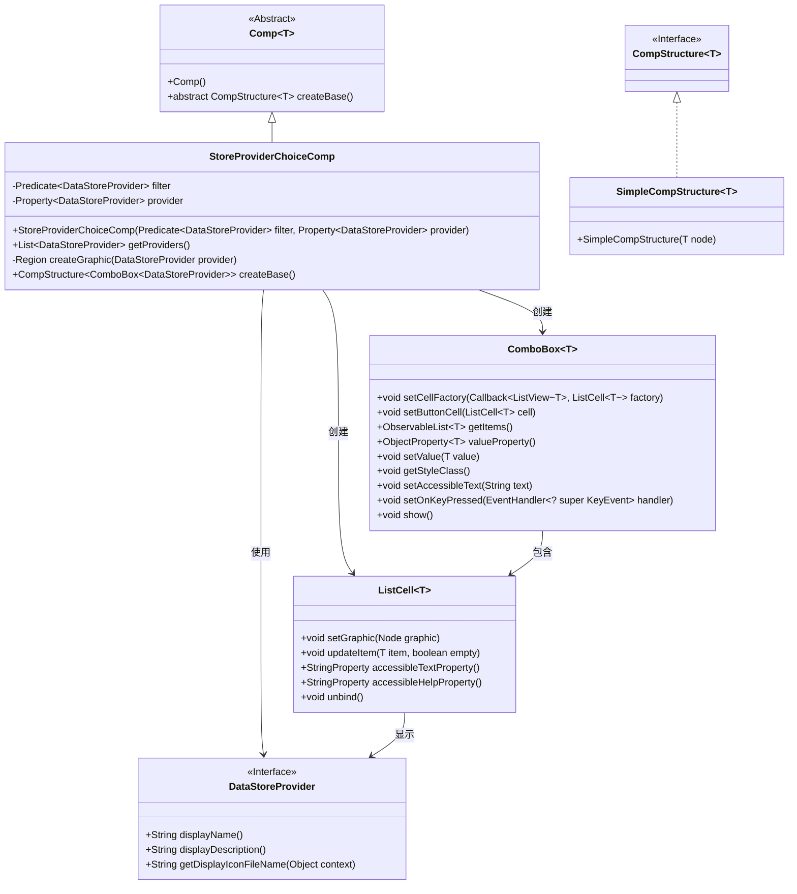
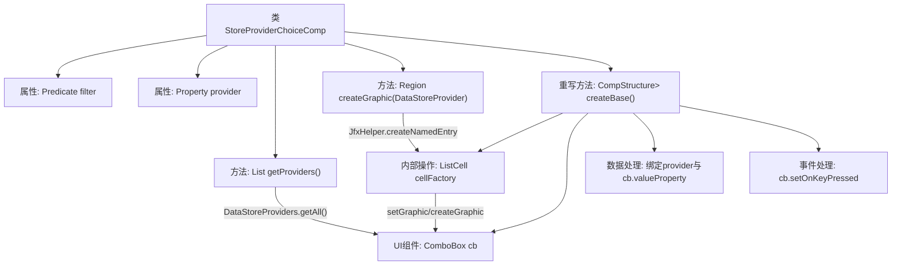

# 基础信息

|      |      |
|------|------|
| 名称 | StoreProviderChoiceComp |
| 编码语言 | .java |
| 代码路径 | xpipe/app/src/main/java/io/xpipe/app/comp/store/StoreProviderChoiceComp.java |
| 包名 | io.xpipe.app.comp.store |
| 依赖项 | ['io.xpipe.app.comp.Comp', 'io.xpipe.app.comp.CompStructure', 'io.xpipe.app.comp.SimpleCompStructure', 'io.xpipe.app.ext.DataStoreProvider', 'io.xpipe.app.ext.DataStoreProviders', 'io.xpipe.app.util.JfxHelper', 'javafx.beans.property.Property', 'javafx.scene.control.ComboBox', 'javafx.scene.control.ListCell', 'javafx.scene.input.KeyCode', 'javafx.scene.layout.Region', 'lombok.AccessLevel', 'lombok.AllArgsConstructor', 'lombok.experimental.FieldDefaults', 'java.util.List', 'java.util.function.Predicate', 'java.util.function.Supplier'] |
| 概述说明 | 存储选择组件类，含过滤器和属性，提供数据存储列表并绑定UI控件。 |

# 说明

这是一个名为StoreProviderChoiceComp的Java类，用于创建数据存储提供者选择组件。该类继承自Comp类，使用ComboBox作为基础结构。主要功能包括：通过filter属性过滤可用的数据存储提供者列表；使用createGraphic方法为每个选项创建图形化显示；通过createBase方法构建下拉选择框，包含自定义单元格渲染、初始值设置和键盘事件处理。组件支持无障碍访问，绑定显示名称和描述，并在按下Enter键时自动展开下拉列表。

# 类列表 Class Summary

| 名称   | 类型  | 说明 |
|-------|------|-------------|
| StoreProviderChoiceComp | class | 存储选择组件类，含过滤器和属性，提供数据存储列表并显示图标和描述。 |

## 类 StoreProviderChoiceComp

|      |      |
|------|------|
| 访问范围 | @FieldDefaults(makeFinal = true, level = AccessLevel.PRIVATE);@AllArgsConstructor;public |
| 类型 | class |
| 名称 | StoreProviderChoiceComp |
| 说明 | 存储选择组件类，含过滤器和属性，提供数据存储列表并显示图标和描述。 |

### UML类图

这段代码展示了一个StoreProviderChoiceComp类，继承自泛型Comp类，用于创建和管理一个数据存储提供者的选择组件。该类通过ComboBox显示可选的DataStoreProvider列表，使用自定义ListCell来呈现每个选项的图标和描述信息。代码实现了数据过滤、UI渲染和用户交互处理功能，核心是通过JavaFX组件构建一个可访问性良好的下拉选择器。

### 内部方法调用关系图

这段代码实现了一个可定制的数据存储提供者选择组件，主要功能包括：通过getProviders方法过滤可用提供者列表，使用createGraphic创建带图标的UI元素，在createBase方法中构建ComboBox组件并配置单元格工厂、数据绑定和键盘事件。流程图展示了类结构、核心方法调用关系和数据流向，重点突出了UI组件与数据处理的交互过程，以及事件处理逻辑的集成方式。

### 字段列表 Field List

| 名称  | 类型  | 说明 |
|-------|-------|------|
| filter | Predicate<DataStoreProvider> | 数据存储提供者的过滤谓词。 |
| provider | Property<DataStoreProvider> | 数据存储提供者属性声明。 |

### 方法列表 Method List

| 名称  | 类型  | 说明 |
|-------|-------|------|
| getProviders | List<DataStoreProvider> | 获取数据存储提供者列表，按条件过滤后返回。 |
| createGraphic | Region | 创建图形区域：检查提供者非空后，获取图标并生成命名条目。 |
| createBase | CompStructure<ComboBox<DataStoreProvider>> | 创建组合框组件，绑定数据源并设置样式和事件。 |

