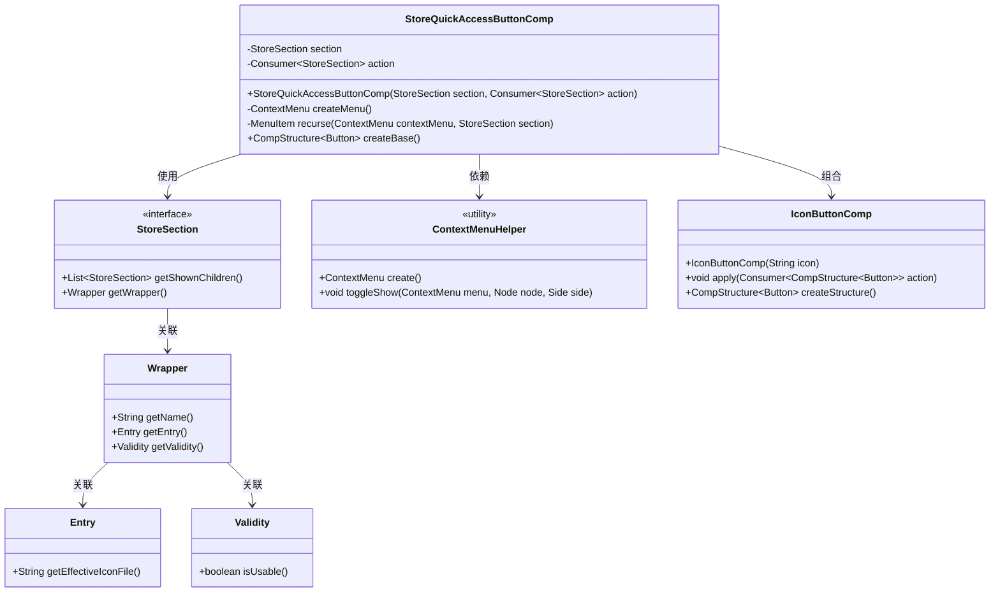
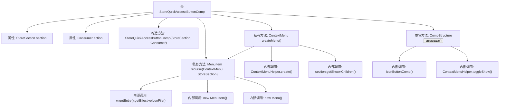

# 基础信息

|      |      |
|------|------|
| 名称 | StoreQuickAccessButtonComp |
| 编码语言 | .java |
| 代码路径 | xpipe/app/src/main/java/io/xpipe/app/comp/store/StoreQuickAccessButtonComp.java |
| 包名 | io.xpipe.app.comp.store |
| 依赖项 | ['io.xpipe.app.comp.Comp', 'io.xpipe.app.comp.CompStructure', 'io.xpipe.app.comp.base.IconButtonComp', 'io.xpipe.app.comp.base.PrettyImageHelper', 'io.xpipe.app.util.ContextMenuHelper', 'io.xpipe.app.util.LabelGraphic', 'javafx.geometry.Side', 'javafx.scene.control.Button', 'javafx.scene.control.ContextMenu', 'javafx.scene.control.Menu', 'javafx.scene.control.MenuItem', 'java.util.ArrayList', 'java.util.concurrent.atomic.AtomicReference', 'java.util.function.Consumer'] |
| 概述说明 | 商店快速访问按钮组件，含菜单递归生成及点击动作处理。 |

# 说明

该代码定义了一个名为StoreQuickAccessButtonComp的组件类，用于创建商店快速访问按钮。该类继承自Comp，包含StoreSection和Consumer参数。主要功能是生成一个带图标的按钮，点击时显示上下文菜单。菜单通过递归方法recurse构建，包含子菜单项和操作逻辑。按钮点击时切换菜单显示，菜单项点击后执行传入的action并隐藏菜单。组件使用图标按钮，支持多级嵌套菜单结构，并包含有效性检查。

# 类列表 Class Summary

| 名称   | 类型  | 说明 |
|-------|------|-------------|
| StoreQuickAccessButtonComp | class | 商店快速访问按钮组件，含菜单递归生成逻辑，点击触发动作。 |

## 类 StoreQuickAccessButtonComp

|      |      |
|------|------|
| 访问范围 | public |
| 类型 | class |
| 名称 | StoreQuickAccessButtonComp |
| 说明 | 商店快速访问按钮组件，含菜单递归生成逻辑，点击触发动作。 |

### UML类图

该代码实现了一个商店快速访问按钮组件，通过递归方式创建多级上下文菜单。核心类`StoreQuickAccessButtonComp`继承自泛型组件`Comp`，包含菜单创建逻辑和按钮行为控制。它依赖`StoreSection`接口获取层级数据，使用`ContextMenuHelper`工具类管理菜单显示，并通过`IconButtonComp`实现基础按钮功能。菜单项动态生成时会校验`Wrapper`中的有效性状态，并加载`Entry`中的图标资源。整体设计采用组合模式处理多级菜单结构，通过事件消费机制实现交互控制。

### 内部方法调用关系图

这段代码实现了一个商店快速访问按钮组件，主要功能是创建带有层级菜单的按钮。当按钮被点击时，会根据StoreSection的数据结构递归生成上下文菜单，菜单项可以触发预设的action操作。流程图展示了类结构、主要方法调用关系，包括菜单创建、递归处理菜单项以及按钮事件处理等核心逻辑。组件通过组合模式将按钮与动态生成的菜单结合，实现了灵活的可扩展交互功能。

### 字段列表 Field List

| 名称  | 类型  | 说明 |
|-------|-------|------|
| section | StoreSection | 私有存储区段对象。 |
| action | Consumer<StoreSection> | 私有最终消费者动作，处理StoreSection类型参数。 |

### 方法列表 Method List

| 名称  | 类型  | 说明 |
|-------|-------|------|
| createMenu | ContextMenu | 创建上下文菜单，若无子项返回空，否则添加菜单项并返回。 |
| recurse | MenuItem | 递归生成菜单项，处理子项和图标，触发动作后隐藏菜单。 |
| createBase | CompStructure<Button> | 创建带图标的按钮，点击时显示右侧菜单。 |

