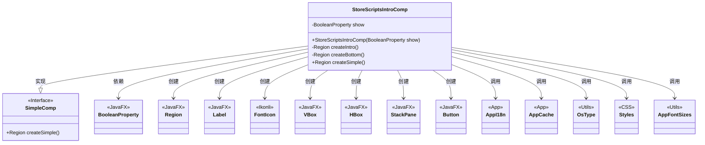
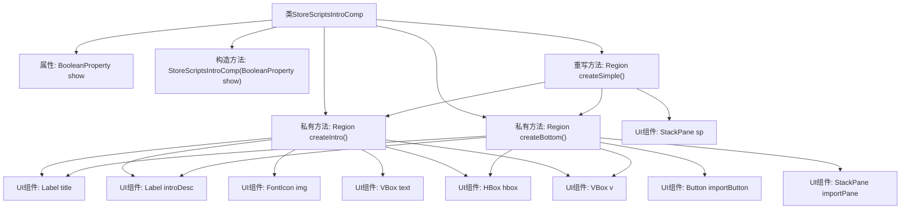

# 基础信息

|      |      |
|------|------|
| 名称 | StoreScriptsIntroComp |
| 编码语言 | .java |
| 代码路径 | xpipe/app/src/main/java/io/xpipe/app/comp/store/StoreScriptsIntroComp.java |
| 包名 | io.xpipe.app.comp.store |
| 依赖项 | ['io.xpipe.app.comp.SimpleComp', 'io.xpipe.app.core.AppCache', 'io.xpipe.app.core.AppFontSizes', 'io.xpipe.app.core.AppI18n', 'io.xpipe.core.process.OsType', 'javafx.beans.property.BooleanProperty', 'javafx.geometry.Insets', 'javafx.geometry.Pos', 'javafx.scene.control.Button', 'javafx.scene.control.Label', 'javafx.scene.layout.HBox', 'javafx.scene.layout.Region', 'javafx.scene.layout.StackPane', 'javafx.scene.layout.VBox', 'atlantafx.base.theme.Styles', 'org.kordamp.ikonli.javafx.FontIcon'] |
| 概述说明 | StoreScriptsIntroComp类创建脚本介绍界面，包含标题、描述和启动按钮。 |

# 说明

StoreScriptsIntroComp是一个继承自SimpleComp的JavaFX组件，用于展示脚本介绍界面。它包含两个主要部分：createIntro创建顶部介绍区域，包含标题、描述文本和图标；createBottom创建底部区域，包含标题、描述、启动按钮和图标。组件通过BooleanProperty控制显示状态，点击按钮会更新缓存并隐藏界面。布局采用VBox和HBox组合，支持多语言绑定，样式根据操作系统类型调整，图标使用FontIcon实现。整体界面居中显示，具有自适应尺寸和间距设置。

# 类列表 Class Summary

| 名称   | 类型  | 说明 |
|-------|------|-------------|
| StoreScriptsIntroComp | class | StoreScriptsIntroComp类创建脚本介绍界面，包含标题、描述和启动按钮，支持多语言和样式调整。 |

## 类 StoreScriptsIntroComp

|      |      |
|------|------|
| 访问范围 | public |
| 类型 | class |
| 名称 | StoreScriptsIntroComp |
| 说明 | StoreScriptsIntroComp类创建脚本介绍界面，包含标题、描述和启动按钮，支持多语言和样式调整。 |

### UML类图

这段代码展示了一个JavaFX组件`StoreScriptsIntroComp`，它继承自`SimpleComp`接口，用于创建脚本介绍界面。该类包含两个核心私有方法`createIntro()`和`createBottom()`分别创建介绍区域和底部操作区域，并通过`createSimple()`方法组合这两个区域。代码大量使用JavaFX控件（如Label、Button、VBox等）和Ikonli图标库，同时依赖国际化工具AppI18n和样式工具类。组件通过BooleanProperty控制显示状态，并在按钮点击时更新应用缓存。

### 内部方法调用关系图

这段代码是JavaFX的GUI组件类，继承自SimpleComp，主要用于创建脚本介绍界面。流程图展示了类结构和方法调用关系，包含两个核心构建方法createIntro()和createBottom()，分别创建介绍区域和底部操作区域，最终由createSimple()方法整合成完整界面。特别注意UI组件的嵌套关系和属性绑定机制，如文本绑定国际化资源和按钮事件处理。

### 字段列表 Field List

| 名称  | 类型  | 说明 |
|-------|-------|------|
| show | BooleanProperty | 私有布尔属性show |

### 方法列表 Method List

| 名称  | 类型  | 说明 |
|-------|-------|------|
| createIntro | Region | 创建带标题、描述和图标的垂直布局区域，支持多语言绑定和样式调整。 |
| createBottom | Region | 创建底部区域，包含标题、描述、按钮和图标，布局为水平垂直组合。 |
| createSimple | Region | 创建垂直布局面板，设置间距尺寸，居中返回堆栈面板。 |

