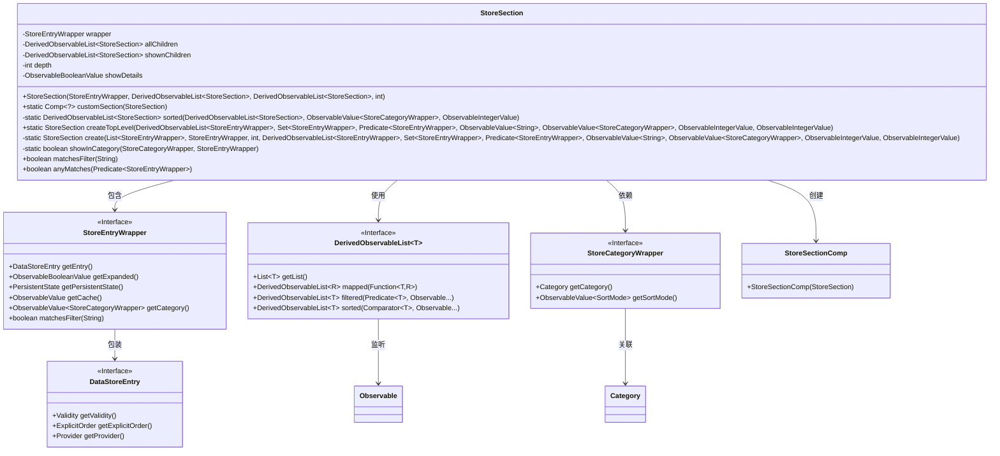
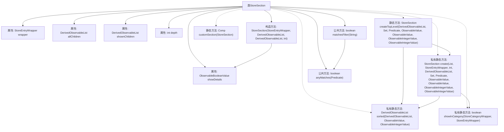

# 基础信息

|      |      |
|------|------|
| 名称 | StoreSection |
| 编码语言 | .java |
| 代码路径 | xpipe/app/src/main/java/io/xpipe/app/comp/store/StoreSection.java |
| 包名 | io.xpipe.app.comp.store |
| 依赖项 | ['io.xpipe.app.comp.Comp', 'io.xpipe.app.prefs.AppPrefs', 'io.xpipe.app.storage.DataStorage', 'io.xpipe.app.storage.DataStoreEntry', 'io.xpipe.app.util.BindingsHelper', 'io.xpipe.app.util.DerivedObservableList', 'javafx.beans.binding.Bindings', 'javafx.beans.property.SimpleBooleanProperty', 'javafx.beans.value.ObservableBooleanValue', 'javafx.beans.value.ObservableIntegerValue', 'javafx.beans.value.ObservableValue', 'lombok.Getter', 'java.util.ArrayList', 'java.util.Comparator', 'java.util.List', 'java.util.Set', 'java.util.function.Predicate', 'java.util.function.ToIntFunction'] |
| 概述说明 | StoreSection类管理商店条目层级结构，包含子列表、深度和显示逻辑。 |

# 说明

StoreSection类用于管理商店条目层级结构，包含包装器、子节点列表、深度和显示状态等属性。构造函数初始化这些属性，并根据包装器状态决定是否显示详情。提供静态方法创建顶级节点和排序子节点列表，支持按显式顺序和分类模式排序。通过过滤条件控制条目可见性，包括匹配筛选字符串、选择器条件和分类归属。包含辅助方法检查条目是否匹配筛选条件或任意条件，并处理分类层级关系以确保正确显示。

# 类列表 Class Summary

| 名称   | 类型  | 说明 |
|-------|------|-------------|
| StoreSection | class | StoreSection类管理商店条目层次结构，包含子列表、深度和显示逻辑，支持过滤和排序。 |

## 类 StoreSection

|      |      |
|------|------|
| 访问范围 | @Getter;public |
| 类型 | class |
| 名称 | StoreSection |
| 说明 | StoreSection类管理商店条目层次结构，包含子列表、深度和显示逻辑，支持过滤和排序。 |

### UML类图

这段代码描述了一个商店分区的数据结构，主要用于管理商店条目及其子分区的层级关系、过滤和排序功能。StoreSection类通过wrapper封装商店条目，维护所有子分区和显示子分区的列表，并提供创建顶级分区、自定义排序、过滤匹配等方法。类图中展示了与StoreEntryWrapper、DerivedObservableList等接口的依赖关系，体现了复杂的数据处理和观察者模式应用。

### 内部方法调用关系图

这段代码定义了一个StoreSection类，用于管理商店条目及其子条目。主要功能包括：通过构造方法初始化条目包装器、子列表和深度；提供静态方法创建顶级条目和子条目；实现条目排序、过滤和分类显示逻辑。类中包含多个属性如wrapper、allChildren等，以及关键方法如createTopLevel()用于创建顶层条目，sorted()用于排序，create()用于递归创建子条目。整体结构体现了分层数据管理和响应式编程的特点。

### 字段列表 Field List

| 名称  | 类型  | 说明 |
|-------|-------|------|
| showDetails | ObservableBooleanValue | 私有不可变布尔值显示详情属性 |
| depth | int | 私有整型变量depth |
| allChildren | DerivedObservableList<StoreSection> | 私有最终派生观察列表存储所有子节点 |
| shownChildren | DerivedObservableList<StoreSection> | 私有最终派生可观察列表存储区段显示子项 |
| wrapper | StoreEntryWrapper | 私有存储条目包装器实例。 |

### 方法列表 Method List

| 名称  | 类型  | 说明 |
|-------|-------|------|
| create | StoreSection | 创建StoreSection方法：处理条目有效性、子项过滤、排序及可见性检查，返回新实例。 |
| customSection | Comp<?> | 静态方法customSection接收StoreSection参数，返回StoreSectionComp实例。 |
| createTopLevel | StoreSection | 创建顶级商店区段，过滤、映射、排序并显示符合条件的条目。 |
| sorted | DerivedObservableList<StoreSection> | 对商店分类列表进行排序，优先不可用项置底，再按显式顺序和当前排序模式比较。 |
| showInCategory | boolean | 检查条目是否属于指定分类或其父分类，根据设置决定是否显示子分类。 |
| matchesFilter | boolean | 方法检查字符串是否匹配过滤器，返回布尔值。 |
| anyMatches | boolean | 检查条件：空或包装器匹配或子项任一匹配。 |

