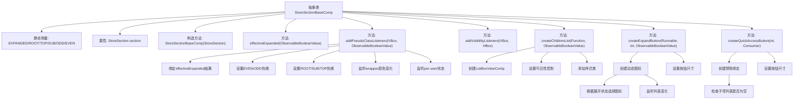

# 基础信息

|      |      |
|------|------|
| 名称 | StoreSectionBaseComp |
| 编码语言 | .java |
| 代码路径 | xpipe/app/src/main/java/io/xpipe/app/comp/store/StoreSectionBaseComp.java |
| 包名 | io.xpipe.app.comp.store |
| 依赖项 | ['io.xpipe.app.comp.Comp', 'io.xpipe.app.comp.CompStructure', 'io.xpipe.app.comp.base.IconButtonComp', 'io.xpipe.app.comp.base.ListBoxViewComp', 'io.xpipe.app.storage.DataStoreColor', 'io.xpipe.app.util.BindingsHelper', 'io.xpipe.app.util.LabelGraphic', 'javafx.beans.binding.Bindings', 'javafx.beans.property.SimpleBooleanProperty', 'javafx.beans.value.ObservableBooleanValue', 'javafx.css.PseudoClass', 'javafx.scene.control.Button', 'javafx.scene.layout.HBox', 'javafx.scene.layout.VBox', 'java.util.ArrayList', 'java.util.Arrays', 'java.util.function.Consumer', 'java.util.function.Function'] |
| 概述说明 | 抽象类StoreSectionBaseComp，扩展Comp，管理商店区段UI状态与交互，包括展开控制、样式监听和按钮创建。 |

# 说明

这是一个抽象类StoreSectionBaseComp，继承自Comp类，用于构建基于VBox布局的商店区域组件。类中定义了多个静态伪类常量用于样式控制，包含EXPANDED、ROOT、TOP等。构造函数接收StoreSection对象作为参数。提供了effectiveExpanded方法处理展开状态逻辑，addPseudoClassListeners方法添加伪类监听器来管理组件样式，addVisibilityListeners方法控制子组件可见性。还包含创建子列表、展开按钮和快速访问按钮的辅助方法，这些方法都支持数据绑定和样式定制。整个类专注于商店区域的可视化控制和交互逻辑实现。

# 类列表 Class Summary

| 名称   | 类型  | 说明 |
|-------|------|-------------|
| StoreSectionBaseComp | class | 抽象类StoreSectionBaseComp扩展Comp，管理UI状态和交互逻辑。 |

## 类 StoreSectionBaseComp

|      |      |
|------|------|
| 访问范围 | public abstract |
| 类型 | class |
| 名称 | StoreSectionBaseComp |
| 说明 | 抽象类StoreSectionBaseComp扩展Comp，管理UI状态和交互逻辑。 |

### UML类图

```mermaid
classDiagram
    class Comp~T~ {
        <<Abstract>>
    }

    class CompStructure~T~ {
    }

    class VBox {
    }

    class HBox {
    }

    class Button {
    }

    class StoreSection {
        +getDepth() int
        +getWrapper() Wrapper
        +getShownChildren() ObservableList~StoreSection~
        +getAllChildren() ObservableList~StoreSection~
    }

    class ObservableBooleanValue {
        <<Interface>>
        +get() boolean
    }

    class SimpleBooleanProperty {
        +SimpleBooleanProperty(boolean)
    }

    class Bindings {
        <<Utility>>
        +createBooleanBinding(BooleanSupplier, Observable...) ObservableBooleanValue
        +createObjectBinding(Supplier~T~, Observable...) ObjectBinding~T~
    }

    class ListBoxViewComp~T~ {
        +ListBoxViewComp(ObservableList~T~, ObservableList~T~, Function~T, Comp~?~~, boolean)
        +setVisibilityControl(boolean)
        +minHeight(double)
        +hgrow()
        +styleClass(String)
        +hide(ObservableBooleanValue)
    }

    class IconButtonComp {
        +IconButtonComp(ObjectBinding~LabelGraphic.IconGraphic~, Runnable)
        +minWidth(double)
        +prefWidth(double)
        +accessibleText(StringBinding)
        +disable(BooleanBinding)
        +styleClass(String)
        +maxHeight(double)
    }

    class StoreQuickAccessButtonComp {
        +StoreQuickAccessButtonComp(StoreSection, Consumer~StoreSection~)
        +styleClass(String)
        +minWidth(double)
        +prefWidth(double)
        +maxHeight(double)
        +accessibleText(StringBinding)
        +disable(BooleanBinding)
    }

    class LabelGraphic.IconGraphic {
        +IconGraphic(String)
    }

    Comp~T~ <|-- StoreSectionBaseComp
    StoreSectionBaseComp --> CompStructure~VBox~ : 包含
    StoreSectionBaseComp --> StoreSection : 依赖
    StoreSectionBaseComp --> ObservableBooleanValue : 使用
    StoreSectionBaseComp --> Bindings : 调用
    StoreSectionBaseComp --> ListBoxViewComp~StoreSection~ : 创建
    StoreSectionBaseComp --> IconButtonComp : 创建
    StoreSectionBaseComp --> StoreQuickAccessButtonComp : 创建
    ListBoxViewComp~T~ --> Comp~?~ : 生成
    IconButtonComp --> LabelGraphic.IconGraphic : 使用
```

这段代码展示了一个抽象类`StoreSectionBaseComp`，它是`Comp`类的子类，用于管理商店分区的UI组件。该类包含多个受保护方法，用于处理分区展开状态、样式类切换、可见性控制以及创建子组件列表和按钮。它依赖于`StoreSection`来获取分区数据，使用`ObservableBooleanValue`进行状态绑定，并通过`Bindings`工具类创建动态绑定关系。类图中清晰地展示了这些类之间的关系和依赖。

### 内部方法调用关系图

这段代码描述了一个抽象UI组件类，主要用于管理商店分区的可视化表现。核心功能包括：动态处理展开/折叠状态（通过伪类控制）、响应式样式管理、子项列表渲染以及快速访问按钮创建。类中使用了大量数据绑定和观察者模式，实现了与StoreSection数据模型的深度集成，特别注重对分层结构（depth）和可视化状态（expanded/shownChildren）的响应式处理。所有方法都围绕VBox和HBox容器展开，通过JavaFX的属性和绑定机制实现UI与数据的自动同步。

### 字段列表 Field List

| 名称  | 类型  | 说明 |
|-------|-------|------|
| TOP = PseudoClass.getPseudoClass("top") | PseudoClass | 定义静态常量TOP，表示伪类"top"。 |
| section | StoreSection | 受保护的最终存储区段。 |
| EVEN = PseudoClass.getPseudoClass("even-depth") | PseudoClass | 定义静态常量EVEN，用于表示伪类"even-depth"。 |
| ODD = PseudoClass.getPseudoClass("odd-depth") | PseudoClass | 定义ODD伪类常量表示奇数深度样式。 |
| EXPANDED = PseudoClass.getPseudoClass("expanded") | PseudoClass | 定义静态常量EXPANDED，值为伪类"expanded"。 |
| SUB = PseudoClass.getPseudoClass("sub") | PseudoClass | 私有静态常量SUB，值为伪类"sub"。 |
| ROOT = PseudoClass.getPseudoClass("root") | PseudoClass | 定义静态常量ROOT，值为伪类"root"。 |

### 方法列表 Method List

| 名称  | 类型  | 说明 |
|-------|-------|------|
| createChildrenList | ListBoxViewComp<StoreSection> | 创建子列表组件，绑定数据源与样式，设置可见性控制。 |
| createExpandButton | Comp<CompStructure<Button>> | 创建可展开按钮，根据状态切换图标，设置宽度和辅助文本，无子项时禁用。 |
| effectiveExpanded | ObservableBooleanValue | 方法返回布尔值，基于输入和条件判断是否展开且子项非空，否则返回真。 |
| addPseudoClassListeners | void | 为VBox添加伪类监听器，处理展开状态、深度样式及颜色变化。 |
| addVisibilityListeners | void | 方法监听VBox可见性，动态增减HBox子节点。 |
| createQuickAccessButton | Comp<CompStructure<Button>> | 创建快速访问按钮组件，绑定禁用状态和可访问文本，设置样式和尺寸。 |

