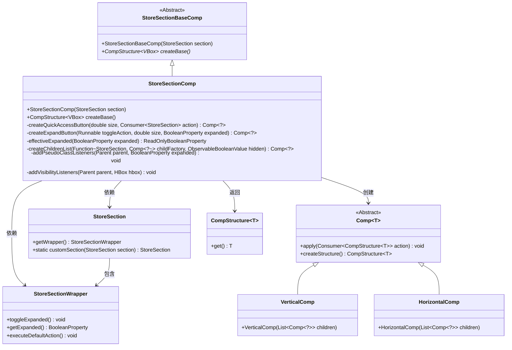

# 基础信息

|      |      |
|------|------|
| 名称 | StoreSectionComp |
| 编码语言 | .java |
| 代码路径 | xpipe/app/src/main/java/io/xpipe/app/comp/store/StoreSectionComp.java |
| 包名 | io.xpipe.app.comp.store |
| 依赖项 | ['io.xpipe.app.comp.Comp', 'io.xpipe.app.comp.CompStructure', 'io.xpipe.app.comp.base.HorizontalComp', 'io.xpipe.app.comp.base.VerticalComp', 'io.xpipe.app.util.ThreadHelper', 'javafx.beans.binding.Bindings', 'javafx.geometry.Pos', 'javafx.scene.control.Button', 'javafx.scene.input.KeyCode', 'javafx.scene.input.KeyCodeCombination', 'javafx.scene.input.KeyEvent', 'javafx.scene.layout.HBox', 'javafx.scene.layout.VBox', 'java.util.ArrayList', 'java.util.List'] |
| 概述说明 | 商店区组件类，继承基础类，包含按钮事件处理和布局逻辑。 |

# 说明

StoreSectionComp类继承自StoreSectionBaseComp，用于创建商店区域的可交互界面组件。主要功能包括：通过entryButton处理空格键展开/折叠区域，右键触发默认操作；quickAccessButton提供快速访问子连接功能；expandButton控制区域展开状态。组件结构包含水平排列的按钮和垂直布局的内容区域，支持动态高度调整和样式管理。通过事件过滤器和绑定机制实现交互响应，整体设计符合无障碍访问规范。

# 类列表 Class Summary

| 名称   | 类型  | 说明 |
|-------|------|-------------|
| StoreSectionComp | class | 商店区段组件类，继承基础类，实现按键交互、子组件布局及展开功能。 |


## 类 StoreSectionComp

|      |      |
|------|------|
| 访问范围 | public |
| 类型 | class |
| 名称 | StoreSectionComp |
| 说明 | 商店区段组件类，继承基础类，实现按键交互、子组件布局及展开功能。 |


### UML类图



这段代码展示了一个商店区域组件(StoreSectionComp)的实现，继承自抽象基类StoreSectionBaseComp。主要功能是创建可交互的UI结构，包含入口按钮、快速访问按钮和展开按钮，能够响应键盘事件和展开/折叠操作。组件使用组合模式构建，通过VerticalComp和HorizontalComp组织布局，并与StoreSection业务模型交互。代码中处理了多种用户交互场景，包括空格键切换展开状态、右键触发默认操作等，同时维护了UI状态同步和可访问性特性。


### 内部方法调用关系图

```mermaid
graph TD
    A["类StoreSectionComp"]
    B["继承: StoreSectionBaseComp"]
    C["构造方法: StoreSectionComp(StoreSection section)"]
    D["重写方法: createBase()"]
    E["创建entryButton: StoreEntryComp.customSection()"]
    F["添加事件过滤器: KEY_PRESSED处理"]
    G["创建quickAccessButton: createQuickAccessButton()"]
    H["创建expandButton: createExpandButton()"]
    I["构建buttonList: ArrayList<Comp<?>>"]
    J["创建topEntryList: HorizontalComp"]
    K["创建content: createChildrenList()"]
    L["创建full布局: VerticalComp"]
    M["返回结构: full.createStructure()"]

    A --> B
    A --> C
    A --> D
    D --> E
    E --> F
    D --> G
    D --> H
    D --> I
    I -->|添加条件按钮| G
    I -->|添加| H
    D --> J
    J -->|组合| I
    J -->|组合| E
    D --> K
    D --> L
    L -->|包含| J
    L -->|包含分隔线| 
    L -->|包含| K
    D --> M
    M <-- L
```

这段代码是StoreSectionComp类的实现，继承自StoreSectionBaseComp。主要功能是创建一个商店区域的可交互UI组件，包含入口按钮、快速访问按钮和展开按钮。通过处理键盘事件(空格键切换展开状态，右键触发默认操作)，动态构建垂直布局结构。代码使用JavaFX组件，包含事件监听、条件渲染和响应式绑定等特性，最终返回一个包含标题栏和可折叠内容区的完整组件结构。

### 字段列表 Field List

| 名称  | 类型  | 说明 |
|-------|-------|------|

### 方法列表 Method List

| 名称  | 类型  | 说明 |
|-------|-------|------|
| createBase | CompStructure<VBox> | 创建包含按钮和内容区的垂直布局，支持键盘操作和展开/折叠功能。 |


