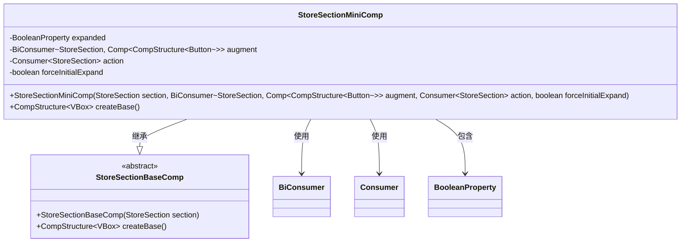
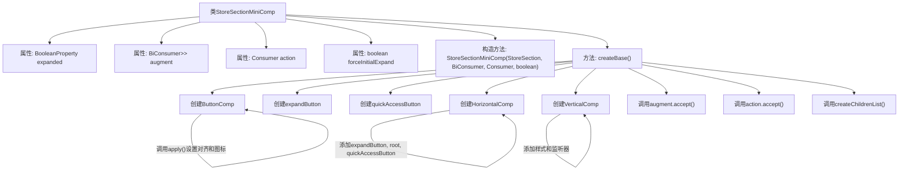

# 基础信息

|      |      |
|------|------|
| 名称 | StoreSectionMiniComp |
| 编码语言 | .java |
| 代码路径 | xpipe/app/src/main/java/io/xpipe/app/comp/store/StoreSectionMiniComp.java |
| 包名 | io.xpipe.app.comp.store |
| 依赖项 | ['io.xpipe.app.comp.Comp', 'io.xpipe.app.comp.CompStructure', 'io.xpipe.app.comp.base', 'javafx.beans.binding.Bindings', 'javafx.beans.property.BooleanProperty', 'javafx.beans.property.SimpleBooleanProperty', 'javafx.geometry.Pos', 'javafx.scene.control.Button', 'javafx.scene.layout.HBox', 'javafx.scene.layout.VBox', 'java.util.ArrayList', 'java.util.function.BiConsumer', 'java.util.function.Consumer'] |
| 概述说明 | StoreSectionMiniComp继承StoreSectionBaseComp，包含展开状态、按钮增强、操作逻辑和初始展开控制，创建带按钮和子内容的面板结构。 |

# 说明

这是一个名为StoreSectionMiniComp的Java类，继承自StoreSectionBaseComp，用于创建可折叠的商店区域迷你组件。类包含四个主要属性：expanded表示展开状态，augment用于按钮增强，action定义点击行为，forceInitialExpand控制初始展开。构造函数初始化这些属性，并根据条件设置初始展开状态。createBase方法构建界面结构，包含按钮列表、展开按钮和快速访问按钮，根据深度决定是否显示快速访问按钮。组件使用水平布局和垂直布局组合，应用样式类并设置宽度填充，同时管理展开状态的视觉反馈。

# 类列表 Class Summary

| 名称   | 类型  | 说明 |
|-------|------|-------------|
| StoreSectionMiniComp | class | 商店区迷你组件类，继承基础组件，含展开状态、按钮增强、操作回调及初始展开控制，创建包含按钮和子内容的垂直布局。 |

## 类 StoreSectionMiniComp

|      |      |
|------|------|
| 访问范围 | public |
| 类型 | class |
| 名称 | StoreSectionMiniComp |
| 说明 | 商店区迷你组件类，继承基础组件，含展开状态、按钮增强、操作回调及初始展开控制，创建包含按钮和子内容的垂直布局。 |

### UML类图

这段代码展示了一个`StoreSectionMiniComp`类，它继承自抽象基类`StoreSectionBaseComp`，用于创建可折叠的商店区域迷你组件。该类通过`BooleanProperty`控制展开状态，使用`BiConsumer`和`Consumer`进行回调处理，并包含创建按钮、处理布局等复杂逻辑。组件支持深度嵌套、图标显示、快速访问等功能，通过观察者模式实现状态同步，整体结构采用组合模式构建UI层次。

### 内部方法调用关系图

这段代码流程图展示了StoreSectionMiniComp类的结构和主要方法调用关系。该类继承自StoreSectionBaseComp，包含4个主要属性和1个构造方法。核心方法createBase()负责创建UI组件结构，包括按钮组件(ButtonComp)、展开按钮(expandButton)、快速访问按钮(quickAccessButton)的水平布局(HorizontalComp)和垂直布局(VerticalComp)。方法内部还调用了augment.accept()和action.accept()等回调函数，并通过createChildrenList()创建子组件列表。整个流程展示了从组件创建到最终布局结构的完整过程，体现了组件间的层级关系和交互逻辑。

### 字段列表 Field List

| 名称  | 类型  | 说明 |
|-------|-------|------|
| expanded | BooleanProperty | 私有布尔属性expanded |
| augment | BiConsumer<StoreSection, Comp<CompStructure<Button>>> | 私有终态双消费者，处理存储区与按钮组件结构。 |
| action | Consumer<StoreSection> | 私有消费者接口，处理StoreSection类型参数。 |
| forceInitialExpand | boolean | 私有布尔变量，控制强制初始展开。 |

### 方法列表 Method List

| 名称  | 类型  | 说明 |
|-------|-------|------|
| createBase | CompStructure<VBox> | 创建可折叠面板组件，包含按钮、展开图标和快速访问功能，支持动态子项加载和样式控制。 |

