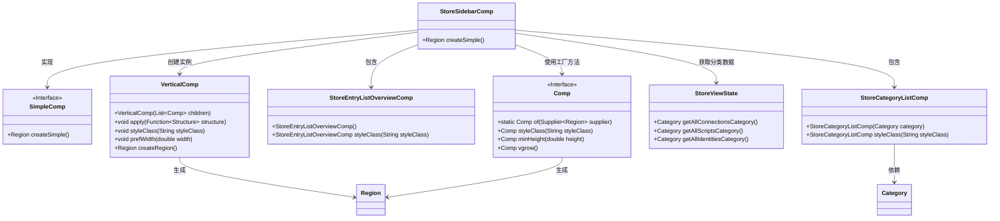
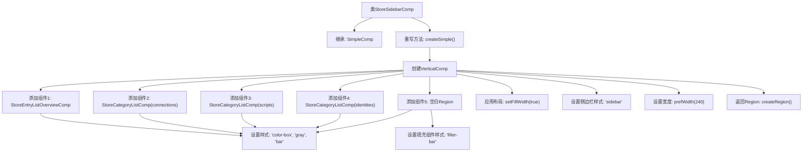

# 基础信息

|      |      |
|------|------|
| 名称 | StoreSidebarComp |
| 编码语言 | .java |
| 代码路径 | xpipe/app/src/main/java/io/xpipe/app/comp/store/StoreSidebarComp.java |
| 包名 | io.xpipe.app.comp.store |
| 依赖项 | ['io.xpipe.app.comp.Comp', 'io.xpipe.app.comp.SimpleComp', 'io.xpipe.app.comp.base.VerticalComp', 'javafx.scene.layout.Region', 'java.util.List'] |
| 概述说明 | 商店侧边栏组件，包含条目列表和分类列表，样式统一。 |

# 说明

StoreSidebarComp是一个继承自SimpleComp的类，用于创建垂直布局的侧边栏。侧边栏包含多个组件：StoreEntryListOverviewComp用于显示条目列表概览，三个StoreCategoryListComp分别显示所有连接、脚本和身份的类别列表，以及一个占位区域。所有组件都应用了相同的样式类（color-box、gray、bar），占位区域额外设置了最小高度和垂直增长属性。侧边栏宽度固定为240像素，并填充父容器宽度。

# 类列表 Class Summary

| 名称   | 类型  | 说明 |
|-------|------|-------------|
| StoreSidebarComp | class | 创建垂直侧边栏，包含条目列表和分类组件，设置样式和宽度。 |

## 类 StoreSidebarComp

|      |      |
|------|------|
| 访问范围 | public |
| 类型 | class |
| 名称 | StoreSidebarComp |
| 说明 | 创建垂直侧边栏，包含条目列表和分类组件，设置样式和宽度。 |

### UML类图

这段代码描述了一个商店侧边栏组件(StoreSidebarComp)的实现，它继承自SimpleComp接口。该组件通过VerticalComp垂直布局容器组织多个子组件，包括StoreEntryListOverviewComp(条目列表概览)和三个StoreCategoryListComp(分类列表)，最后添加了一个填充区域。所有子组件都应用了统一样式，侧边栏宽度固定为240像素。StoreViewState提供了分类数据源，Comp工厂方法用于创建填充区域。整体实现了可扩展的商店导航界面，具有清晰的层级结构和样式控制。

### 内部方法调用关系图

这段代码流程图展示了StoreSidebarComp类的核心逻辑，该类继承自SimpleComp并重写了createSimple方法。主要流程包括创建垂直布局容器，添加五个具有统一样式的子组件（其中四个是功能组件，一个是填充空白区域），然后配置布局属性（填充宽度、样式类和预设宽度），最后创建并返回Region对象。整个过程清晰地展现了GUI侧边栏组件的构建过程，体现了组合式UI设计的模式。

### 字段列表 Field List

| 名称  | 类型  | 说明 |
|-------|-------|------|

### 方法列表 Method List

| 名称  | 类型  | 说明 |
|-------|-------|------|
| createSimple | Region | 创建垂直侧边栏，包含列表组件和填充区域，宽度240像素。 |

