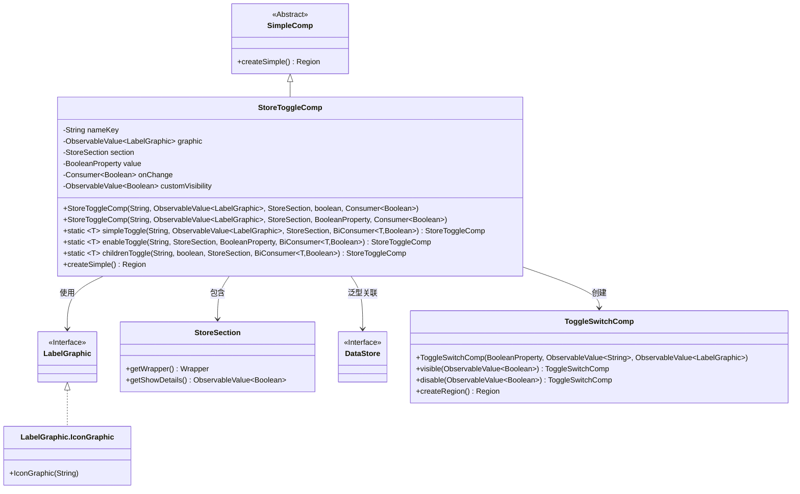
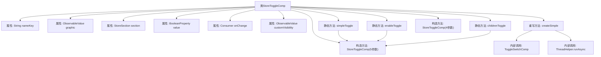
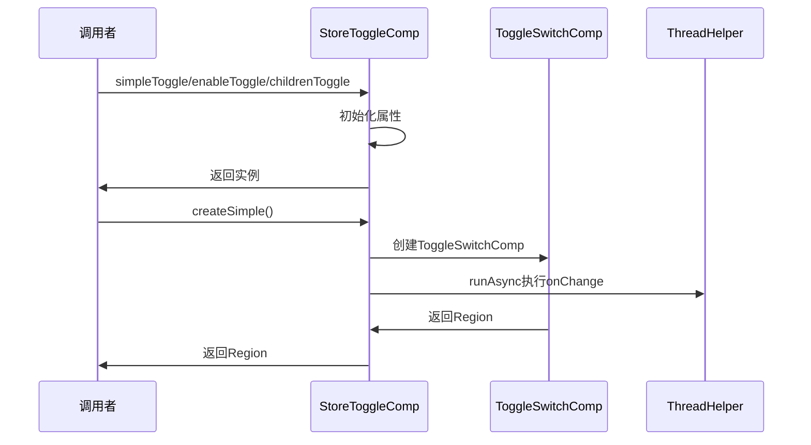

# 基础信息

|      |      |
|------|------|
| 名称 | StoreToggleComp |
| 编码语言 | .java |
| 代码路径 | xpipe/app/src/main/java/io/xpipe/app/comp/store/StoreToggleComp.java |
| 包名 | io.xpipe.app.comp.store |
| 依赖项 | ['io.xpipe.app.comp.SimpleComp', 'io.xpipe.app.comp.base.ToggleSwitchComp', 'io.xpipe.app.core.AppI18n', 'io.xpipe.app.storage.DataStoreEntry', 'io.xpipe.app.util.LabelGraphic', 'io.xpipe.app.util.ThreadHelper', 'io.xpipe.core.store.DataStore', 'javafx.application.Platform', 'javafx.beans.binding.Bindings', 'javafx.beans.property.BooleanProperty', 'javafx.beans.property.SimpleBooleanProperty', 'javafx.beans.value.ObservableValue', 'javafx.scene.layout.Region', 'lombok.AllArgsConstructor', 'lombok.Setter', 'java.util.function.BiConsumer', 'java.util.function.Consumer', 'java.util.function.Function'] |
| 概述说明 | StoreToggleComp类：用于创建可切换UI组件，支持自定义图标、状态和回调。 |

# 说明

StoreToggleComp是一个继承自SimpleComp的组件类，用于创建可切换的UI控件。主要属性包括nameKey（名称键）、graphic（图形显示）、section（存储区段）、value（布尔值属性）和onChange（值变更回调）。类提供了三种静态工厂方法：simpleToggle用于基础切换，enableToggle用于启用状态切换，childrenToggle用于子项可见性切换。组件支持自定义可见性控制，通过createSimple方法创建实际UI区域，包含可见性、禁用状态绑定及异步回调处理。所有方法均围绕DataStore操作设计，支持国际化文本和动态图标切换。

# 类列表 Class Summary

| 名称   | 类型  | 说明 |
|-------|------|-------------|
| StoreToggleComp | class | StoreToggleComp类实现可配置开关组件，支持动态图标、状态绑定和回调处理。 |

## 类 StoreToggleComp

|      |      |
|------|------|
| 访问范围 | @AllArgsConstructor;public |
| 类型 | class |
| 名称 | StoreToggleComp |
| 说明 | StoreToggleComp类实现可配置开关组件，支持动态图标、状态绑定和回调处理。 |

### UML类图

类图描述：该图展示了StoreToggleComp类继承自SimpleComp，实现了可复用的开关组件功能。通过泛型支持多种DataStore类型，使用LabelGraphic接口实现图标动态切换，依赖StoreSection获取上下文数据，最终通过ToggleSwitchComp生成UI控件。包含三种工厂方法(simpleToggle/enableToggle/childrenToggle)满足不同场景需求，通过观察者模式实现数据双向绑定。

### 内部方法调用关系图

这段代码实现了一个可复用的开关组件StoreToggleComp，主要用于数据存储的开关控制。类包含三种静态工厂方法(simpleToggle/enableToggle/childrenToggle)用于不同场景的开关创建，核心功能通过createSimple方法实现，该方法会创建一个带可见性控制的ToggleSwitchComp组件，并通过异步线程执行状态变更回调。组件支持自定义图标、国际化文本、禁用状态和可见性控制，特别适合在数据存储管理界面中使用。

### 字段列表 Field List

| 名称  | 类型  | 说明 |
|-------|-------|------|
| graphic | ObservableValue<LabelGraphic> | 私有不可变标签图形可观察值。 |
| section | StoreSection | 私有存储区段对象。 |
| nameKey | String | 私有字符串常量nameKey |
| customVisibility = new SimpleBooleanProperty(true) | ObservableValue<Boolean> | 设置自定义可见性属性，初始值为true。 |
| onChange | Consumer<Boolean> | 私有最终布尔值变更消费者。 |
| value | BooleanProperty | 私有布尔属性value。 |

### 方法列表 Method List

| 名称  | 类型  | 说明 |
|-------|-------|------|
| enableToggle | StoreToggleComp | 静态方法创建开关组件，绑定布尔值、图标和存储操作。 |
| childrenToggle | StoreToggleComp | 创建可切换子组件显示状态的StoreToggleComp，支持图标显示和状态更新。 |
| simpleToggle | StoreToggleComp | 创建简单开关组件，接收名称、图标、区域、初始值和设置函数。 |
| createSimple | Region | 重写方法创建开关组件，绑定可见性和禁用状态，值变化时异步回调。 |

