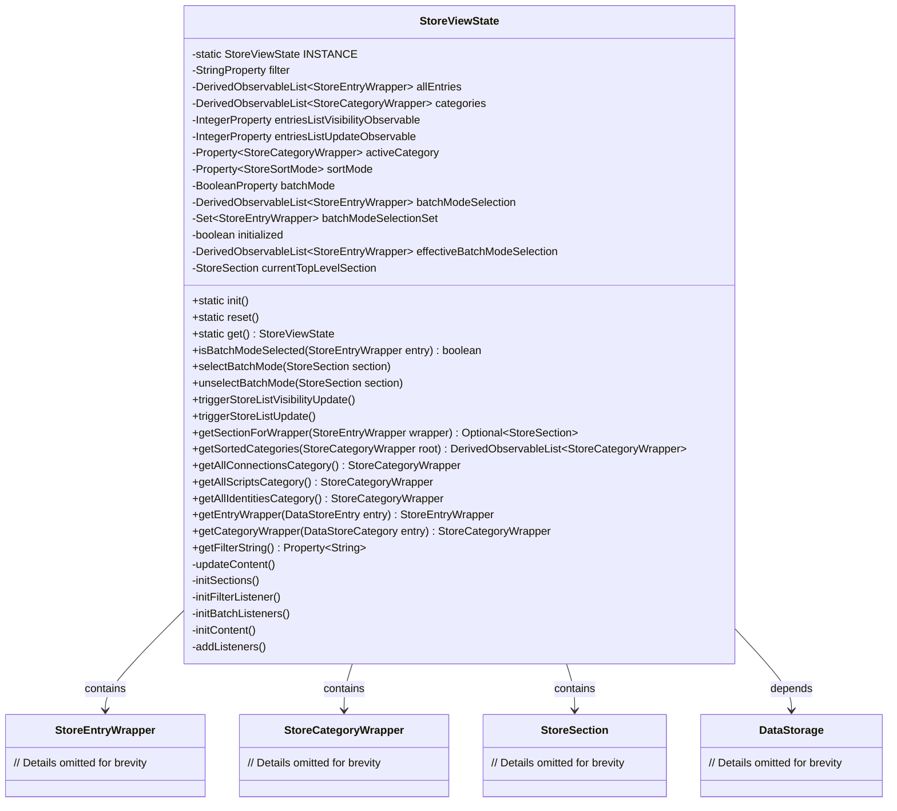

# 基础信息

|      |      |
|------|------|
| 名称 | StoreViewState |
| 编码语言 | .java |
| 代码路径 | xpipe/app/src/main/java/io/xpipe/app/comp/store/StoreViewState.java |
| 包名 | io.xpipe.app.comp.store |
| 依赖项 | ['io.xpipe.app.core.AppCache', 'io.xpipe.app.ext.DataStoreUsageCategory', 'io.xpipe.app.issue.ErrorEvent', 'io.xpipe.app.prefs.AppPrefs', 'io.xpipe.app.storage.DataStorage', 'io.xpipe.app.storage.DataStoreCategory', 'io.xpipe.app.storage.DataStoreEntry', 'io.xpipe.app.storage.StorageListener', 'io.xpipe.app.util.DerivedObservableList', 'io.xpipe.app.util.PlatformThread', 'javafx.application.Platform', 'javafx.beans.property', 'javafx.collections.FXCollections', 'javafx.collections.ListChangeListener', 'lombok.Getter', 'java.util', 'java.util.stream.Collectors'] |
| 概述说明 | 单例模式管理商店视图状态，包含条目、分类筛选及批量操作功能。 |

# 说明

StoreViewState是一个单例类，用于管理商店视图的状态。它包含多个可观察属性，如过滤器字符串、条目列表、分类列表、活动分类、排序模式等。该类提供了批量模式选择功能，支持添加和移除批量选择条目。它还维护了条目和分类的同步列表，并处理数据存储的更新事件。类中包含初始化方法、重置方法以及各种监听器，用于响应数据变化和用户交互。此外，它还提供了获取特定分类或条目包装器的方法，以及排序和过滤分类的功能。所有操作都通过平台线程确保线程安全。

# 类列表 Class Summary

| 名称   | 类型  | 说明 |
|-------|------|-------------|
| StoreViewState | class | 存储视图状态类，管理条目、分类、批量模式及筛选功能。 |

## 类 StoreViewState

|      |      |
|------|------|
| 访问范围 | public |
| 类型 | class |
| 名称 | StoreViewState |
| 说明 | 存储视图状态类，管理条目、分类、批量模式及筛选功能。 |

### UML类图

这段代码展示了一个单例模式的状态管理类StoreViewState，用于管理商店视图的各种状态和操作。该类包含多个可观察属性（如过滤条件、条目列表、分类列表等），提供了批量模式选择、分类排序、条目包装等功能，并与DataStorage进行数据交互。通过静态方法控制实例生命周期，使用观察者模式监听数据变化，实现了复杂的商店视图状态管理逻辑。

### 内部方法调用关系图

```mermaid
graph TD
    A["类StoreViewState"]
    B["静态属性: INSTANCE"]
    C["属性: StringProperty filter"]
    D["属性: DerivedObservableList<StoreEntryWrapper> allEntries"]
    E["属性: DerivedObservableList<StoreCategoryWrapper> categories"]
    F["属性: IntegerProperty entriesListVisibilityObservable"]
    G["属性: IntegerProperty entriesListUpdateObservable"]
    H["属性: Property<StoreCategoryWrapper> activeCategory"]
    I["属性: Property<StoreSortMode> sortMode"]
    J["属性: BooleanProperty batchMode"]
    K["属性: DerivedObservableList<StoreEntryWrapper> batchModeSelection"]
    L["属性: Set<StoreEntryWrapper> batchModeSelectionSet"]
    M["属性: boolean initialized"]
    N["属性: DerivedObservableList<StoreEntryWrapper> effectiveBatchModeSelection"]
    O["属性: StoreSection currentTopLevelSection"]
    P["私有构造方法: StoreViewState()"]
    Q["静态方法: init()"]
    R["静态方法: reset()"]
    S["静态方法: get()"]
    T["方法: isBatchModeSelected()"]
    U["方法: selectBatchMode()"]
    V["方法: unselectBatchMode()"]
    W["私有方法: updateContent()"]
    X["私有方法: initSections()"]
    Y["私有方法: initFilterListener()"]
    Z["私有方法: initBatchListeners()"]
    AA["私有方法: initContent()"]
    AB["方法: triggerStoreListVisibilityUpdate()"]
    AC["方法: triggerStoreListUpdate()"]
    AD["私有方法: addListeners()"]
    AE["方法: getSectionForWrapper()"]
    AF["方法: getSortedCategories()"]
    AG["方法: getAllConnectionsCategory()"]
    AH["方法: getAllScriptsCategory()"]
    AI["方法: getAllIdentitiesCategory()"]
    AJ["方法: getEntryWrapper()"]
    AK["方法: getCategoryWrapper()"]
    AL["方法: getFilterString()"]

    A --> B
    A --> C
    A --> D
    A --> E
    A --> F
    A --> G
    A --> H
    A --> I
    A --> J
    A --> K
    A --> L
    A --> M
    A --> N
    A --> O
    A --> P
    A --> Q
    A --> R
    A --> S
    A --> T
    A --> U
    A --> V
    A --> W
    A --> X
    A --> Y
    A --> Z
    A --> AA
    A --> AB
    A --> AC
    A --> AD
    A --> AE
    A --> AF
    A --> AG
    A --> AH
    A --> AI
    A --> AJ
    A --> AK
    A --> AL
    P --> W
    P --> X
    P --> Y
    P --> Z
    P --> AA
    P --> AD
    Q --> P
    Q --> W
    Q --> X
    Q --> Y
    Q --> Z
    U --> K
    V --> K
    W --> D
    W --> E
    X --> D
    X --> K
    X --> C
    X --> H
    X --> F
    X --> G
    Y --> E
    Y --> C
    Y --> H
    Z --> K
    Z --> D
    Z --> J
    AA --> D
    AA --> E
    AA --> I
    AA --> H
    AD --> F
    AD --> G
    AD --> D
    AD --> E
    AE --> O
    AF --> E
    AG --> E
    AH --> E
    AI --> E
    AJ --> D
    AK --> E
    AL --> C
```

这段代码实现了一个单例模式的StoreViewState类，用于管理商店视图的状态和数据。它包含多个可观察属性用于UI绑定，如过滤条件、分类列表、条目列表等，并通过监听器机制实现数据变更的自动同步。类提供了批量操作模式支持、分类/条目检索、数据更新触发等方法，同时维护与数据存储层(DataStorage)的交互，确保视图状态与底层数据的实时一致性。核心功能通过私有方法实现初始化、内容更新和监听器设置，对外暴露静态访问接口和状态操作方法。

### 字段列表 Field List

| 名称  | 类型  | 说明 |
|-------|-------|------|
| entriesListUpdateObservable = new SimpleIntegerProperty() | IntegerProperty | 私有整型属性entriesListUpdateObservable，使用Getter注解和SimpleIntegerProperty初始化。 |
| INSTANCE | StoreViewState | 单例模式存储视图状态实例 |
| categories =            DerivedObservableList.synchronizedArrayList(true) | DerivedObservableList<StoreCategoryWrapper> | 私有最终列表categories，同步派生可观察数组。 |
| activeCategory = new SimpleObjectProperty<>() | Property<StoreCategoryWrapper> | 私有属性activeCategory，类型为Property<StoreCategoryWrapper>，使用SimpleObjectProperty初始化。 |
| batchModeSelectionSet = new HashSet<>() | Set<StoreEntryWrapper> | 私有Set集合存储批量模式选中的条目。 |
| allEntries =            DerivedObservableList.synchronizedArrayList(true) | DerivedObservableList<StoreEntryWrapper> | 私有最终同步派生列表allEntries存储StoreEntryWrapper对象。 |
| effectiveBatchModeSelection = batchModeSelection.filtered(            storeEntryWrapper -> {                if (!storeEntryWrapper.getValidity().getValue().isUsable()) {                    return false;                }                if (storeEntryWrapper.getEntry().getProvider().getUsageCategory() == DataStoreUsageCategory.GROUP) {                    return false;                }                return true;            },            entriesListVisibilityObservable,            entriesListUpdateObservable) | DerivedObservableList<StoreEntryWrapper> | 私有最终列表effectiveBatchModeSelection，过滤不可用及GROUP类条目，依赖两个可观察对象。 |
| entriesListVisibilityObservable = new SimpleIntegerProperty() | IntegerProperty | 私有整型属性entriesListVisibilityObservable，使用Getter注解和SimpleIntegerProperty初始化。 |
| batchModeSelection =            DerivedObservableList.synchronizedArrayList(true) | DerivedObservableList<StoreEntryWrapper> | 私有最终列表batchModeSelection，使用同步数组列表实现。 |
| filter = new SimpleStringProperty() | StringProperty | 私有字符串属性filter初始化为SimpleStringProperty实例。 |
| currentTopLevelSection | StoreSection | 私有变量currentTopLevelSection，带Getter注解。 |
| sortMode = new SimpleObjectProperty<>() | Property<StoreSortMode> | 私有属性sortMode，类型为Property<StoreSortMode>，初始化为SimpleObjectProperty。 |
| batchMode = new SimpleBooleanProperty(false) | BooleanProperty | 私有布尔属性batchMode，初始值为false。 |
| initialized = false | boolean | 私有布尔变量initialized初始为false，带Getter方法。 |

### 方法列表 Method List

| 名称  | 类型  | 说明 |
|-------|-------|------|
| get | StoreViewState | 获取单例StoreViewState实例。 |
| getFilterString | Property<String> | 获取过滤字符串属性。 |
| getEntryWrapper | StoreEntryWrapper | 方法通过流处理查找匹配entry的StoreEntryWrapper，未找到则抛出异常。 |
| reset | void | 静态方法reset()：检查实例存在性，保存活动分类UUID后清空实例。 |
| getAllScriptsCategory | StoreCategoryWrapper | 获取所有脚本分类，通过UUID匹配并返回首个结果，否则抛出异常。 |
| triggerStoreListUpdate | void | 触发列表更新：异步增加计数器值。 |
| selectBatchMode | void | 方法selectBatchMode处理批量模式选择：添加有效wrapper到列表，递归处理子section。 |
| initBatchListeners | void | 初始化批量监听器：监听列表变化，更新选择集，清空无效项。 |
| init | void | 静态方法init初始化单例实例，检查实例存在后创建对象并执行初始化操作，包括更新内容、初始化区块和监听器等。 |
| unselectBatchMode | void | 方法取消批量选择模式，移除包装器并递归处理子项。 |
| triggerStoreListVisibilityUpdate | void | 方法触发列表可见性更新，通过线程安全操作递增可见性状态值。 |
| initContent | void | 初始化内容：加载条目和分类，设置排序和活动分类监听，恢复选中分类。 |
| getSortedCategories | DerivedObservableList<StoreCategoryWrapper> | 方法返回按自定义比较器排序的商店分类列表，比较逻辑基于根分类、父级关系和名称。 |
| getAllIdentitiesCategory | StoreCategoryWrapper | 获取所有身份类别的存储分类，若无则抛出异常。 |
| getAllConnectionsCategory | StoreCategoryWrapper | 获取所有连接类别的StoreCategoryWrapper实例，若无则抛出异常。 |
| getCategoryWrapper | StoreCategoryWrapper | 获取与指定分类匹配的StoreCategoryWrapper实例。 |
| getSectionForWrapper | Optional<StoreSection> | 查找包装器对应的存储区段，若无顶层区段返回空，否则递归搜索子区段匹配项，未找到则返回空。 |
| initSections | void | 初始化顶级区域，处理异常时创建空区域并记录错误。 |
| isBatchModeSelected | boolean | 检查条目是否在批量模式选择集中。 |
| addListeners | void | 监听数据存储变更，更新条目和分类列表。 |
| updateContent | void | 更新所有分类和条目内容。 |
| initFilterListener | void | 初始化过滤器监听器：更新分类并匹配筛选值，若匹配则设为首选分类。 |

