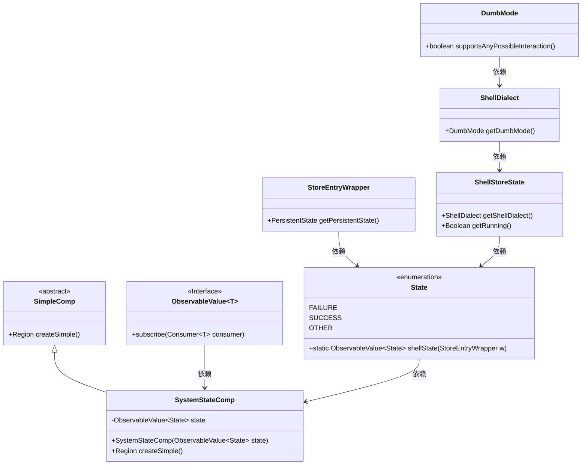
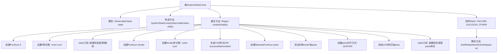

# 基础信息

|      |      |
|------|------|
| 名称 | SystemStateComp |
| 编码语言 | .java |
| 代码路径 | xpipe/app/src/main/java/io/xpipe/app/comp/store/SystemStateComp.java |
| 包名 | io.xpipe.app.comp.store |
| 依赖项 | ['io.xpipe.app.comp.SimpleComp', 'io.xpipe.app.util.BindingsHelper', 'io.xpipe.app.util.PlatformThread', 'io.xpipe.core.process.ShellStoreState', 'javafx.beans.value.ObservableValue', 'javafx.geometry.Pos', 'javafx.scene.layout.Region', 'atlantafx.base.theme.Styles', 'lombok.Getter', 'org.kordamp.ikonli.javafx.FontIcon', 'org.kordamp.ikonli.javafx.StackedFontIcon'] |
| 概述说明 | 系统状态组件，根据状态显示不同图标和颜色，支持成功、失败和其他状态切换。 |

# 说明

SystemStateComp是一个继承SimpleComp的组件类，用于根据系统状态显示不同图标。核心属性state是一个ObservableValue，存储State枚举值（FAILURE/SUCCESS/OTHER）。createSimple方法构建一个双层图标：内层图标随状态变化切换闪电（失败）、对勾（成功）或叉号（其他）；外层是半透明圆角方框。通过CSS动态修改外层颜色（成功绿/失败红/其他强调色），并控制内外层图标尺寸。State枚举包含解析ShellStoreState的逻辑：若支持交互则返回SUCCESS，运行中为SUCCESS，停止为FAILURE，其他情况为OTHER。组件通过订阅state实现UI实时更新。

# 类列表 Class Summary

| 名称   | 类型  | 说明 |
|-------|------|-------------|
| SystemStateComp | class | 系统状态组件，根据状态显示不同图标和颜色，支持成功、失败和其他状态。 |

## 类 SystemStateComp

|      |      |
|------|------|
| 访问范围 | @Getter;public |
| 类型 | class |
| 名称 | SystemStateComp |
| 说明 | 系统状态组件，根据状态显示不同图标和颜色，支持成功、失败和其他状态。 |

### UML类图

这段代码描述了一个系统状态组件`SystemStateComp`，它继承自`SimpleComp`，通过监听`ObservableValue<State>`状态变化来动态更新UI图标样式。核心是`State`枚举类，定义了三种状态（FAILURE/SUCCESS/OTHER）并提供了从`StoreEntryWrapper`解析状态的静态方法。组件使用双层图标堆叠（内层状态图标+外层边框）和动态样式表切换来实现可视化效果，通过`PlatformThread.runLaterIfNeeded`确保线程安全更新UI。整体设计采用观察者模式响应状态变化，涉及5个关联类实现状态解析逻辑链。

### 内部方法调用关系图

这段代码实现了一个系统状态可视化组件SystemStateComp，继承自SimpleComp。主要功能是通过图标组合显示系统状态（成功、失败或其他），包含状态枚举定义和样式动态切换逻辑。流程图展示了从类结构到核心方法createSimple()的内部实现，包括图标创建、样式订阅、状态响应等关键步骤，最终返回一个包含动态样式和图标的自定义Region组件。

### 字段列表 Field List

| 名称  | 类型  | 说明 |
|-------|-------|------|
| state | ObservableValue<State> | 私有不可变状态观察值。 |

### 方法列表 Method List

| 名称  | 类型  | 说明 |
|-------|-------|------|
| createSimple | Region | 创建动态图标区域，根据状态切换样式和图标。 |

