# 基础信息

|      |      |
|------|------|
| 名称 | store |
| 编码语言 | .java |
| 代码路径 | xpipe/app/src/main/java/io/xpipe/app/comp/store |
| 包名 | xpipe.app.src.main.java.io.xpipe.app.comp.store |
| 概述说明 | 多个Java类实现商店系统UI组件，包括图标显示、状态管理、分类列表、创建模型、批量操作等核心功能。 |

# 说明

```markdown
## 概述
该代码模块是一个基于JavaFX的商店管理系统前端组件集合，主要用于数据存储条目（如连接、脚本、身份等）的可视化展示与交互管理。核心功能围绕`StoreEntryWrapper`和`StoreCategoryWrapper`两个核心模型展开，提供完整的CRUD操作、分类管理、批量处理、状态监控等能力。模块采用MVVM架构，通过`StoreViewState`单例管理全局状态，包含50+个组件类，分为以下功能层：

1. **基础组件层**：提供图标(`OsLogoComp`)、状态指示器(`SystemStateComp`)、笔记编辑器(`StoreNotesComp`)等原子级UI元素
2. **条目展示层**：支持标准(`StandardStoreEntryComp`)/密集(`DenseStoreEntryComp`)两种视图模式，含上下文菜单、批量选择、排序过滤等功能
3. **分类管理层**：通过树形结构(`StoreCategoryComp`)组织数据，支持多级嵌套、快速访问(`StoreQuickAccessButtonComp`)和配置(`StoreCategoryConfigComp`)
4. **创建编辑层**：包含向导式表单(`StoreCreationComp`)、提供者选择(`StoreProviderChoiceComp`)和图标选择器(`StoreIconChoiceComp`)
5. **布局容器层**：整合侧边栏(`StoreSidebarComp`)、主视图(`StoreLayoutComp`)和状态栏(`StoreEntryListStatusBarComp`)的完整界面

## 主要业务场景
1. **数据存储管理**
   - 通过`StoreCreationDialog`创建/编辑连接、脚本等条目，支持200+种提供者的动态表单
   - 使用`StoreEntryWrapper`实现条目的启用/禁用、移动分类、笔记标注等操作
   - 通过`StoreChoiceComp`实现跨分类的条目选择（如为隧道选择目标主机）

2. **分类体系操作**
   - 树形导航(`StoreCategoryListComp`)支持展开/折叠、右键菜单操作
   - 分类配置(`StoreCategoryConfigComp`)管理颜色标记、同步策略等元数据
   - 智能排序(`StoreSortMode`)支持按名称/日期/自定义顺序排列

3. **批量处理模式**
   - `StoreEntryBatchSelectComp`实现全选/部分选逻辑
   - 状态栏(`StoreEntryListStatusBarComp`)集中显示选中项数量和可用操作
   - 支持跨分类批量启用/删除/导出等操作

4. **系统状态监控**
   - `SystemStateComp`实时显示连接健康状态（成功/失败/其他）
   - `StoreActiveComp`标记活动会话，支持一键终止
   - 异步操作通过`busy`状态统一禁用交互控件

5. **辅助功能**
   - 多语言支持：所有文本通过资源绑定实现国际化
   - 无障碍访问：键盘导航、焦点管理符合WCAG标准
   - 响应式布局：适配从800px到4K分辨率的不同屏幕
```


### 包内部结构视图

```mermaid
graph TD
    store --> StoreCreationConsumer.java
    store --> OsLogoComp.java
    store --> SystemStateComp.java
    store --> StoreCategoryListComp.java
    store --> StoreCreationModel.java
    store --> StoreSectionBaseComp.java
    store --> StoreActiveComp.java
    store --> StoreNotFoundComp.java
    store --> StoreCreationMenu.java
    store --> StoreSectionMiniComp.java
    store --> StoreIntroComp.java
    store --> DenseStoreEntryComp.java
    store --> StoreIdentitiesIntroComp.java
    store --> StoreEntryListOverviewComp.java
    store --> StoreEntryListStatusBarComp.java
    store --> StoreIconComp.java
    store --> StoreChoiceComp.java
    store --> StoreEntryBatchSelectComp.java
    store --> StoreSidebarComp.java
    store --> StoreNotesComp.java
    store --> StoreListChoiceComp.java
    store --> StoreCreationDialog.java
    store --> StoreSectionComp.java
    store --> StoreViewState.java
    store --> StoreScriptsIntroComp.java
    store --> StoreCategoryComp.java
    store --> StoreCategoryWrapper.java
    store --> StoreIconChoiceDialog.java
    store --> StoreLayoutComp.java
    store --> StoreQuickAccessButtonComp.java
    store --> StoreProviderChoiceComp.java
    store --> StoreToggleComp.java
    store --> StoreEntryComp.java
    store --> StoreCreationComp.java
    store --> StoreEntryListComp.java
    store --> StoreSection.java
    store --> StandardStoreEntryComp.java
    store --> StoreNotes.java
    store --> StoreSortMode.java
    store --> StoreEntryWrapper.java
    store --> StoreIconChoiceComp.java
    store --> StoreCategoryConfigComp.java
```



该流程图展示了`store`目录下的所有文件结构，共包含35个Java文件，这些文件直接隶属于`store`目录，没有进一步的子目录层级。所有文件均以组件(Comp)、控制器(Controller)、模型(Model)等类型命名，表明这是一个存储相关功能的模块实现，可能涉及界面组件、状态管理、数据模型等不同方面的实现。

# 文件列表 File List

| 名称   | 类型  | 说明 |
|-------|------|-------------|
| [StoreSectionBaseComp.java](StoreSectionBaseComp.md) | file | 抽象类StoreSectionBaseComp，扩展Comp，管理商店区段UI状态与交互，包括展开控制、样式监听和按钮创建。 |
| [StoreCreationModel.java](StoreCreationModel.md) | file | 存储创建模型类，包含属性、验证及连接逻辑。 |
| [StoreCategoryListComp.java](StoreCategoryListComp.md) | file | Java类：StoreCategoryListComp继承SimpleComp，包含根分类和滚动区域创建逻辑。 |
| [SystemStateComp.java](SystemStateComp.md) | file | 系统状态组件，根据状态显示不同图标和颜色，支持成功、失败和其他状态切换。 |
| [OsLogoComp.java](OsLogoComp.md) | file | OsLogoComp类根据系统状态显示对应操作系统图标，默认显示Linux图标。 |
| [StoreCreationConsumer.java](StoreCreationConsumer.md) | file | 输入内容为空，无法生成概要描述。请提供具体信息以便总结。 |
| [StoreEntryListComp.java](StoreEntryListComp.md) | file | 创建商店条目列表组件，包含滚动重置、状态栏和不同条件下的内容显示逻辑。 |
| [StoreCategoryComp.java](StoreCategoryComp.md) | file | StoreCategoryComp类实现商店分类UI组件，包含名称编辑、展开/折叠、同步状态及右键菜单功能。 |
| [StoreChoiceComp.java](StoreChoiceComp.md) | file | StoreChoiceComp类用于选择数据存储条目，支持代理、主机和其他模式，包含弹窗交互和条件过滤功能。 |
| [StoreSectionMiniComp.java](StoreSectionMiniComp.md) | file | StoreSectionMiniComp继承StoreSectionBaseComp，包含展开状态、按钮增强、操作逻辑和初始展开控制，创建带按钮和子内容的面板结构。 |
| [StoreIconComp.java](StoreIconComp.md) | file | StoreIconComp类创建带悬停效果和点击处理的商店图标组件。 |
| [StoreEntryListStatusBarComp.java](StoreEntryListStatusBarComp.md) | file | StoreEntryListStatusBarComp类实现批量操作状态栏，包含选择框、标签、工具栏和关闭按钮。 |
| [StoreEntryListOverviewComp.java](StoreEntryListOverviewComp.md) | file | 商店列表组件，含分类标题、筛选器、排序和批量操作按钮。 |
| [StoreIdentitiesIntroComp.java](StoreIdentitiesIntroComp.md) | file | 创建身份介绍界面，包含标题、描述、图标和操作按钮，支持同步设置。 |
| [DenseStoreEntryComp.java](DenseStoreEntryComp.md) | file | DenseStoreEntryComp继承StoreEntryComp，创建密集存储条目UI，包含状态显示、名称、图标、按钮等组件，高度根据系统类型调整。 |
| [StoreIntroComp.java](StoreIntroComp.md) | file | 创建商店介绍组件，包含标题、描述和扫描按钮，以及导入连接功能。 |
| [StoreCreationMenu.java](StoreCreationMenu.md) | file | 为菜单添加创建各类数据存储的按钮选项。 |
| [StoreScriptsIntroComp.java](StoreScriptsIntroComp.md) | file | StoreScriptsIntroComp类创建脚本介绍界面，包含标题、描述和启动按钮。 |
| [StoreViewState.java](StoreViewState.md) | file | 单例模式管理商店视图状态，包含条目、分类筛选及批量操作功能。 |
| [StoreSectionComp.java](StoreSectionComp.md) | file | 商店区组件类，继承基础类，包含按钮事件处理和布局逻辑。 |
| [StoreCreationDialog.java](StoreCreationDialog.md) | file | 商店创建对话框类，支持编辑和创建数据存储条目，包含验证和扫描功能。 |
| [StoreListChoiceComp.java](StoreListChoiceComp.md) | file | 存储列表选择组件，支持多选和删除操作。 |
| [StoreNotesComp.java](StoreNotesComp.md) | file | StoreNotesComp类实现笔记按钮和弹出编辑功能，支持保存和删除操作。 |
| [StoreSidebarComp.java](StoreSidebarComp.md) | file | 商店侧边栏组件，包含条目列表和分类列表，样式统一。 |
| [StoreEntryBatchSelectComp.java](StoreEntryBatchSelectComp.md) | file | StoreEntryBatchSelectComp类实现批量选择功能，通过复选框控制StoreSection的批量模式状态。 |
| [StoreNotFoundComp.java](StoreNotFoundComp.md) | file | 未找到商店页面的简单组件类，重写方法返回空面板。 |
| [StoreCreationComp.java](StoreCreationComp.md) | file | StoreCreationComp类扩展ModalOverlayContentComp，包含模型处理、布局创建和属性验证功能。 |
| [StoreEntryComp.java](StoreEntryComp.md) | file | 抽象类StoreEntryComp，继承SimpleComp，处理存储条目UI逻辑，含状态管理、按钮操作和上下文菜单。 |
| [StoreToggleComp.java](StoreToggleComp.md) | file | StoreToggleComp类：用于创建可切换UI组件，支持自定义图标、状态和回调。 |
| [StoreProviderChoiceComp.java](StoreProviderChoiceComp.md) | file | 存储选择组件类，含过滤器和属性，提供数据存储列表并绑定UI控件。 |
| [StoreQuickAccessButtonComp.java](StoreQuickAccessButtonComp.md) | file | 商店快速访问按钮组件，含菜单递归生成及点击动作处理。 |
| [StoreLayoutComp.java](StoreLayoutComp.md) | file | 商店布局组件，包含延迟初始化的侧边栏和主内容区，支持宽度调整和快捷键粘贴检测。 |
| [StoreIconChoiceDialog.java](StoreIconChoiceDialog.md) | file | 显示图标选择对话框，设置选中图标并更新数据存储条目。 |
| [StoreCategoryWrapper.java](StoreCategoryWrapper.md) | file | 存储分类包装类，包含根节点、深度、名称、子项等属性，支持监听更新、筛选和国际化。 |
| [StoreCategoryConfigComp.java](StoreCategoryConfigComp.md) | file | 商店分类配置组件，含颜色、脚本、同步等选项，支持模态窗口展示与更新。 |
| [StoreIconChoiceComp.java](StoreIconChoiceComp.md) | file | 图标选择组件，支持筛选、刷新和双击操作。 |
| [StoreEntryWrapper.java](StoreEntryWrapper.md) | file | StoreEntryWrapper类封装DataStoreEntry，管理属性、操作和状态，支持数据存储和UI交互。 |
| [StoreSortMode.java](StoreSortMode.md) | file | 输入内容为空，无法生成概要描述。请提供具体信息。 |
| [StoreNotes.java](StoreNotes.md) | file | 存储笔记类，含提交和当前内容，检查是否一致。 |
| [StandardStoreEntryComp.java](StandardStoreEntryComp.md) | file | 标准商店条目组件，包含名称、图标、摘要和按钮栏，高度固定57，支持批量选择和状态显示。 |
| [StoreSection.java](StoreSection.md) | file | StoreSection类管理商店条目层级结构，包含子列表、深度和显示逻辑。 |
| [StoreActiveComp.java](StoreActiveComp.md) | file | StoreActiveComp类继承SimpleComp，包含圆形交互组件，点击停止会话，绑定可见性。 |


