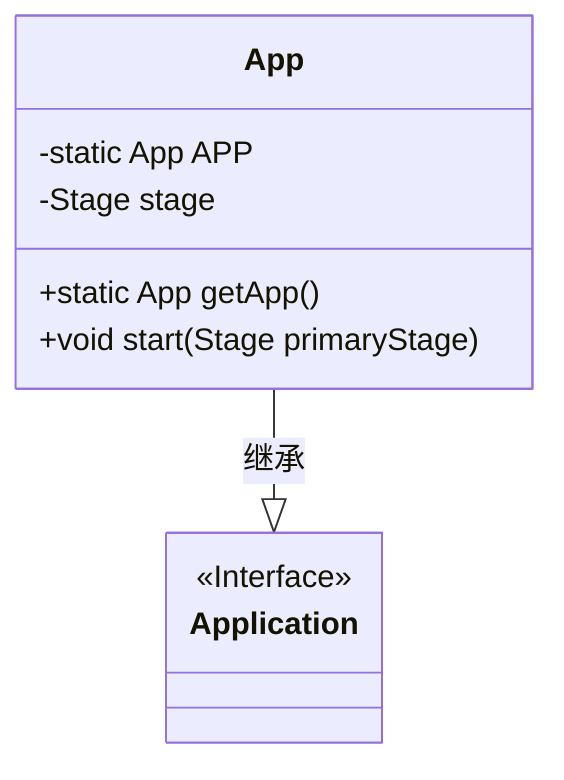
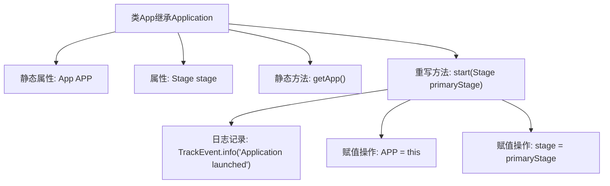

# 基础信息

|      |      |
|------|------|
| 名称 | App |
| 编码语言 | .java |
| 代码路径 | xpipe/app/src/main/java/io/xpipe/app/core/App.java |
| 包名 | io.xpipe.app.core |
| 依赖项 | ['io.xpipe.app.issue.TrackEvent', 'javafx.application.Application', 'javafx.stage.Stage', 'lombok.Getter', 'lombok.SneakyThrows'] |
| 概述说明 | Java应用类，单例模式，含启动方法和静态获取实例方法。 |

# 说明

这段代码描述了一个JavaFX应用程序类App，继承自Application类。该类使用@Getter注解自动生成getter方法，包含一个静态APP实例和stage成员变量。提供了静态方法getApp()用于获取APP实例。重写了start方法，在应用启动时记录日志，初始化APP静态实例并将传入的primaryStage赋值给stage变量。整个类实现了单例模式，用于管理JavaFX应用的主舞台实例。

# 类列表 Class Summary

| 名称   | 类型  | 说明 |
|-------|------|-------------|
| App | class | Java应用类，单例模式，含启动方法和静态获取实例方法。 |

## 类 App

|      |      |
|------|------|
| 访问范围 | @Getter;public |
| 类型 | class |
| 名称 | App |
| 说明 | Java应用类，单例模式，含启动方法和静态获取实例方法。 |

### UML类图

类图描述：该图展示了一个继承自Application接口的App类，使用Lombok的@Getter注解自动生成getter方法。App类包含静态单例实例APP和Stage对象stage，提供获取单例的静态方法getApp()和重写的start()方法。start()方法会初始化单例并记录应用启动事件，体现了JavaFX应用的典型启动流程。

### 内部方法调用关系图

该流程图展示了JavaFX应用程序类App的结构和启动流程。类包含静态实例引用APP和舞台对象stage，通过getApp()提供全局访问点。start()方法作为入口点，依次执行事件日志记录、实例赋值和舞台初始化。箭头清晰表示了类成员关系和启动时的执行顺序，体现了单例模式的应用和JavaFX生命周期控制。

### 字段列表 Field List

| 名称  | 类型  | 说明 |
|-------|-------|------|
| stage | Stage | 私有舞台变量stage |
| APP | App | 私有静态应用实例APP |

### 方法列表 Method List

| 名称  | 类型  | 说明 |
|-------|-------|------|
| getApp | App | 获取App实例的静态方法。 |
| start | void | 应用启动初始化主舞台并记录日志。 |

