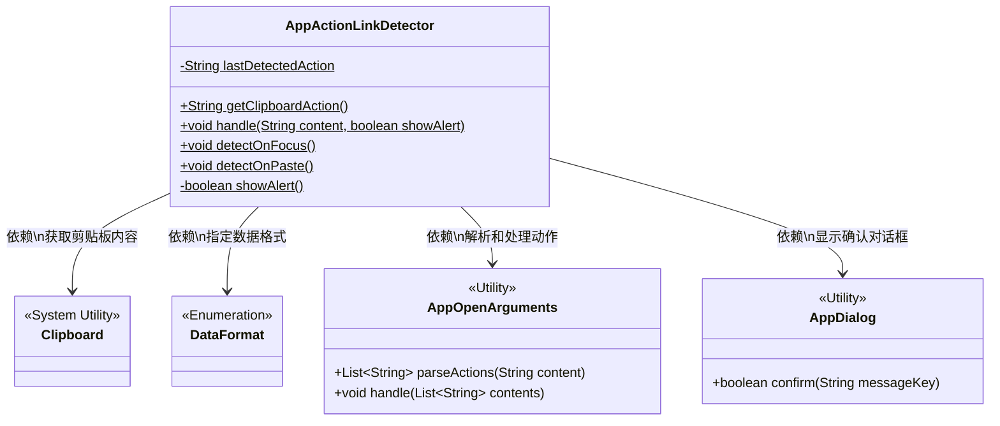
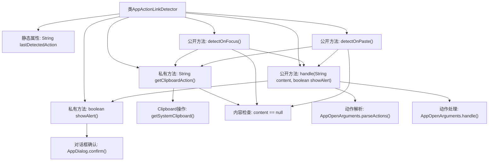

# 基础信息

|      |      |
|------|------|
| 名称 | AppActionLinkDetector |
| 编码语言 | .java |
| 代码路径 | xpipe/app/src/main/java/io/xpipe/app/core/AppActionLinkDetector.java |
| 包名 | io.xpipe.app.core |
| 依赖项 | ['io.xpipe.app.core.window.AppDialog', 'javafx.scene.input.Clipboard', 'javafx.scene.input.DataFormat', 'lombok.Setter', 'java.util.List'] |
| 概述说明 | 检测剪贴板动作并处理，支持焦点和粘贴触发，含确认提示。 |

# 说明

AppActionLinkDetector类用于检测和处理剪贴板中的动作链接。它包含静态方法getClipboardAction获取剪贴板内容，优先URL格式后纯文本。handle方法解析并处理动作内容，可选显示确认弹窗。detectOnFocus在焦点变化时检测剪贴板内容，避免重复处理相同内容。detectOnPaste在粘贴时直接处理内容。lastDetectedAction记录上次检测内容。showAlert方法显示确认对话框。

# 类列表 Class Summary

| 名称   | 类型  | 说明 |
|-------|------|-------------|
| AppActionLinkDetector | class | 检测剪贴板动作并处理，支持焦点和粘贴触发。 |

## 类 AppActionLinkDetector

|      |      |
|------|------|
| 访问范围 | public |
| 类型 | class |
| 名称 | AppActionLinkDetector |
| 说明 | 检测剪贴板动作并处理，支持焦点和粘贴触发。 |

### UML类图

这段代码描述了一个应用动作链接检测器(AppActionLinkDetector)，主要功能是通过剪贴板内容检测并处理特定的应用动作。类图中包含5个类：主类AppActionLinkDetector负责核心检测逻辑，Clipboard和DataFormat是系统工具类用于剪贴板操作，AppOpenArguments用于解析和处理动作参数，AppDialog用于显示确认对话框。主类通过静态方法与其他工具类交互，实现了焦点变化时检测、粘贴时检测以及带确认提示的处理流程。

### 内部方法调用关系图

该流程图展示了AppActionLinkDetector类的完整工作流程。类通过剪贴板监控实现动作链接检测，包含焦点变化(detectOnFocus)和粘贴事件(detectOnPaste)两种触发方式。核心逻辑包括：从剪贴板获取内容、解析有效动作、处理确认对话框和执行动作处理。流程图清晰呈现了方法调用层级关系，特别是getClipboardAction()作为基础方法被多个公开方法调用，以及showAlert()在需要用户确认时的分支逻辑。所有路径最终都会汇聚到AppOpenArguments.handle()进行实际动作处理。

### 字段列表 Field List

| 名称  | 类型  | 说明 |
|-------|-------|------|
| lastDetectedAction | String | 私有静态字符串变量lastDetectedAction的setter方法。 |

### 方法列表 Method List

| 名称  | 类型  | 说明 |
|-------|-------|------|
| getClipboardAction | String | 获取剪贴板内容，优先URL，其次纯文本，无则返回空。 |
| showAlert | boolean | 检测剪贴板操作并显示确认对话框。 |
| detectOnPaste | void | 检测剪贴板内容并处理，若无内容则返回。 |
| detectOnFocus | void | 检测剪贴板内容变化并处理，避免重复操作。 |
| handle | void | 静态方法处理内容，检测到参数则执行操作，可选显示警报。 |

