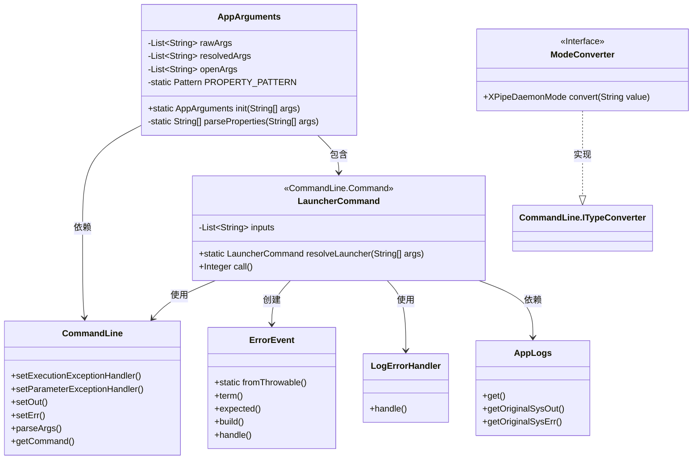
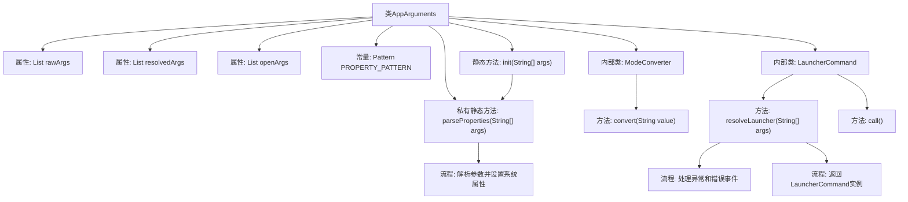

# 基础信息

|      |      |
|------|------|
| 名称 | AppArguments |
| 编码语言 | .java |
| 代码路径 | xpipe/app/src/main/java/io/xpipe/app/core/AppArguments.java |
| 包名 | io.xpipe.app.core |
| 依赖项 | ['io.xpipe.app.issue.ErrorEvent', 'io.xpipe.app.issue.LogErrorHandler', 'io.xpipe.core.util.XPipeDaemonMode', 'lombok.Value', 'picocli.CommandLine', 'java.io.PrintWriter', 'java.util.ArrayList', 'java.util.Arrays', 'java.util.List', 'java.util.concurrent.Callable', 'java.util.regex.Pattern'] |
| 概述说明 | 解析命令行参数，处理属性设置和异常，返回处理结果。 |

# 说明

该代码定义了一个处理命令行参数的AppArguments类，包含原始参数、解析后参数和开放参数列表。通过PROPERTY_PATTERN正则表达式解析-D和-P开头的属性参数并设置系统属性。LauncherCommand内部类使用CommandLine库处理命令行输入，设置了异常处理器来捕获并记录执行和参数异常。当存在日志时，使用原始输出流打印错误信息。整体实现了命令行参数的解析、属性设置和错误处理功能。

# 类列表 Class Summary

| 名称   | 类型  | 说明 |
|-------|------|-------------|
| AppArguments | class | 处理命令行参数的Java类，包含解析属性、异常处理和启动命令逻辑。 |

## 类 AppArguments

|      |      |
|------|------|
| 访问范围 | @Value;public |
| 类型 | class |
| 名称 | AppArguments |
| 说明 | 处理命令行参数的Java类，包含解析属性、异常处理和启动命令逻辑。 |

### UML类图

该代码实现了一个命令行参数解析系统，核心类AppArguments负责初始化参数并处理属性设置。LauncherCommand作为子命令处理器，使用CommandLine库解析参数并处理异常，通过ErrorEvent和LogErrorHandler记录错误。ModeConverter实现了类型转换接口，AppLogs提供日志输出支持。整体结构展示了命令行应用的参数解析、异常处理和日志记录机制。

### 内部方法调用关系图

流程图描述：该流程图展示了AppArguments类的结构和主要方法调用关系。核心流程包括参数初始化(init)、属性解析(parseProperties)和启动命令解析(resolveLauncher)。其中parseProperties方法负责匹配参数模式并设置系统属性，resolveLauncher方法包含完整的异常处理流程，最终返回LauncherCommand实例。内部类ModeConverter和LauncherCommand分别实现了类型转换和命令行参数处理功能。

### 字段列表 Field List

| 名称  | 类型  | 说明 |
|-------|-------|------|
| rawArgs | List<String> | 变量rawArgs是字符串列表类型。 |
| openArgs | List<String> | 字符串列表openArgs |
| resolvedArgs | List<String> | 已解析的参数列表。 |
| PROPERTY_PATTERN = Pattern.compile("^-[DP](.+)=(.+)$") | Pattern | 私有静态常量PROPERTY_PATTERN，匹配以-D或-P开头后接键值对的正则表达式。 |

### 方法列表 Method List

| 名称  | 类型  | 说明 |
|-------|-------|------|
| init | AppArguments | 静态方法初始化应用参数，解析输入并生成参数对象。 |
| parseProperties | String[] | 解析参数并设置系统属性，返回非属性参数。 |

