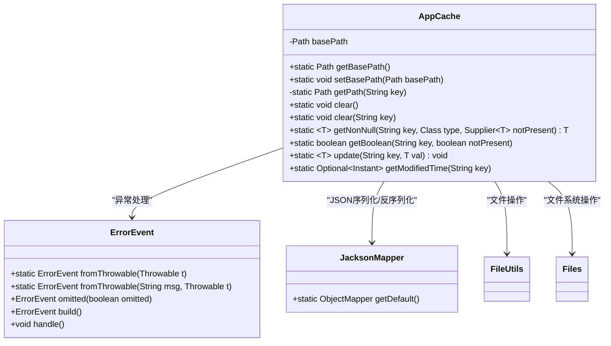
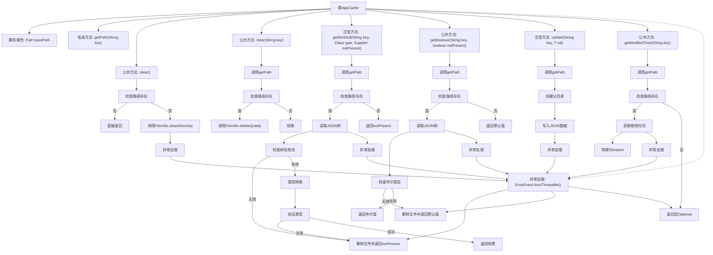

# 基础信息

|      |      |
|------|------|
| 名称 | AppCache |
| 编码语言 | .java |
| 代码路径 | xpipe/app/src/main/java/io/xpipe/app/core/AppCache.java |
| 包名 | io.xpipe.app.core |
| 依赖项 | ['io.xpipe.app.issue.ErrorEvent', 'io.xpipe.core.util.JacksonMapper', 'com.fasterxml.jackson.databind.ObjectMapper', 'lombok.Getter', 'lombok.Setter', 'org.apache.commons.io.FileUtils', 'java.io.IOException', 'java.nio.file.Files', 'java.nio.file.Path', 'java.time.Instant', 'java.util.Optional', 'java.util.function.Supplier'] |
| 概述说明 | AppCache类提供静态方法管理缓存文件，支持清除、读写和查询修改时间。 |

# 说明

这是一个名为AppCache的Java工具类，用于管理基于文件的缓存系统。它提供了静态方法来实现缓存操作，包括设置基础路径、清理缓存、读写缓存数据以及获取文件修改时间。类中使用Path处理文件路径，通过Jackson库实现对象序列化。主要功能包括：清除全部或指定键的缓存；获取非空缓存对象或布尔值，若不存在则返回默认值；更新指定键的缓存值；获取缓存文件的最后修改时间。所有操作都包含异常处理，通过ErrorEvent记录错误并静默失败。

# 类列表 Class Summary

| 名称   | 类型  | 说明 |
|-------|------|-------------|
| AppCache | class | AppCache类提供静态方法管理缓存文件，支持读写、清除和获取修改时间。 |

## 类 AppCache

|      |      |
|------|------|
| 访问范围 | public |
| 类型 | class |
| 名称 | AppCache |
| 说明 | AppCache类提供静态方法管理缓存文件，支持读写、清除和获取修改时间。 |

### UML类图

类图描述：
AppCache是一个提供缓存功能的工具类，主要包含静态方法用于管理基于文件的缓存数据。它通过JacksonMapper处理JSON序列化，使用FileUtils和Files进行文件操作，并依赖ErrorEvent处理异常。核心功能包括缓存清理（clear）、数据存取（getNonNull/getBoolean/update）以及获取修改时间（getModifiedTime）。类设计采用静态方法模式，通过路径解析和类型检查确保数据安全，异常处理机制完善，适合需要持久化缓存的场景。

### 内部方法调用关系图

这段代码实现了一个基于文件系统的应用缓存系统，主要功能包括缓存清理、数据读写、类型安全检查和修改时间获取。流程图展示了8个核心方法的调用关系和异常处理逻辑，其中getNonNull()和getBoolean()方法包含完整的JSON解析和类型验证流程，所有方法都通过统一的ErrorEvent机制处理异常。缓存文件存储在basePath指定的目录下，每个键对应一个.cache后缀的文件。

### 字段列表 Field List

| 名称  | 类型  | 说明 |
|-------|-------|------|
| basePath | Path | 静态路径变量basePath，带Getter和Setter注解。 |

### 方法列表 Method List

| 名称  | 类型  | 说明 |
|-------|-------|------|
| clear | void | 静态方法clear删除指定键对应的文件。 |
| getPath | Path | 私有方法，通过键名生成缓存文件路径。 |
| clear | void | 静态方法clear检查路径存在后清空目录，异常时处理错误。 |
| getNonNull | T | 从指定路径读取JSON文件并转换为指定类型对象，若无效则删除文件并返回默认值。 |
| getBoolean | boolean | 静态方法获取布尔值，若文件不存在或解析失败返回默认值。 |
| update | void | 静态方法更新键值数据，异常时记录错误。 |
| getModifiedTime | Optional<Instant> | 获取文件修改时间，存在则返回时间，异常或不存在返回空。 |

