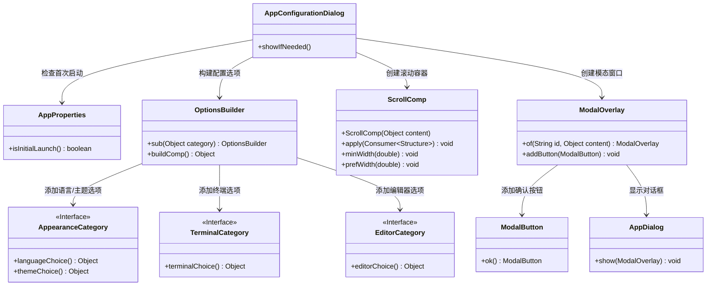

# 基础信息

|      |      |
|------|------|
| 名称 | AppConfigurationDialog |
| 编码语言 | .java |
| 代码路径 | xpipe/app/src/main/java/io/xpipe/app/core/AppConfigurationDialog.java |
| 包名 | io.xpipe.app.core |
| 依赖项 | ['io.xpipe.app.comp.base.ModalButton', 'io.xpipe.app.comp.base.ModalOverlay', 'io.xpipe.app.comp.base.ScrollComp', 'io.xpipe.app.core.window.AppDialog', 'io.xpipe.app.prefs.AppearanceCategory', 'io.xpipe.app.prefs.EditorCategory', 'io.xpipe.app.prefs.TerminalCategory', 'io.xpipe.app.util.OptionsBuilder', 'javafx.scene.layout.Region'] |
| 概述说明 | 首次启动时显示配置对话框，包含语言、主题、终端和编辑器选项，宽度650，带确定按钮。 |

# 说明

这是一个名为AppConfigurationDialog的类，包含一个静态方法showIfNeeded。该方法在应用首次启动时显示配置对话框。首先检查是否初始启动，若非则直接返回。然后构建包含语言选择、主题选择、终端选择和编辑器选择的选项面板，并设置样式类。将选项面板放入滚动容器，设置最小和首选宽度为650。最后创建模态对话框，添加确认按钮并显示。整个过程用于首次启动时的用户偏好设置。

# 类列表 Class Summary

| 名称   | 类型  | 说明 |
|-------|------|-------------|
| AppConfigurationDialog | class | 首次启动时显示配置对话框，包含语言、主题、终端和编辑器选项，宽度650，带确定按钮。 |

## 类 AppConfigurationDialog

|      |      |
|------|------|
| 访问范围 | public |
| 类型 | class |
| 名称 | AppConfigurationDialog |
| 说明 | 首次启动时显示配置对话框，包含语言、主题、终端和编辑器选项，宽度650，带确定按钮。 |

### UML类图

该代码实现了一个应用配置对话框的显示逻辑，当检测到应用首次启动时，会构建包含语言、主题、终端和编辑器选项的配置界面，并封装在可滚动的模态窗口中显示。类图展示了核心组件间的协作关系：AppConfigurationDialog作为入口，通过AppProperties判断启动状态，使用建造者模式组合各类配置选项，最终通过ModalOverlay和AppDialog实现交互式弹窗。各配置选项通过接口隔离实现模块化扩展。

### 内部方法调用关系图

这段代码流程图展示了AppConfigurationDialog类的showIfNeeded()方法的完整执行流程。该方法首先检查应用是否为首次启动，如果不是则直接返回；如果是则构建一个包含语言选择、主题选择、终端选择和编辑器选择的配置界面，设置样式和尺寸后创建模态对话框并显示。流程从条件判断开始，分支出两个路径，然后通过一系列UI组件的创建和配置，最终完成对话框的展示。

### 字段列表 Field List

| 名称  | 类型  | 说明 |
|-------|-------|------|

### 方法列表 Method List

| 名称  | 类型  | 说明 |
|-------|-------|------|
| showIfNeeded | void | 首次启动时显示语言、主题、终端和编辑器选项的配置对话框。 |

