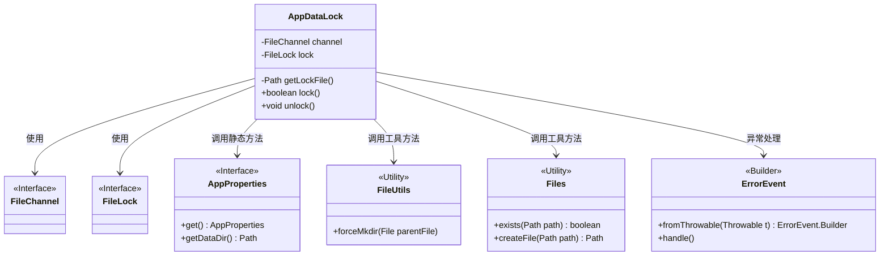

# 基础信息

|      |      |
|------|------|
| 名称 | AppDataLock |
| 编码语言 | .java |
| 代码路径 | xpipe/app/src/main/java/io/xpipe/app/core/AppDataLock.java |
| 包名 | io.xpipe.app.core |
| 依赖项 | ['io.xpipe.app.issue.ErrorEvent', 'org.apache.commons.io.FileUtils', 'java.io.RandomAccessFile', 'java.nio.channels.FileChannel', 'java.nio.channels.FileLock', 'java.nio.file.FileAlreadyExistsException', 'java.nio.file.Files', 'java.nio.file.Path'] |
| 概述说明 | AppDataLock类通过文件锁实现单例应用控制，提供lock()和unlock()方法管理锁状态。 |

# 说明

这是一个用于应用程序数据锁定的工具类，通过文件锁机制确保单实例运行。主要功能包括获取锁文件路径、尝试获取锁以及释放锁。lock方法会创建锁文件并使用文件通道尝试获取独占锁，成功返回true，失败或异常返回false。unlock方法负责释放锁并关闭通道。异常处理通过ErrorEvent记录错误。该机制可防止多实例同时运行，确保数据一致性。

# 类列表 Class Summary

| 名称   | 类型  | 说明 |
|-------|------|-------------|
| AppDataLock | class | AppDataLock类通过文件锁实现单例应用控制，提供lock和unlock方法管理并发访问。 |

## 类 AppDataLock

|      |      |
|------|------|
| 访问范围 | public |
| 类型 | class |
| 名称 | AppDataLock |
| 说明 | AppDataLock类通过文件锁实现单例应用控制，提供lock和unlock方法管理并发访问。 |

### UML类图

类图描述：
AppDataLock类通过文件锁机制实现应用程序单实例运行控制，包含获取锁(lock)和释放锁(unlock)两个核心方法。它依赖FileChannel和FileLock接口进行底层文件锁定操作，通过AppProperties获取数据目录路径，使用FileUtils和Files工具类处理文件创建，并通过ErrorEvent处理异常情况。该设计采用静态成员变量维护锁状态，通过原子性文件操作确保多进程竞争时的线程安全。

### 内部方法调用关系图

这段代码实现了一个基于文件锁的应用数据互斥机制。流程图展示了AppDataLock类的核心结构，包含两个静态属性channel和lock，以及三个主要方法。getLockFile()获取锁文件路径，lock()方法通过创建文件、获取文件通道并尝试加锁来实现互斥访问，unlock()负责释放资源。整个过程考虑了并发场景下的竞态条件，并通过异常处理保证健壮性。文件锁机制可防止多实例同时访问共享数据。

### 字段列表 Field List

| 名称  | 类型  | 说明 |
|-------|-------|------|
| lock | FileLock | 私有静态文件锁变量 |
| channel | FileChannel | 私有静态文件通道变量。 |

### 方法列表 Method List

| 名称  | 类型  | 说明 |
|-------|-------|------|
| unlock | void | 释放锁并关闭通道，处理异常。 |
| lock | boolean | 检查并创建文件锁，成功返回true，失败返回false。 |
| getLockFile | Path | 获取锁文件路径：应用数据目录下的"lock"文件。 |

