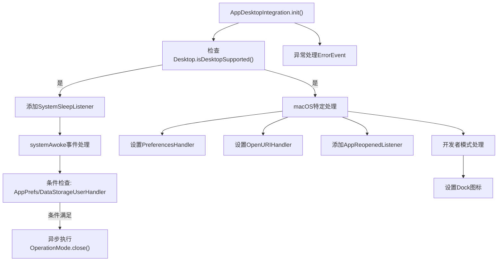
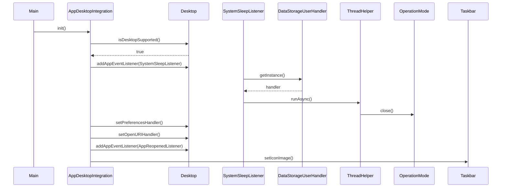

# 基础信息

|      |      |
|------|------|
| 名称 | AppDesktopIntegration |
| 编码语言 | .java |
| 代码路径 | xpipe/app/src/main/java/io/xpipe/app/core/AppDesktopIntegration.java |
| 包名 | io.xpipe.app.core |
| 依赖项 | ['io.xpipe.app.Main', 'io.xpipe.app.core.mode.OperationMode', 'io.xpipe.app.issue.ErrorEvent', 'io.xpipe.app.prefs.AppPrefs', 'io.xpipe.app.storage.DataStorageUserHandler', 'io.xpipe.app.util.PlatformState', 'io.xpipe.app.util.ThreadHelper', 'io.xpipe.core.process.OsType', 'java.awt', 'java.awt.desktop', 'java.util.List', 'javax.imageio.ImageIO'] |
| 概述说明 | 桌面应用集成类，处理系统休眠唤醒、MacOS偏好设置、URI打开及任务栏图标设置。 |

# 说明

该代码实现了桌面应用集成功能，主要包含系统休眠唤醒监听、macOS特定处理及任务栏图标设置。当系统唤醒时，若满足条件（如用户启用休眠锁定），会异步关闭操作模式。针对macOS，设置了偏好设置处理器、URI打开处理器及应用重新打开监听器，确保后台应用行为符合系统规范。开发者模式下还会显式设置任务栏图标。所有操作均包含异常处理，确保稳定性。

# 类列表 Class Summary

| 名称   | 类型  | 说明 |
|-------|------|-------------|
| AppDesktopIntegration | class | 桌面应用集成类，支持系统休眠唤醒监听、macOS偏好设置处理、URI打开操作及任务栏图标设置。 |

## 类 AppDesktopIntegration

|      |      |
|------|------|
| 访问范围 | public |
| 类型 | class |
| 名称 | AppDesktopIntegration |
| 说明 | 桌面应用集成类，支持系统休眠唤醒监听、macOS偏好设置处理、URI打开操作及任务栏图标设置。 |

### UML类图

```mermaid
classDiagram
    class AppDesktopIntegration {
        +init() void
    }

    class Desktop {
        <<Interface>>
        +isDesktopSupported() boolean
        +getDesktop() Desktop
        +addAppEventListener(AppEventListener) void
        +setPreferencesHandler(Consumer~OpenFilesEvent~) void
        +setOpenURIHandler(Consumer~OpenURIEvent~) void
    }

    class SystemSleepListener {
        <<Interface>>
        +systemAboutToSleep(SystemSleepEvent) void
        +systemAwoke(SystemSleepEvent) void
    }

    class AppReopenedListener {
        <<Interface>>
        +appReopened(AppReopenedEvent) void
    }

    class DataStorageUserHandler {
        +getInstance() DataStorageUserHandler
        +getActiveUser() User
    }

    class AppPrefs {
        +get() AppPrefs
        +lockVaultOnHibernation() BooleanProperty
    }

    class OperationMode {
        +close() void
        +switchToAsync(OperationMode) void
    }

    class ThreadHelper {
        +runAsync(Runnable) void
        +sleep(long) void
    }

    class PlatformState {
        +RUNNING PlatformState
        +getCurrent() PlatformState
    }

    class AppLayoutModel {
        +get() AppLayoutModel
        +selectSettings() void
    }

    class AppOpenArguments {
        +handle(List~String~) void
    }

    class Taskbar {
        +isTaskbarSupported() boolean
        +getTaskbar() Taskbar
        +setIconImage(Image) void
    }

    AppDesktopIntegration --> Desktop : 依赖
    AppDesktopIntegration --> SystemSleepListener : 使用
    AppDesktopIntegration --> AppReopenedListener : 使用
    AppDesktopIntegration --> DataStorageUserHandler : 依赖
    AppDesktopIntegration --> AppPrefs : 依赖
    AppDesktopIntegration --> OperationMode : 依赖
    AppDesktopIntegration --> ThreadHelper : 依赖
    AppDesktopIntegration --> PlatformState : 依赖
    AppDesktopIntegration --> AppLayoutModel : 依赖
    AppDesktopIntegration --> AppOpenArguments : 依赖
    AppDesktopIntegration --> Taskbar : 依赖
```

这段代码主要实现了桌面应用集成功能，包括系统睡眠/唤醒监听、macOS特定处理（偏好设置、URI打开、应用重新打开）、开发者模式下的任务栏图标设置等。类图展示了AppDesktopIntegration与多个辅助类之间的依赖关系，核心是通过Java的Desktop API实现跨平台的桌面集成功能，同时处理各种边缘情况如系统休眠时的异步操作、macOS特殊行为等。代码结构体现了良好的分层设计，将不同平台特性、事件监听、UI操作等关注点分离到不同类中。

### 内部方法调用关系图

这段代码实现了桌面应用集成功能，主要包含系统睡眠唤醒监听、macOS特定处理（偏好设置/URI打开/应用重开事件）、开发者模式下的Dock图标设置等。流程图展示了从初始化到各分支处理的完整逻辑路径，时序图则详细描述了主要对象间的交互过程。代码特别注重跨平台兼容性，对macOS做了特殊适配，并通过异步线程避免系统休眠时的操作冲突，同时包含完善的异常处理机制。

### 字段列表 Field List

| 名称  | 类型  | 说明 |
|-------|-------|------|

### 方法列表 Method List

| 名称  | 类型  | 说明 |
|-------|-------|------|
| init | void | 初始化方法，支持系统休眠唤醒监听，MacOS特殊处理如偏好设置、URI打开、应用重开及任务栏图标设置。 |

