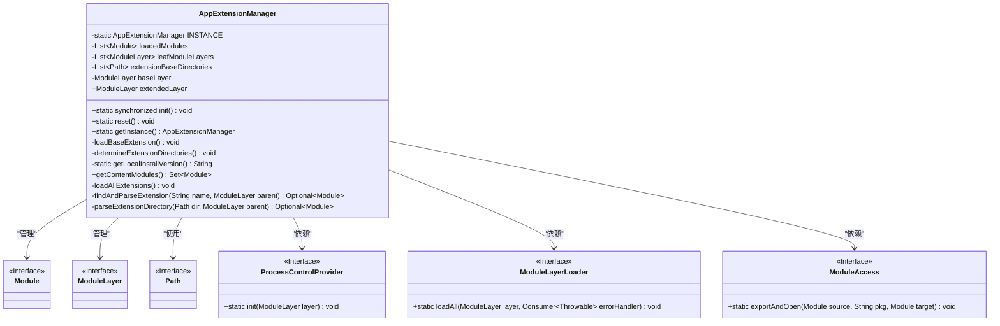
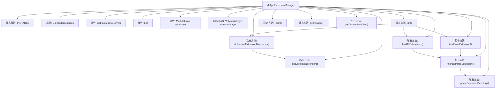

# 基础信息

|      |      |
|------|------|
| 名称 | AppExtensionManager |
| 编码语言 | .java |
| 代码路径 | xpipe/app/src/main/java/io/xpipe/app/core/AppExtensionManager.java |
| 包名 | io.xpipe.app.core |
| 依赖项 | ['io.xpipe.app.ext.ExtensionException', 'io.xpipe.app.ext.ProcessControlProvider', 'io.xpipe.app.issue.ErrorEvent', 'io.xpipe.app.issue.TrackEvent', 'io.xpipe.app.resources.AppResources', 'io.xpipe.app.util.ModuleAccess', 'io.xpipe.core.process.OsType', 'io.xpipe.core.util.ModuleLayerLoader', 'io.xpipe.core.util.XPipeInstallation', 'lombok.Getter', 'lombok.Value', 'java.lang.module.Configuration', 'java.lang.module.ModuleFinder', 'java.nio.file.Files', 'java.nio.file.Path', 'java.util', 'java.util.concurrent.TimeUnit', 'java.util.concurrent.atomic.AtomicReference', 'java.util.stream.Collectors', 'java.util.stream.Stream'] |
| 概述说明 | App扩展管理器，单例模式，加载模块并处理依赖。 |

# 说明

AppExtensionManager是一个单例类，负责管理应用程序的模块扩展。它通过静态方法init初始化，加载基础模块和系统、进程等扩展模块，并创建扩展模块层。类中包含模块列表、模块层列表和扩展目录路径列表等关键属性。初始化过程会检查本地安装版本与源代码版本是否兼容，并处理模块加载错误。还提供了重置和获取实例的方法。模块加载支持从启动模块路径或指定目录查找，并处理模块配置和层定义。

# 类列表 Class Summary

| 名称   | 类型  | 说明 |
|-------|------|-------------|
| AppExtensionManager | class | 应用扩展管理器，单例模式，加载模块并管理扩展层。 |

## 类 AppExtensionManager

|      |      |
|------|------|
| 访问范围 | public |
| 类型 | class |
| 名称 | AppExtensionManager |
| 说明 | 应用扩展管理器，单例模式，加载模块并管理扩展层。 |

### UML类图

这段代码描述了一个应用扩展管理器(AppExtensionManager)，它负责加载和管理Java模块系统中的扩展模块。该类采用单例模式，包含模块加载、目录解析、版本校验等核心功能，通过ModuleLayer实现模块隔离，并与ProcessControlProvider、ModuleLayerLoader等组件协作完成模块初始化。代码中特别处理了开发环境与生产环境的差异，包含严格的版本校验机制和错误处理逻辑。

### 内部方法调用关系图

这段代码实现了一个应用扩展管理器，采用单例模式管理模块加载和依赖关系。核心流程包含初始化时确定扩展目录、加载基础模块和所有扩展模块，通过ModuleLayer实现模块化隔离。关键方法包括动态解析扩展目录、版本校验、模块层构建，特别处理了开发环境下的本地安装验证和模块访问权限控制。异常处理机制完善，通过TrackEvent和ErrorEvent记录操作日志和错误信息。

### 字段列表 Field List

| 名称  | 类型  | 说明 |
|-------|-------|------|
| leafModuleLayers = new ArrayList<>() | List<ModuleLayer> | 私有模块层列表初始化 |
| INSTANCE | AppExtensionManager | 单例模式下的静态应用扩展管理器实例。 |
| extendedLayer | ModuleLayer | 私有模块层扩展字段。 |
| extensionBaseDirectories = new ArrayList<>() | List<Path> | 私有列表存储扩展基础目录路径。 |
| baseLayer = ModuleLayer.boot() | ModuleLayer | 私有模块层变量baseLayer初始化为引导层。 |
| loadedModules = new ArrayList<>() | List<Module> | 私有模块列表初始化 |

### 方法列表 Method List

| 名称  | 类型  | 说明 |
|-------|-------|------|
| reset | void | 重置单例实例为null。 |
| getContentModules | Set<Module> | 获取模块集合，包含启动层模块和已加载模块。 |
| loadAllExtensions | void | 加载扩展模块并配置层，处理模块访问权限。 |
| determineExtensionDirectories | void | 检查XPipe本地安装版本与源码版本是否一致，不一致则报错。 |
| getLocalInstallVersion | String | 获取本地安装版本：解析路径启动进程读取输出并返回。 |
| getInstance | AppExtensionManager | 获取AppExtensionManager单例实例。 |
| init | void | 静态同步方法init初始化单例实例，加载扩展目录和模块，处理异常。 |
| loadBaseExtension | void | 加载基础模块，缺失则报错。 |
| findAndParseExtension | Optional<Module> | 查找解析扩展模块，优先从启动路径加载，其次检查扩展目录，未找到返回空。 |
| parseExtensionDirectory | Optional<Module> | 解析扩展目录，检查存在性并扫描模块，成功则加载模块层，失败记录错误。 |

